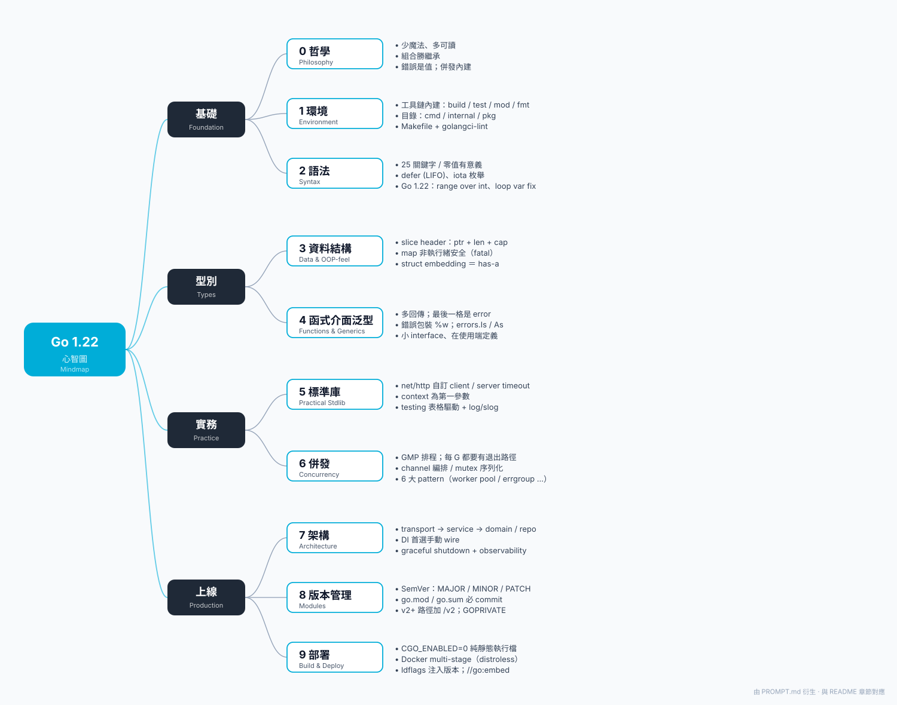

# Go 語言知識庫筆記（Go 1.22）

> 依據 PROMPT.md 完整展開的學習筆記，採「**繁體中文敘述 + 英文術語對照**」風格。
> 適合：已具備至少一種程式語言經驗、想完整掌握 Go 1.22 的工程師。
> 基準版本：**Go 1.22**（含 generics、`min`/`max`/`clear`、range-over-int、loop variable fix）

---

## 全書心智圖（Mindmap）

> 中心 **Go 1.22** → 4 大群組（基礎 / 型別 / 實務 / 上線）→ 10 個章節 → 每章 3 個關鍵字。
> 看不到圖時請直接打開 [`mindmap.svg`](mindmap.svg)。

---

## 學習路線（Learning Path）

| 章節 | 主題 | 對應檔案 |
|---|---|---|
| 第 0 章 | 角色設定與設計哲學（Philosophy） | [00-角色與哲學.md](00-角色與哲學.md) |
| 第 1 章 | 環境與專案結構（Environment & Layout） | [01-環境與專案結構.md](01-環境與專案結構.md) |
| 第 2 章 | 基礎語法（Basic Syntax） | [02-基礎語法.md](02-基礎語法.md) |
| 第 3 章 | 資料結構與物件感（Data Structures & OOP-feel） | [03-資料結構與物件感.md](03-資料結構與物件感.md) |
| 第 4 章 | 函式、錯誤、介面、泛型（Functions / Errors / Interfaces / Generics） | [04-函式錯誤介面泛型.md](04-函式錯誤介面泛型.md) |
| 第 5 章 | 實務標準庫（Practical Standard Library） | [05-實務標準庫.md](05-實務標準庫.md) |
| 第 6 章 | 併發程式設計（Concurrency） | [06-併發程式設計.md](06-併發程式設計.md) |
| 第 7 章 | 大型專案架構（Large-scale Architecture） | [07-大型專案架構.md](07-大型專案架構.md) |
| 第 8 章 | 版本管理（Module Versioning） | [08-版本管理.md](08-版本管理.md) |
| 第 9 章 | 打包與部署（Build & Deployment） | [09-打包與部署.md](09-打包與部署.md) |
| 附錄 A | 語言規範重點（Language Spec） | [A1-語言規範附錄.md](A1-語言規範附錄.md) |
| 附錄 B | 常見陷阱速查（Common Pitfalls） | [A2-常見陷阱速查.md](A2-常見陷阱速查.md) |
| 附錄 C | 中英術語對照表（Glossary） | [A3-術語對照表.md](A3-術語對照表.md) |

---

## 怎麼使用這份筆記（How to use）

1. **新手路徑**：第 0 → 1 → 2 → 3 → 4 → 5 章；先把語法與標準庫的基礎打穩。
2. **後端工程師快速上手**：直接從第 3 章「物件感」進入，看 OOP ↔ Go 對照；接著第 6 章併發、第 7 章架構。
3. **複習 / 面試**：附錄 B 陷阱速查、附錄 C 術語表，配合每章末「重點回顧」。
4. **寫扣前查**：每章中的「Idiom」段落（慣用寫法）與「Anti-pattern」段落（反模式）。

---

## 全書貫穿的五大原則（Five Principles）

1. **少魔法、多可讀**（Less magic, more readability）
   程式應該像散文：第一次讀懂、第二次仍然懂。
2. **錯誤是值**（Errors are values）
   `error` 是一般型別，用 `if err != nil` 處理；`panic` 只給「程式設計者錯誤」。
3. **介面在使用端定義**（Interfaces are defined by the consumer）
   越小越好，最好只有一兩個方法。`io.Reader`、`io.Writer` 是典範。
4. **以組合取代繼承**（Composition over inheritance）
   `struct embedding`、`interface embedding` 解決多型；不要硬模仿 OOP class。
5. **併發不是平行**（Concurrency is not parallelism）
   goroutine + channel + context 三件套；每個 goroutine 都要有退出路徑。

---

## 版本與更新（Version Notes）

- 撰寫日期：2026-05-10
- 基準 Go 版本：1.22（向下相容到 1.18 的 generics）
- 補充收錄：1.21 的 `min`/`max`/`clear`、`slices`、`maps` 套件；1.22 的 `for i := range N`、loop variable per-iteration

> 如需更新到更新版本（1.23+），請參閱官方 release notes：<https://go.dev/doc/devel/release>。
