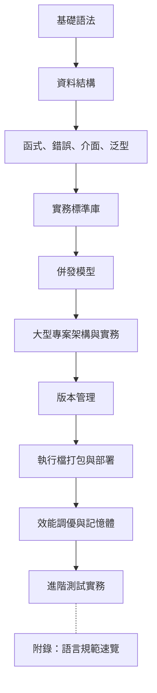

# Golang 語言教學筆記

這是一套給「有程式基礎的新手」的 Go 語言教材。寫法會站在 10 年專案開發經驗的角度：先建立正確語法心智模型，再把語法放進可維護的專案設計中。

> 教材版本：`v1.0.59`
> 教材基準：`Go 1.26.4`
> 這次更新重點：正式發布 Production workflow contract gate，固定 `production-api-worker/.github/workflows/production-api-worker.yml` 的 contract tests、race/coverage、govulncheck、Docker build 與 Compose smoke 不會退化成只跑單元測試。

## 版本策略

| 項目 | 目前策略 |
|---|---|
| 教材講解基準 | 以 Go 1.26.4 作為 2026-06 的主教材版本 |
| 範例相容層 | 現有 `go.mod` 仍保留 `go 1.22`，避免舊環境無法執行基本範例 |
| 新特性標示 | Go 1.25 / 1.26 內容會在章節、康乃爾筆記與速查表內明確標示版本 |
| 實務建議 | 新專案建議直接使用目前受支援的最新 Go 1.26 patch release |
| 升級檢查 | 升級 Go 1.26 時同步確認 bootstrap toolchain、目標 OS/ARCH、Docker base image、CI `setup-go` 與 CGO 依賴 |
| 依賴治理 | 每次新增或升級 module 都要跑 `go mod tidy`、`go mod verify`、`go list -m -u all` 與 `govulncheck ./...` |
| 效能診斷 | 效能修改前後需保留 benchmark / profile / metrics 證據，避免只靠直覺調整 |
| Release Note 效能矩陣 | 版本升級頁需列出官方效能數字、升級前後狀態、受影響場景與本地驗證指令 |
| Release Note 官方覆蓋 | Go 1.1-1.26 報告需對照官方段落標題、Tools、Ports、minor changes 與 Patch Revisions，並同步 `ReleaseNote/` 與 `docs/ReleaseNote/` |
| Release Note 支援狀態 | ReleaseNote 索引需依官方 Release Policy 標示目前支援版本、未支援版本與最新 patch，並用 SVG 圖表呈現 |
| 補充教材頁 | 重大補充 HTML 需放入 `docs/`，包含語法應用圖解、第三方模組選型、C/Python/Go 效能比較、Assembly 與微服務 |
| 語法 SVG 流程圖 | 單語法補充頁需以 Start/End、Input/Output、Decision、Process 等標準流程圖符號呈現，並保留 `<title>` / `<desc>` / `aria-labelledby` 可存取性 metadata |
| Operational runbook | `production-api-worker/docs/operational-runbook.md` 與 `configs/prometheus/production-api-worker-alerts.yml` 需固定 SLI/SLO、告警、incident workflow、verification 與 risk notes |
| Prometheus config gate | `configs/prometheus/prometheus.yml`、Compose `monitoring` profile 與 `node scripts/check-prometheus-config.mjs` 需固定 scrape job、rule_files、alert rules 載入與 API key 風險說明 |
| Operational observability contract gate | Runbook、Prometheus scrape config、alert rules、Compose `monitoring` profile 與 API key scrape auth 風險需由 `node scripts/check-operational-observability-contract.mjs` 固定文件、Makefile、CI 與教材入口 |
| Docs publishing contract gate | `docs/index.html`、GitHub Pages link fix 與 HTML 主頁教程回鏈需由 `node scripts/check-docs-publishing-contract.mjs` 固定來源同步、Makefile、CI 與教材入口 |
| Production workflow contract gate | `production-api-worker/.github/workflows/production-api-worker.yml` 需由 `node scripts/check-production-workflow-contract.mjs` 固定 `make ci-contract`、race/coverage、govulncheck、Docker build、Compose smoke、failure logs 與 cleanup |
| OpenAPI contract | `production-api-worker/api/openapi.yaml` 需同步 `docs/api-contract.md` 與 Go contract tests，並由 `node scripts/check-openapi-contract.mjs` 固定 endpoint、schema、error code 與 auth 邊界 |
| Readiness lifecycle contract | `/livez` 必須公開回 `200`；`/readyz` 在 ready 時回 `200`、draining 時回 `503`，並由 `TestReadinessContract` 和 `node scripts/check-readiness-contract.mjs` 固定 |
| Request decoding contract | `POST /jobs` 只接受單一 JSON object；malformed JSON、unknown field、trailing JSON value 與空白 `name` 都必須回 `400 invalid_input`，並由 `TestRequestDecodingContract` 和 `node scripts/check-request-decoding-contract.mjs` 固定 |
| Panic recovery contract | handler panic 必須回 `500 internal_error` JSON、保留 `X-Request-ID`，並由 `TestPanicRecoveryContract` 和 `node scripts/check-panic-recovery-contract.mjs` 固定 |
| Request correlation contract | `X-Request-ID` 必須回傳給 client、寫入 request context、structured log 欄位 `request_id` 與 trace attribute `request.id`，並由 `TestRequestIDContract` 和 `node scripts/check-request-correlation-contract.mjs` 固定 |
| API security contract | `API_KEY` 啟用後 `/jobs`、`/jobs/{id}`、`/metrics` 必須要求 Bearer token；`/livez`、`/readyz` 保持公開，安全標頭由 `TestAPIKeyAuthContract`、`TestSecurityHeadersContract` 與 `node scripts/check-api-security-contract.mjs` 固定 |
| CORS allowlist contract | `CORS_ALLOWED_ORIGINS` 預設空值；只允許 exact `http` / `https` origin，preflight 與實際 request 由 `TestCORSAllowedOriginsContract` 和 `node scripts/check-cors-contract.mjs` 固定 |
| Request body limit contract | `REQUEST_BODY_LIMIT_BYTES=1048576` 為預設；`POST /jobs` 超過上限回 `413 payload_too_large`，並由 `TestRequestBodyLimitContract` 和 `node scripts/check-request-body-limit-contract.mjs` 固定 |
| HTTP server timeout contract | `HTTP_READ_HEADER_TIMEOUT=3s`、`HTTP_READ_TIMEOUT=5s`、`HTTP_WRITE_TIMEOUT=10s`、`HTTP_IDLE_TIMEOUT=60s`、`HTTP_SHUTDOWN_TIMEOUT=5s`、`QUEUE_DRAIN_TIMEOUT=10s` 為預設，並由 `TestHTTPServerTimeoutContract` 和 `node scripts/check-http-timeout-contract.mjs` 固定 |
| Startup config contract gate | `PORT`、`QUEUE_SIZE`、`WORKERS` 與 `OTEL_EXPORTER_OTLP_ENDPOINT` 必須集中驗證，錯誤設定 fail fast，不可 silent fallback，並由 `node scripts/check-startup-config-contract.mjs` 固定文件、Go tests、Makefile 與 CI 入口 |
| Request timeout contract gate | Handler 造成的 `context.DeadlineExceeded` 必須回 `504 request_timeout`、保留 `X-Request-ID`，並由 `TestRequestTimeoutContract` 和 `node scripts/check-request-timeout-contract.mjs` 固定 |
| Worker failure contract | worker processor 成功與失敗都必須記錄 duration，失敗需標記 `worker_jobs_total{result="failed"}`，成功標記 `success`，並由 `TestWorkerFailureResultContract` 和 `node scripts/check-worker-failure-contract.mjs` 固定 |
| Retry cancellation contract | DB deadlock retry 的 backoff 必須尊重 `context` cancellation / deadline，避免 shutdown 或 request timeout 後繼續重試，並由 `TestCreateJobStopsDeadlockRetryWhenContextCanceled` 和 `node scripts/check-retry-cancellation-contract.mjs` 固定 |
| Queue backpressure contract | bounded queue 滿載時必須回 `domain.ErrQueueFull`、API 對外回 `503 queue_full`，並記錄 `worker_jobs_total{result="dropped"}` 與 queue depth，由 `TestQueueBackpressureContract` 和 `node scripts/check-queue-backpressure-contract.mjs` 固定 |
| DB pool contract gate | Postgres 連線池容量與生命週期必須由 `DATABASE_MAX_OPEN_CONNS`、`DATABASE_MAX_IDLE_CONNS`、`DATABASE_CONN_MAX_LIFETIME` 驅動，且由 `node scripts/check-db-pool-contract.mjs` 固定 config、repository、main wiring、文件、Makefile 與 CI 入口 |
| Migration contract gate | DB schema migration 需有 `DATABASE_URL`、`MIGRATIONS_DIR`、`MIGRATION_TIMEOUT` 設定驗證、`schema_migrations` 版本紀錄、transaction apply 與重複執行保護，並由 `node scripts/check-migration-contract.mjs` 固定 |
| Pprof diagnostics contract | `ENABLE_PPROF=false` 為預設；啟用 `/debug/pprof/` 時必須設定 `PPROF_TOKEN` 或 `API_KEY`，並由 `node scripts/check-pprof-contract.mjs` 固定文件、測試與 CI 入口 |
| OTLP collector contract | `production-api-worker/otel-collector.yaml` 需固定 OTLP gRPC receiver `0.0.0.0:4317`、`debug` exporter、Compose endpoint 與 `node scripts/check-otel-collector-contract.mjs` CI gate |
| Rate limit contract | `RATE_LIMIT_REQUESTS_PER_MINUTE=120` 為預設；`/jobs` 與 `/jobs/{id}` 依 client IP 限速，超限回 `429 rate_limited` 與 `Retry-After`，並由 `node scripts/check-rate-limit-contract.mjs` 固定文件、OpenAPI、測試與 CI 入口 |
| Trusted proxy client IP contract gate | `TRUSTED_PROXY_CIDRS` 預設空值；只有 trusted proxy 來源可採用 `X-Forwarded-For` 第一個 IP，避免外部直連偽造 rate limit key，並由 `node scripts/check-trusted-proxy-contract.mjs` 固定文件、runbook、測試、Makefile 與 CI 入口 |
| Shutdown signal contract | `api-worker` 必須同時監聽 SIGINT/SIGTERM；收到訊號後先讓 readiness 轉 draining，再停止 HTTP server 並 drain queue，並由 `node scripts/check-shutdown-signal-contract.mjs` 固定文件、測試與 CI 入口 |
| Assembly 教材 | Assembly 只能作為可量測 hot path 的小型 adapter，必須保留 pure Go fallback、benchmark、pprof 與部署風險說明 |
| 微服務教材 | Go 微服務需獨立說明 handler、service、config、timeout、health check、Docker smoke 與 deployment risk |
| 跨語言 / GPU 效能範例 | C/Python/Go 效能比較需提供可重跑 workload、正式測試 script、compiler flags、語言版本、raw output 與 Markdown 報告；GPU/Metal 比較需分開標示 CPU baseline、GPU kernel time 與 GPU total time |
| CI release gate | `.github/workflows/ci.yml` 需固定 root module、production-api-worker contract、race/coverage、govulncheck 與 Docker build，避免教材只描述 CI 卻沒有真實 workflow |
| CI quality gate contract | GitHub Actions 需同時保留 root course、production contracts、`go mod verify`、`go test -race -cover`、`govulncheck ./...`、Docker build 與 Compose smoke，並由 `node scripts/check-ci-quality-gate-contract.mjs` 固定文件、Makefile 與 CI 入口 |
| CI contract parity gate | `make ci-contract` 的 API contract test selector 必須與 `.github/workflows/ci.yml` production contract job 一致，包含 `TestCORSAllowedOriginsContract`，並由 `node scripts/check-ci-contract-parity-contract.mjs` 固定 |
| Contract gate inventory | 28 個 root contract checker 必須全部被 `.github/workflows/ci.yml` 呼叫，並由 `node scripts/check-contract-gate-inventory-contract.mjs` 固定 Makefile、README、API contract、章節與整合視覺課程入口 |
| Docs publishing contract gate | `docs/index.html` 必須保留 `ReleaseNote/index.html`、補充教材入口與主頁教程回鏈，並由 `node scripts/check-docs-publishing-contract.mjs` 固定 `fix-docs-index-links.mjs --check` 與 `check-html-home-links.mjs` |
| Compose smoke contract gate | Docker Compose 不只要 build 成功，還要用主機端 smoke script 驗證 API ready、建立 job、讀回 job 與 metrics 暴露，並由 `node scripts/check-compose-smoke-contract.mjs` 固定文件、Makefile 與 CI 入口 |
| API 合約 | 對外 HTTP endpoint 需有穩定 request/response/error schema，並用 contract test 阻擋破壞性變更 |
| Request decoding | JSON request 需拒絕 malformed body、unknown field、trailing JSON value 與空白必填欄位 |
| 觀測性關聯 | 對外 API 需保留 `X-Request-ID`，並讓 log、trace、metrics 可互相對照 |
| 服務生命週期 | SIGINT/SIGTERM 時先讓 readiness 轉為 draining，再停止收新流量並等待 queue drain |
| Queue shutdown | queue close 與 enqueue 必須由同一個同步邊界保護，避免 shutdown 期間送入已關閉 channel |
| Panic recovery | HTTP handler 需用 middleware 將未預期 panic 轉成穩定 `internal_error` JSON，並保留 request id |
| Retry cancellation | DB deadlock retry 的 backoff 必須尊重 `context` cancellation / deadline，避免 shutdown 或 request timeout 後繼續重試 |
| Request timeout | Handler 造成的 `context.DeadlineExceeded` 應回 `504 request_timeout`，避免 timeout 被誤分類成未知伺服器錯誤 |
| Startup config | `PORT`、`QUEUE_SIZE`、`WORKERS` 等啟動設定需先驗證；錯誤設定應 fail fast，不可靜默套用預設值，並由 `node scripts/check-startup-config-contract.mjs` 形成 Startup config contract gate |
| Database pool | Postgres 連線池容量與生命週期需由 env 設定並驗證，避免 repository 內硬編碼造成部署容量不可控 |
| Migration contract | DB schema migration 需有 `DATABASE_URL`、`MIGRATIONS_DIR`、`MIGRATION_TIMEOUT` 設定驗證、`schema_migrations` 版本紀錄與重複執行保護 |
| CORS policy | 瀏覽器跨域存取不可使用 `*`；應以 `CORS_ALLOWED_ORIGINS=https://app.example.com,http://localhost:5173` 明確列出前端 origin |
| Diagnostics security | `/debug/pprof/` 必須預設關閉；開啟時只能作為短期事故診斷工具，並以 Bearer token、網路層限制與事後關閉流程保護 |
| API rate limiting | 業務 endpoint 需有 per-client 保護，避免單一 client 壓垮 queue / DB；health endpoint 不應被限速影響部署探測 |

## 學習路線



## 章節目錄

| 順序 | 章節 | 重點 |
|---:|---|---|
| 1 | [環境與專案結構](chapters/01-environment-and-project.md) | `go mod`、package、專案目錄 |
| 2 | [基礎語法](chapters/02-basic-syntax.md) | 變數、常數、型別、流程控制、`defer`、`iota`、`init()` |
| 3 | [資料結構與物件感](chapters/03-data-structures.md) | array、slice、map、string、struct、pointer |
| 4 | [函式、錯誤、介面、泛型](chapters/04-functions-errors-interfaces-generics.md) | 多回傳值、error wrapping、interface、generics |
| 5 | [實務標準庫](chapters/05-practical-go.md) | JSON、檔案、HTTP、testing、benchmark |
| 6 | [併發程式設計](chapters/06-concurrency.md) | goroutine、channel、GMP 模型、fan-in/out、errgroup |
| 7 | [大型專案架構與實務](chapters/07-large-project-concurrent-crawler.md) | 目錄佈局、DI、Config、Makefile、並發爬蟲 |
| 8 | [版本管理](chapters/08-version-management.md) | go.mod 深入、SemVer、private module、proxy |
| 9 | [執行檔打包與部署](chapters/09-build-and-deploy.md) | 交叉編譯、ldflags、embed、Docker、CI/CD |
| 10 | [效能調優與記憶體管理](chapters/10-performance-and-memory.md) | Escape Analysis、pprof、GC、sync.Pool、runtime metrics、trace、benchstat |
| 11 | [進階測試實務](chapters/11-advanced-testing.md) | Mocking 策略、Fuzz Testing、Integration Test |

### 附錄

| 順序 | 章節 | 重點 |
|---:|---|---|
| A1 | [語言規範速覽](chapters/A1-language-spec-overview.md) | 標識符、關鍵字、運算子、字面量、作用域、panic/recover |

## 筆記與速查

| 類型 | 檔案/目錄 | 適合 |
|---|---|---|
| **全域知識圖** | **[Golang-Mindmap.md](Golang-Mindmap.md)** | **全局觀覽**、建立知識體系、面試前盤點 |
| 視覺圖解 | [圖解筆記/](圖解筆記/README.md) | **圖像記憶**、理解 GMP/記憶體/底層原理 |
| 康乃爾筆記 | [康乃爾筆記法/](康乃爾筆記法/README.md) | **最新推薦**。複習、準備面試、自我測驗 |
| 基礎速查 | [cheatsheet-basic.md](Cheatsheet/cheatsheet-basic.md) | 剛學 Go、日常快速回憶 |
| 進階速查 | [cheatsheet-advanced.md](Cheatsheet/cheatsheet-advanced.md) | 進階 pattern、效能工具、部署 |

## 可執行範例

```bash
go run ./examples/...
```

### 跨語言效能比較範例

```bash
cd examples/performance-comparison

clang -O2 c/bench.c -o /tmp/bench-c
/tmp/bench-c

go test -bench=. -benchmem -count=10 ./go

python3 python/bench.py
```

此範例用相同整數運算 workload 示範 benchmark 方法。正式結論仍需記錄 CPU、OS、compiler flags、Go/Python 版本、資料量與完整原始輸出。

## 專案實戰路線

```bash
go test ./project-concurrent-crawler/...
```

| 專案 | 目標 | 建議時機 | 入口 |
|---|---|---|---|
| `project-concurrent-crawler` | 練習 worker pool、retry、parser/store 抽象 | 第一次完成第 7 章後 | `go test ./project-concurrent-crawler/...` |
| `production-api-worker` | 練習 HTTP API、OpenAPI contract、readiness lifecycle contract、API key security contract、CORS allowlist contract、request body limit contract、HTTP server timeout contract、worker failure contract、diagnostics / pprof contract、OTLP collector contract、rate limit contract、shutdown signal contract、startup config、DB pool contract、migration contract、strict request decoding、transaction、context-aware retry、request timeout contract、queue shutdown safety、observability、operational runbook、Prometheus monitoring profile、panic recovery、graceful shutdown、Docker Compose | 完成第 5、7、9、11 章後 | `cd production-api-worker && go test ./...` |

`production-api-worker` 也附上 [API 合約文件](production-api-worker/docs/api-contract.md)，用來示範 production service 不只要能跑，也要把 endpoint、錯誤格式、相容性規則與 release gate 寫清楚。

## 驗證指令

| 場景 | 指令 | 說明 |
|---|---|---|
| 根目錄範例 | `go run ./examples/...` | 快速確認語法範例可執行 |
| 爬蟲專案 | `go test ./project-concurrent-crawler/...` | 驗證並發流程與 retry |
| Production 專案 | `cd production-api-worker && go test ./...` | 驗證 API、service、worker |
| 受限環境 | `TMPDIR=$PWD/.tmp GOCACHE=$PWD/.gocache GOMODCACHE=$PWD/.gomodcache go test ./...` | 避免使用系統快取路徑 |
| Go 1.26 新特性 | `go1.26.4 test ./...` 或本機 Go 1.26.4 | 驗證 `new(expression)`、`testing/synctest` 等新版內容 |
| Go 1.26 test artifact | `go1.26.4 test -artifacts -outputdir ./test-artifacts ./...` | 驗證 `T.ArtifactDir` / `B.ArtifactDir` / `F.ArtifactDir` 並收集輸出產物 |
| Go 1.26 升級盤點 | 對照第 1 / 9 章的支援矩陣 | 確認 macOS、Windows、FreeBSD、Wasm、bootstrap 與容器建置限制 |
| Go 1.20 效能矩陣 | `rg -n "效能比較|crypto/rsa encryption|runtime/metrics histogram" ReleaseNote/go1.20-release-note.html docs/ReleaseNote/go1.20-release-note.html` | 確認 Release Note 同步記錄官方效能數字與 benchmark / metrics 驗證建議 |
| Release Note 官方段落覆蓋 | `rg -n "Go 1.1-1.26|support-status-chart|Go 1.25、Go 1.26|go1.1-release-note" ReleaseNote docs/ReleaseNote` | 確認根目錄與 Pages 版都保留 Go 1.1、Roadmap、支援狀態圖與最新 patch 訊號 |
| 補充教材頁 | `test -f docs/golang-syntax-application-svg.html && test -f docs/golang-third-party-modules.html && test -f docs/c-python-go-performance-supplement.html && test -f docs/golang-assembly-tutorial.html && test -f docs/golang-microservice-tutorial.html` | 確認補充 HTML 交付頁存在 |
| 語法 SVG 流程圖品質門檻 | `node scripts/check-syntax-flow-svg.mjs` | 確認 `docs/` 與整合來源都保留 25 個單語法流程圖、標準流程圖符號、SVG metadata 與 blueprint renderer |
| Operational runbook gate | `node scripts/check-operational-runbook.mjs` | 確認 `production-api-worker/docs/operational-runbook.md`、`configs/prometheus/production-api-worker-alerts.yml`、README 與 CI 都保留 SLI/SLO、告警、incident workflow 與驗證入口 |
| Prometheus config gate | `node scripts/check-prometheus-config.mjs` | 確認 `configs/prometheus/prometheus.yml`、alert rules、Compose monitoring profile、README、runbook 與 CI 入口一致 |
| Operational observability contract gate | `node scripts/check-operational-observability-contract.mjs` | 確認 runbook、Prometheus scrape config、alert rules、Compose monitoring profile、API key scrape auth 風險、Makefile 與 CI 入口一致 |
| OpenAPI contract gate | `node scripts/check-openapi-contract.mjs` | 確認 `production-api-worker/api/openapi.yaml` 保留 endpoint、request/response schema、error code、Bearer auth 與 `X-Request-ID` |
| Readiness lifecycle gate | `node scripts/check-readiness-contract.mjs` | 確認 `/livez`、`/readyz`、draining 503、public probes、Go tests、OpenAPI、README 與 CI 入口一致 |
| Request decoding gate | `node scripts/check-request-decoding-contract.mjs` | 確認 malformed JSON、unknown field、trailing JSON value、空白 `name`、Go tests、OpenAPI、README 與 CI 入口一致 |
| Panic recovery gate | `node scripts/check-panic-recovery-contract.mjs` | 確認 recover middleware、`500 internal_error`、request id、Go tests、OpenAPI、README 與 CI 入口一致 |
| Request correlation gate | `node scripts/check-request-correlation-contract.mjs` | 確認 `X-Request-ID`、request context、structured log、trace attribute、Go tests、OpenAPI、README 與 CI 入口一致 |
| API security gate | `node scripts/check-api-security-contract.mjs` | 確認 `API_KEY`、Bearer auth、public health probes、security headers、Go tests、OpenAPI、README 與 CI 入口一致 |
| CORS allowlist gate | `node scripts/check-cors-contract.mjs` | 確認 `CORS_ALLOWED_ORIGINS`、allowlist middleware、preflight 測試、OpenAPI、README 與 CI 入口一致 |
| Request body limit gate | `node scripts/check-request-body-limit-contract.mjs` | 確認 `REQUEST_BODY_LIMIT_BYTES`、`payload_too_large`、Go tests、OpenAPI、README 與 CI 入口一致 |
| HTTP timeout gate | `node scripts/check-http-timeout-contract.mjs` | 確認 `HTTP_READ_HEADER_TIMEOUT`、`HTTP_READ_TIMEOUT`、`HTTP_WRITE_TIMEOUT`、`HTTP_IDLE_TIMEOUT`、`HTTP_SHUTDOWN_TIMEOUT`、`QUEUE_DRAIN_TIMEOUT`、Go tests、README、API contract 與 CI 入口一致 |
| Startup config gate | `node scripts/check-startup-config-contract.mjs` | 確認 `PORT`、`QUEUE_SIZE`、`WORKERS`、optional endpoint、Go tests、README、API contract、章節、Makefile 與 CI 入口一致 |
| Worker failure gate | `node scripts/check-worker-failure-contract.mjs` | 確認 worker 成功/失敗 result metric、duration、Go tests、README 與 CI 入口一致 |
| Retry cancellation gate | `node scripts/check-retry-cancellation-contract.mjs` | 確認 deadlock retry backoff、context cancellation、Go test、README 與 CI 入口一致 |
| Queue backpressure gate | `node scripts/check-queue-backpressure-contract.mjs` | 確認 bounded queue 滿載時回 `domain.ErrQueueFull`、API `503 queue_full`、dropped metric、Go tests、README 與 CI 入口一致 |
| DB pool contract gate | `node scripts/check-db-pool-contract.mjs` | 確認 DB pool env、config default / override / fail-fast、repository pool 套用、README、API contract、章節、Makefile 與 CI 入口一致 |
| Migration contract gate | `node scripts/check-migration-contract.mjs` | 確認 migration env、timeout、version table、transaction apply、Go tests、README 與 CI 入口一致 |
| Pprof diagnostics gate | `node scripts/check-pprof-contract.mjs` | 確認 `ENABLE_PPROF`、`PPROF_TOKEN`、`/debug/pprof/`、Go tests、runbook、README 與 CI 入口一致 |
| OTLP collector gate | `node scripts/check-otel-collector-contract.mjs` | 確認 `production-api-worker/otel-collector.yaml`、Compose OTLP endpoint、debug exporter、runbook、README 與 CI 入口一致 |
| Rate limit contract gate | `node scripts/check-rate-limit-contract.mjs` | 確認 `RATE_LIMIT_REQUESTS_PER_MINUTE`、`TRUSTED_PROXY_CIDRS`、`429 rate_limited`、Go tests、OpenAPI、README 與 CI 入口一致 |
| Trusted proxy client IP contract gate | `node scripts/check-trusted-proxy-contract.mjs` | 確認 `TRUSTED_PROXY_CIDRS`、`X-Forwarded-For`、untrusted `RemoteAddr` fallback、Go tests、runbook、Makefile 與 CI 入口一致 |
| Shutdown signal contract gate | `node scripts/check-shutdown-signal-contract.mjs` | 確認 SIGINT/SIGTERM、`TestMonitoredSignalsContract`、README、API contract、章節與 CI 入口一致 |
| CI quality gate contract | `node scripts/check-ci-quality-gate-contract.mjs` | 確認 root course、production contracts、`go mod verify`、`go test -race -cover`、`govulncheck ./...`、Docker build、Compose smoke、Makefile 與 CI 入口一致 |
| CI contract parity gate | `node scripts/check-ci-contract-parity-contract.mjs` | 確認 `make ci-contract` 與 GitHub Actions production contract job 的 API test selector 一致，且保留 `TestCORSAllowedOriginsContract` |
| Contract gate inventory | `node scripts/check-contract-gate-inventory-contract.mjs` | 確認 28 個 root contract checker 都被 GitHub Actions 呼叫，且 Makefile、README、API contract、章節與整合視覺課程入口一致 |
| Docs publishing contract gate | `node scripts/check-docs-publishing-contract.mjs` | 確認 `docs/index.html`、GitHub Pages link fix、HTML 主頁教程回鏈、Makefile、CI 與教材入口一致 |
| Production workflow contract gate | `node scripts/check-production-workflow-contract.mjs` | 確認 standalone production workflow 保留 contract、race/coverage、govulncheck、Docker build、Compose smoke、failure logs 與 cleanup |
| Docs index 連結自動修正 | `node scripts/fix-docs-index-links.mjs --sync-source && node scripts/fix-docs-index-links.mjs --check` | 每次重產 `docs/index.html` 後，自動改成 GitHub Pages `docs/` root 可用路徑，避免 `/docs`、`/ReleaseNote` 404 |
| HTML 回主頁教程檢查 | `node scripts/check-html-home-links.mjs` | 確認 `docs/`、`ReleaseNote/` 與圖解 HTML 頁面都有可解析到 `docs/index.html` 的「主頁教程」入口 |
| 跨語言效能範例 | `cd examples/performance-comparison && clang -O2 c/bench.c -o /tmp/bench-c && /tmp/bench-c && go test -bench=. -benchmem -count=1 ./go && python3 python/bench.py` | 確認 C/Python/Go 範例可重跑，並保留正式報告所需原始輸出 |
| 跨語言正式測試報告 | `./TestCode/performance-comparison/run-real-benchmark.sh` | 產出 `測試報告/<timestamp>-C-Python-Go-真實效能測試報告.md` 與 raw stdout |
| GPU / Metal 效能範例 | `cd examples/performance-comparison && swiftc -O -module-cache-path /tmp/swift-module-cache -framework Metal -framework Foundation gpu/bench.swift -o /tmp/bench-gpu-metal && GPU_ELEMENTS=1048576 GPU_ROUNDS=128 /tmp/bench-gpu-metal` | 驗證 data-parallel GPU workload；不可與 sequential CPU loop 混成單一倍率結論 |
| Assembly 補充頁 | `test -f docs/golang-assembly-tutorial.html && rg -n "Pure Go Fallback|go tool objdump|GOARCH=arm64" docs/golang-assembly-tutorial.html` | 確認 Assembly 只作為可替換 hot path，且保留 fallback / benchmark / disassembly 驗證 |
| 微服務補充頁 | `test -f docs/golang-microservice-tutorial.html && rg -n "REQUEST_TIMEOUT|/readyz|Dockerfile|scripts/smoke.sh" docs/golang-microservice-tutorial.html` | 確認微服務教程包含 config、health check、Docker 與 smoke 驗證 |
| CI workflow 語法 | `ruby -e 'require "yaml"; YAML.load_file(".github/workflows/ci.yml")'` | 確認 GitHub Actions YAML 可解析 |
| CI release gate | `.github/workflows/ci.yml` | GitHub Actions 會跑 root module、production-api-worker contract、race/coverage、govulncheck、Docker build 與 Compose smoke |
| Production workflow contract gate | `node scripts/check-production-workflow-contract.mjs && cd production-api-worker && make production-workflow-check` | 固定 tracked standalone workflow 不會漏掉 production release gate |
| Compose smoke contract gate | `node scripts/check-compose-smoke-contract.mjs && cd production-api-worker && docker compose up -d --build && make compose-smoke && docker compose down -v` | 驗證 Postgres、migration、API、worker、readiness、job create/read、metrics、失敗 logs 與 CI 入口端到端可用 |
| Compose monitoring profile | `cd production-api-worker && docker compose --profile monitoring up -d --build && open http://localhost:9090` | 啟動教學用 Prometheus，載入 scrape config 與 alert rules；若設定 `API_KEY`，需同步規劃 scrape auth |
| 依賴供應鏈檢查 | `go mod tidy && go mod verify && go list -m -u all && govulncheck ./...` | 第 8 / 9 / 11 章的依賴治理與 release gate 基線 |
| API 合約回歸 | `cd production-api-worker && go test ./internal/api -run 'Test.*Contract' -count=1` | 驗證 HTTP status、JSON schema 與錯誤 code 沒有意外改變 |
| Request decoding 合約 | `cd production-api-worker && go test ./internal/api -run 'TestRequestDecodingContract' -count=1 && node scripts/check-request-decoding-contract.mjs` | 驗證 malformed JSON、unknown field、trailing JSON 與空白 name 都回 `400 invalid_input`，且文件 / OpenAPI / CI 入口一致 |
| Request body limit 合約 | `cd production-api-worker && go test ./internal/api -run 'TestRequestBodyLimitContract' -count=1` | 驗證 oversized `POST /jobs` request body 會回 `413 payload_too_large` |
| HTTP server timeout 合約 | `cd production-api-worker && go test ./cmd/api-worker -run 'TestHTTPServerTimeoutContract' -count=1` | 驗證 server read header、read、write、idle、shutdown 與 queue drain timeout 由設定集中套用 |
| Request ID 合約 | `cd production-api-worker && go test ./internal/api -run 'TestRequestIDContract|TestCreateJobContract' -count=1` | 驗證 `X-Request-ID` 會回傳並進入 request context |
| Readiness / drain 合約 | `cd production-api-worker && go test ./internal/api -run 'TestReadinessContract' -count=1 && node scripts/check-readiness-contract.mjs` | 驗證 `/livez` 公開存活探測、draining 時 `/readyz` 會回 503，且文件 / OpenAPI / CI 入口一致 |
| Worker shutdown 安全 | `cd production-api-worker && go test ./internal/worker -run 'Test.*Shutdown|TestConcurrentEnqueueAndShutdownDoesNotPanic' -count=1` | 驗證 queue 關閉後 enqueue 回穩定錯誤，shutdown 期間不會送入已關閉 channel |
| Panic recovery 合約 | `cd production-api-worker && go test ./internal/api -run 'TestPanicRecoveryContract' -count=1 && node scripts/check-panic-recovery-contract.mjs` | 驗證 handler panic 會回 `500`、`internal_error` JSON 與原 request id，且文件 / OpenAPI / CI 入口一致 |
| Request timeout 合約 | `cd production-api-worker && go test ./internal/api -run 'TestRequestTimeoutContract' -count=1 && node scripts/check-request-timeout-contract.mjs` | 驗證 handler timeout 會回 `504 request_timeout`，不漂移成 `500 internal_error`，且文件 / OpenAPI / CI 入口一致 |
| Retry cancellation 合約 | `cd production-api-worker && go test ./internal/app -run 'TestCreateJobStopsDeadlockRetryWhenContextCanceled' -count=1 && node scripts/check-retry-cancellation-contract.mjs` | 驗證 deadlock backoff 遇到 request cancel / shutdown context 會立即停止，不再重試或 enqueue |
| Queue backpressure 合約 | `cd production-api-worker && go test ./internal/worker -run 'TestQueueBackpressureContract' -count=1 && node scripts/check-queue-backpressure-contract.mjs` | 驗證 bounded queue 滿載時回 `domain.ErrQueueFull`、記錄 `dropped` result 並維持 queue depth |
| Startup / DB pool 合約 | `cd production-api-worker && go test ./internal/config -count=1 && node scripts/check-db-pool-contract.mjs` | 驗證 `PORT`、`QUEUE_SIZE`、`WORKERS`、DB pool 預設值、合法 env、錯誤設定 fail-fast、repository 套用與 CI 入口 |
| Migration 合約 | `cd production-api-worker && go test ./internal/config ./internal/migration -count=1 && node scripts/check-migration-contract.mjs` | 驗證 migration env、timeout、SQL 檔排序、migration version 命名、`schema_migrations` 與靜態 gate |
| API security 合約 | `cd production-api-worker && go test ./internal/api -run 'TestAPIKeyAuthContract|TestSecurityHeadersContract' -count=1` | 驗證 API key 啟用後保護 `/jobs`、`/metrics`，health endpoint 保持公開，response 有安全標頭 |
| CORS allowlist 合約 | `cd production-api-worker && go test ./internal/api -run 'TestCORSAllowedOriginsContract' -count=1` | 驗證允許來源 preflight、實際 request CORS header 與未允許來源 blocked preflight |
| Pprof diagnostics 合約 | `cd production-api-worker && go test ./internal/config ./internal/api -run 'Test.*Pprof|TestPprofDiagnosticsContract' -count=1` | 驗證 pprof 預設關閉，啟用時缺 token fail fast，`/debug/pprof/` 未帶 Bearer token 回 401 |
| Rate limit 合約 | `cd production-api-worker && go test ./internal/config ./internal/api -run 'TestRateLimitContract|TestRateLimitTrustedProxyContract|TestLoadFromLookup' -count=1` | 驗證每個 client IP 超限回 `429 rate_limited`，且只有 trusted proxy 來源可採用 `X-Forwarded-For` |
| Trusted proxy client IP 合約 | `cd production-api-worker && make trusted-proxy-check` | 驗證只有 `TRUSTED_PROXY_CIDRS` 命中的來源可採用 `X-Forwarded-For` 第一個 IP，未信任來源必須回到 `RemoteAddr` |
| Shutdown signal 合約 | `cd production-api-worker && go test ./cmd/api-worker -run 'TestMonitoredSignalsContract' -count=1` | 驗證 `api-worker` 同時監聽 SIGINT/SIGTERM，避免 rolling deploy 收到 SIGTERM 時無法進入 graceful shutdown |
| 效能 A/B 驗證 | `go test -run='^$' -bench=. -benchmem -count=10 ./... > bench.txt` | 搭配 `benchstat old.txt new.txt` 比較修改前後差異 |
| Runtime profile | `curl -H 'Authorization: Bearer debug-token' 'http://localhost:8080/debug/pprof/profile?seconds=30' -o profile.pb.gz && go tool pprof profile.pb.gz` | CPU 熱點；正式環境需限制來源網段、帶 Bearer token，診斷後關閉 |
| Execution trace | `go test -trace=trace.out ./... && go tool trace trace.out` | 分析排程、syscall、GC 與平行度，不用來取代 CPU/heap profile |

> 若在 sandbox / 離線環境執行：
> - `project-concurrent-crawler` 可能因本機 `dyld` / test binary 工具鏈異常失敗。
> - `production-api-worker` 第一次抓依賴需要網路；無法連外時會停在 module download。
> - `govulncheck` 與 `go list -m -u all` 需要可連線到 module proxy / vulnerability database；離線環境可保留命令與結果待補。
> - 目前本機若仍是 Go 1.22.x，只能驗證既有相容範例；Go 1.26 新語法與測試 API 需換成 Go 1.26.4 toolchain。

## 建議讀法

| 階段 | 建議做法 |
|---|---|
| 第一次讀 | 先照章節順序看，重點放在心智模型 |
| 第二次讀 | 邊讀邊跑 `examples`，改參數觀察輸出 |
| 第三次讀 | 先看 `project-concurrent-crawler`，把語法對應到真實程式結構 |
| 第四次讀 | 再看 `production-api-worker`，補上 API、觀測性與部署流程 |
| 實務前 | 補上測試、錯誤處理、context，再寫功能 |
| 速查 | 開發中隨時翻 Cheat Sheet |

## 專案結構

```text
.
├── README.md
├── Golang-Mindmap.md          ← 🗺️ 全域知識心智圖
├── 圖解筆記/                    ← 🎨 視覺化流程圖與底層結構圖
├── 康乃爾筆記法/                ← 【重點】章節複習與自我測驗用
├── Cheatsheet/
│   ├── cheatsheet-basic.md        ← 基礎速查
│   └── cheatsheet-advanced.md     ← 進階速查
├── chapters/
├── examples/
├── project-concurrent-crawler/    ← 第 1 個大型專案：並發爬蟲
└── production-api-worker/         ← 第 2 個大型專案：production API + worker
```


## 核心觀念

Go 的設計哲學很直接：少一點魔法，多一點可讀性。你會發現 Go 沒有 class、沒有 inheritance、沒有複雜例外機制，但它用 struct、method、interface、composition、goroutine 和 channel 組合出很強的工程能力。
