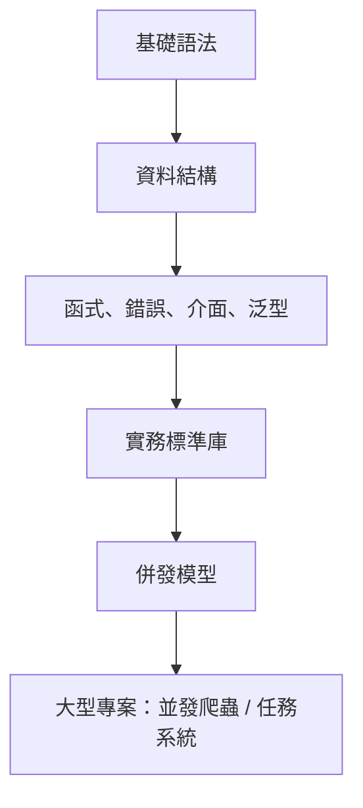

# Golang 語言教學筆記

這是一套給「有程式基礎的新手」的 Go 語言教材。寫法會站在 10 年專案開發經驗的角度：先建立正確語法心智模型，再把語法放進可維護的專案設計中。

## 學習路線



## 章節目錄

| 順序 | 章節 | 重點 |
|---:|---|---|
| 1 | [環境與專案結構](chapters/01-environment-and-project.md) | `go mod`、package、專案目錄 |
| 2 | [基礎語法](chapters/02-basic-syntax.md) | 變數、常數、型別、流程控制、`defer` |
| 3 | [資料結構與物件感](chapters/03-data-structures.md) | array、slice、map、string、struct、pointer |
| 4 | [函式、錯誤、介面、泛型](chapters/04-functions-errors-interfaces-generics.md) | 多回傳值、error wrapping、interface、generics |
| 5 | [實務標準庫](chapters/05-practical-go.md) | JSON、檔案、HTTP、testing、benchmark |
| 6 | [併發程式設計](chapters/06-concurrency.md) | goroutine、channel、select、mutex、worker pool |
| 7 | [大型專案：並發爬蟲 / 任務系統](chapters/07-large-project-concurrent-crawler.md) | 架構、rate limit、retry、context、測試 |

## 可執行範例

```bash
go run ./examples/...
```

## 大型專案測試

```bash
go test ./project-concurrent-crawler/...
```

## 建議讀法

| 階段 | 建議做法 |
|---|---|
| 第一次讀 | 先照章節順序看，重點放在心智模型 |
| 第二次讀 | 邊讀邊跑 `examples`，改參數觀察輸出 |
| 第三次讀 | 看大型專案，把語法對應到真實程式結構 |
| 實務前 | 補上測試、錯誤處理、context，再寫功能 |

## 專案結構

```text
.
├── README.md
├── chapters/
├── examples/
└── project-concurrent-crawler/
```

## 核心觀念

Go 的設計哲學很直接：少一點魔法，多一點可讀性。你會發現 Go 沒有 class、沒有 inheritance、沒有複雜例外機制，但它用 struct、method、interface、composition、goroutine 和 channel 組合出很強的工程能力。
