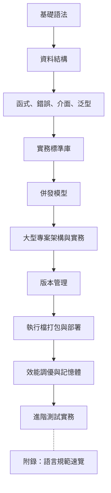

# Golang 語言教學筆記

這是一套給「有程式基礎的新手」的 Go 語言教材。寫法會站在 10 年專案開發經驗的角度：先建立正確語法心智模型，再把語法放進可維護的專案設計中。

> 教材版本：`v1.0.20`
> 教材基準：`Go 1.26.3`
> 這次更新重點：補齊 Go 1.20 Release Note 效能比較矩陣，讓升級評估同時包含官方效能數字、成本變化與驗證方式。

## 版本策略

| 項目 | 目前策略 |
|---|---|
| 教材講解基準 | 以 Go 1.26.3 作為 2026-05 的主教材版本 |
| 範例相容層 | 現有 `go.mod` 仍保留 `go 1.22`，避免舊環境無法執行基本範例 |
| 新特性標示 | Go 1.25 / 1.26 內容會在章節、康乃爾筆記與速查表內明確標示版本 |
| 實務建議 | 新專案建議直接使用目前受支援的最新 Go 1.26 patch release |
| 升級檢查 | 升級 Go 1.26 時同步確認 bootstrap toolchain、目標 OS/ARCH、Docker base image、CI `setup-go` 與 CGO 依賴 |
| 依賴治理 | 每次新增或升級 module 都要跑 `go mod tidy`、`go mod verify`、`go list -m -u all` 與 `govulncheck ./...` |
| 效能診斷 | 效能修改前後需保留 benchmark / profile / metrics 證據，避免只靠直覺調整 |
| Release Note 效能矩陣 | 版本升級頁需列出官方效能數字、升級前後狀態、受影響場景與本地驗證指令 |
| API 合約 | 對外 HTTP endpoint 需有穩定 request/response/error schema，並用 contract test 阻擋破壞性變更 |
| Request decoding | JSON request 需拒絕 malformed body、unknown field、trailing JSON value 與空白必填欄位 |
| 觀測性關聯 | 對外 API 需保留 `X-Request-ID`，並讓 log、trace、metrics 可互相對照 |
| 服務生命週期 | SIGINT/SIGTERM 時先讓 readiness 轉為 draining，再停止收新流量並等待 queue drain |
| Queue shutdown | queue close 與 enqueue 必須由同一個同步邊界保護，避免 shutdown 期間送入已關閉 channel |
| Panic recovery | HTTP handler 需用 middleware 將未預期 panic 轉成穩定 `internal_error` JSON，並保留 request id |
| Retry cancellation | DB deadlock retry 的 backoff 必須尊重 `context` cancellation / deadline，避免 shutdown 或 request timeout 後繼續重試 |
| Request timeout | Handler 造成的 `context.DeadlineExceeded` 應回 `504 request_timeout`，避免 timeout 被誤分類成未知伺服器錯誤 |
| Startup config | `PORT`、`QUEUE_SIZE`、`WORKERS` 等啟動設定需先驗證；錯誤設定應 fail fast，不可靜默套用預設值 |
| Database pool | Postgres 連線池容量與生命週期需由 env 設定並驗證，避免 repository 內硬編碼造成部署容量不可控 |
| Migration contract | DB schema migration 需有 `DATABASE_URL`、`MIGRATIONS_DIR`、`MIGRATION_TIMEOUT` 設定驗證、`schema_migrations` 版本紀錄與重複執行保護 |

## 學習路線



## 章節目錄

| 順序 | 章節 | 重點 |
|---:|---|---|
| 1 | [環境與專案結構](chapters/01-environment-and-project.md) | `go mod`、package、專案目錄 |
| 2 | [基礎語法](chapters/02-basic-syntax.md) | 變數、常數、型別、流程控制、`defer`、`iota`、`init()` |
| 3 | [資料結構與物件感](chapters/03-data-structures.md) | array、slice、map、string、struct、pointer |
| 4 | [函式、錯誤、介面、泛型](chapters/04-functions-errors-interfaces-generics.md) | 多回傳值、error wrapping、interface、generics |
| 5 | [實務標準庫](chapters/05-practical-go.md) | JSON、檔案、HTTP、testing、benchmark |
| 6 | [併發程式設計](chapters/06-concurrency.md) | goroutine、channel、GMP 模型、fan-in/out、errgroup |
| 7 | [大型專案架構與實務](chapters/07-large-project-concurrent-crawler.md) | 目錄佈局、DI、Config、Makefile、並發爬蟲 |
| 8 | [版本管理](chapters/08-version-management.md) | go.mod 深入、SemVer、private module、proxy |
| 9 | [執行檔打包與部署](chapters/09-build-and-deploy.md) | 交叉編譯、ldflags、embed、Docker、CI/CD |
| 10 | [效能調優與記憶體管理](chapters/10-performance-and-memory.md) | Escape Analysis、pprof、GC、sync.Pool、runtime metrics、trace、benchstat |
| 11 | [進階測試實務](chapters/11-advanced-testing.md) | Mocking 策略、Fuzz Testing、Integration Test |

### 附錄

| 順序 | 章節 | 重點 |
|---:|---|---|
| A1 | [語言規範速覽](chapters/A1-language-spec-overview.md) | 標識符、關鍵字、運算子、字面量、作用域、panic/recover |

## 筆記與速查

| 類型 | 檔案/目錄 | 適合 |
|---|---|---|
| **全域知識圖** | **[Golang-Mindmap.md](Golang-Mindmap.md)** | **全局觀覽**、建立知識體系、面試前盤點 |
| 視覺圖解 | [圖解筆記/](圖解筆記/README.md) | **圖像記憶**、理解 GMP/記憶體/底層原理 |
| 康乃爾筆記 | [康乃爾筆記法/](康乃爾筆記法/README.md) | **最新推薦**。複習、準備面試、自我測驗 |
| 基礎速查 | [cheatsheet-basic.md](Cheatsheet/cheatsheet-basic.md) | 剛學 Go、日常快速回憶 |
| 進階速查 | [cheatsheet-advanced.md](Cheatsheet/cheatsheet-advanced.md) | 進階 pattern、效能工具、部署 |

## 可執行範例

```bash
go run ./examples/...
```

## 專案實戰路線

```bash
go test ./project-concurrent-crawler/...
```

| 專案 | 目標 | 建議時機 | 入口 |
|---|---|---|---|
| `project-concurrent-crawler` | 練習 worker pool、retry、parser/store 抽象 | 第一次完成第 7 章後 | `go test ./project-concurrent-crawler/...` |
| `production-api-worker` | 練習 HTTP API、startup config、DB pool contract、migration contract、strict request decoding、transaction、context-aware retry、request timeout contract、queue shutdown safety、observability、panic recovery、graceful shutdown、Docker Compose | 完成第 5、7、9、11 章後 | `cd production-api-worker && go test ./...` |

`production-api-worker` 也附上 [API 合約文件](production-api-worker/docs/api-contract.md)，用來示範 production service 不只要能跑，也要把 endpoint、錯誤格式、相容性規則與 release gate 寫清楚。

## 驗證指令

| 場景 | 指令 | 說明 |
|---|---|---|
| 根目錄範例 | `go run ./examples/...` | 快速確認語法範例可執行 |
| 爬蟲專案 | `go test ./project-concurrent-crawler/...` | 驗證並發流程與 retry |
| Production 專案 | `cd production-api-worker && go test ./...` | 驗證 API、service、worker |
| 受限環境 | `TMPDIR=$PWD/.tmp GOCACHE=$PWD/.gocache GOMODCACHE=$PWD/.gomodcache go test ./...` | 避免使用系統快取路徑 |
| Go 1.26 新特性 | `go1.26.3 test ./...` 或本機 Go 1.26.3 | 驗證 `new(expression)`、`testing/synctest` 等新版內容 |
| Go 1.26 test artifact | `go1.26.3 test -artifacts -outputdir ./test-artifacts ./...` | 驗證 `T.ArtifactDir` / `B.ArtifactDir` / `F.ArtifactDir` 並收集輸出產物 |
| Go 1.26 升級盤點 | 對照第 1 / 9 章的支援矩陣 | 確認 macOS、Windows、FreeBSD、Wasm、bootstrap 與容器建置限制 |
| Go 1.20 效能矩陣 | `rg -n "效能比較|crypto/rsa encryption|runtime/metrics histogram" ReleaseNote/go1.20-release-note.html docs/ReleaseNote/go1.20-release-note.html` | 確認 Release Note 同步記錄官方效能數字與 benchmark / metrics 驗證建議 |
| 依賴供應鏈檢查 | `go mod tidy && go mod verify && go list -m -u all && govulncheck ./...` | 第 8 / 9 / 11 章的依賴治理與 release gate 基線 |
| API 合約回歸 | `cd production-api-worker && go test ./internal/api -run 'Test.*Contract' -count=1` | 驗證 HTTP status、JSON schema 與錯誤 code 沒有意外改變 |
| Request decoding 合約 | `cd production-api-worker && go test ./internal/api -run 'TestRequestDecodingContract' -count=1` | 驗證 malformed JSON、unknown field、trailing JSON 與空白 name 都回 `400 invalid_input` |
| Request ID 合約 | `cd production-api-worker && go test ./internal/api -run 'TestRequestIDContract|TestCreateJobContract' -count=1` | 驗證 `X-Request-ID` 會回傳並進入 request context |
| Readiness / drain 合約 | `cd production-api-worker && go test ./internal/api -run 'TestReadinessContract' -count=1` | 驗證 draining 時 `/readyz` 會回 503，讓 LB / orchestrator 停止導流 |
| Worker shutdown 安全 | `cd production-api-worker && go test ./internal/worker -run 'Test.*Shutdown|TestConcurrentEnqueueAndShutdownDoesNotPanic' -count=1` | 驗證 queue 關閉後 enqueue 回穩定錯誤，shutdown 期間不會送入已關閉 channel |
| Panic recovery 合約 | `cd production-api-worker && go test ./internal/api -run 'TestPanicRecoveryContract' -count=1` | 驗證 handler panic 會回 `500`、`internal_error` JSON 與原 request id |
| Request timeout 合約 | `cd production-api-worker && go test ./internal/api -run 'TestRequestTimeoutContract' -count=1` | 驗證 handler timeout 會回 `504 request_timeout`，不漂移成 `500 internal_error` |
| Retry cancellation 合約 | `cd production-api-worker && go test ./internal/app -run 'TestCreateJobStopsDeadlockRetryWhenContextCanceled' -count=1` | 驗證 deadlock backoff 遇到 request cancel / shutdown context 會立即停止，不再重試或 enqueue |
| Startup / DB pool 合約 | `cd production-api-worker && go test ./internal/config -count=1` | 驗證 `PORT`、`QUEUE_SIZE`、`WORKERS`、`DATABASE_MAX_OPEN_CONNS`、`DATABASE_MAX_IDLE_CONNS` 與 `DATABASE_CONN_MAX_LIFETIME` 預設值、合法 env 與錯誤設定 fail-fast 行為 |
| Migration 合約 | `cd production-api-worker && go test ./internal/config ./internal/migration -count=1` | 驗證 migration env、timeout、SQL 檔排序與 migration version 命名規則 |
| 效能 A/B 驗證 | `go test -run='^$' -bench=. -benchmem -count=10 ./... > bench.txt` | 搭配 `benchstat old.txt new.txt` 比較修改前後差異 |
| Runtime profile | `go tool pprof http://localhost:6060/debug/pprof/profile?seconds=30` | CPU 熱點；block/mutex profile 需先在程式中啟用 |
| Execution trace | `go test -trace=trace.out ./... && go tool trace trace.out` | 分析排程、syscall、GC 與平行度，不用來取代 CPU/heap profile |

> 若在 sandbox / 離線環境執行：
> - `project-concurrent-crawler` 可能因本機 `dyld` / test binary 工具鏈異常失敗。
> - `production-api-worker` 第一次抓依賴需要網路；無法連外時會停在 module download。
> - `govulncheck` 與 `go list -m -u all` 需要可連線到 module proxy / vulnerability database；離線環境可保留命令與結果待補。
> - 目前本機若仍是 Go 1.22.x，只能驗證既有相容範例；Go 1.26 新語法與測試 API 需換成 Go 1.26.3 toolchain。

## 建議讀法

| 階段 | 建議做法 |
|---|---|
| 第一次讀 | 先照章節順序看，重點放在心智模型 |
| 第二次讀 | 邊讀邊跑 `examples`，改參數觀察輸出 |
| 第三次讀 | 先看 `project-concurrent-crawler`，把語法對應到真實程式結構 |
| 第四次讀 | 再看 `production-api-worker`，補上 API、觀測性與部署流程 |
| 實務前 | 補上測試、錯誤處理、context，再寫功能 |
| 速查 | 開發中隨時翻 Cheat Sheet |

## 專案結構

```text
.
├── README.md
├── Golang-Mindmap.md          ← 🗺️ 全域知識心智圖
├── 圖解筆記/                    ← 🎨 視覺化流程圖與底層結構圖
├── 康乃爾筆記法/                ← 【重點】章節複習與自我測驗用
├── Cheatsheet/
│   ├── cheatsheet-basic.md        ← 基礎速查
│   └── cheatsheet-advanced.md     ← 進階速查
├── chapters/
├── examples/
├── project-concurrent-crawler/    ← 第 1 個大型專案：並發爬蟲
└── production-api-worker/         ← 第 2 個大型專案：production API + worker
```


## 核心觀念

Go 的設計哲學很直接：少一點魔法，多一點可讀性。你會發現 Go 沒有 class、沒有 inheritance、沒有複雜例外機制，但它用 struct、method、interface、composition、goroutine 和 channel 組合出很強的工程能力。
