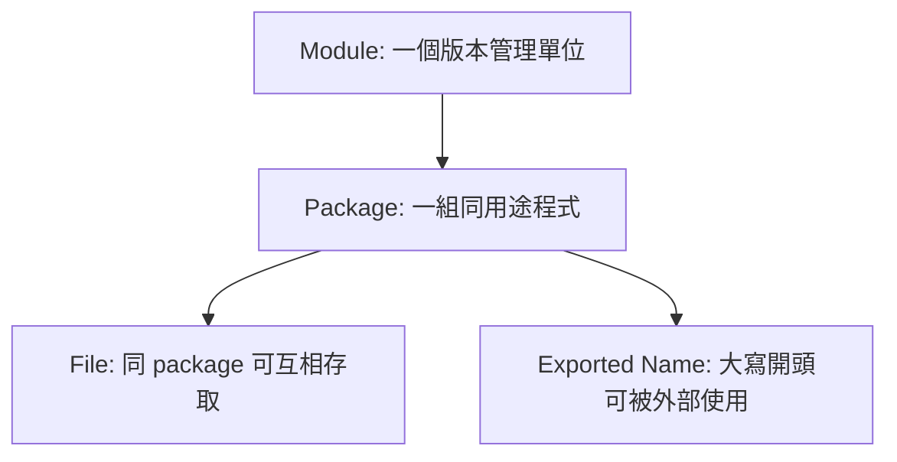

# 01. 環境與專案結構

> **本教材撰寫基準版本：Go 1.26.5**
> 內容涵蓋 Go 1.18（generics）、Go 1.21（`min`/`max`/`clear`）、Go 1.22（range-over-int、loop variable fix）、Go 1.25（container-aware `GOMAXPROCS`、`testing/synctest`）與 Go 1.26（`new(expression)`、Green Tea GC、`T.ArtifactDir`）等重要特性。如使用較舊版本，部分語法可能不支援。

Go 專案的第一個重點不是語法，而是「程式如何被組織、編譯、測試」。Go 的工具鏈很完整，學會 `go` 指令等於學會一半日常工作流。

## 支援的作業系統與平台

Go 是跨平台語言，官方支援以下主要環境：

| 作業系統 | 架構 | 常見用途 |
|---|---|---|
| **Linux** | amd64 | 伺服器、Docker 容器、雲端 |
| **Linux** | arm64 | Raspberry Pi 4、AWS Graviton、ARM 伺服器 |
| **Linux** | arm (v6/v7) | Raspberry Pi 3、嵌入式裝置 |
| **macOS** | arm64 (Apple Silicon) | 開發機（M1/M2/M3/M4） |
| **macOS** | amd64 (Intel) | 開發機（舊款 Mac） |
| **Windows** | amd64 | 開發機、Windows Server |
| **FreeBSD** | amd64, arm64 | 特殊伺服器環境 |

> 完整列表可用 `go tool dist list` 查看，Go 支援超過 40 種 GOOS/GOARCH 組合。

### Go 1.26 平台與升級注意事項

Go 的平台支援不是永久不變。升級 toolchain 時，應把語法/API 相容性、OS 生命週期、交叉編譯目標與 CI runner 一起檢查。

| 項目 | Go 1.26 重點 | 對專案的影響 |
|---|---|---|
| Bootstrap toolchain | Go 1.26 需要 Go 1.24.6 或更新版本才能從原始碼 bootstrap | 自建 toolchain 或企業內部映像需先更新 builder |
| macOS | Go 1.26 是最後支援 macOS 12 Monterey 的版本；Go 1.27 將要求 macOS 13+ | 舊 Mac runner / 開發機要提前規劃升級 |
| Windows | `GOOS=windows GOARCH=arm` 已移除 | 發布矩陣不要再保留 32-bit Windows ARM 目標 |
| FreeBSD | `freebsd/riscv64` 在 Go 1.26 標記為 broken | 若有特殊平台部署，需用 `go tool dist list` 與實機 CI 驗證 |
| Linux RISC-V | `linux/riscv64` 支援 race detector | RISC-V 服務可把 `go test -race` 納入更完整的併發驗證 |
| WebAssembly | `GOWASM=signext` / `satconv` 設定已被忽略 | Wasm build script 可移除過時 feature flag |

> **工程經驗**：不要只把 `go.mod` 改成新版本。一次完整升級至少要同步檢查 `go.mod`、Docker builder image、CI `setup-go`、本機安裝版本、release build matrix 與客戶端最低作業系統。

### 安裝方式

| 作業系統 | 安裝方式 | 指令 |
|---|---|---|
| **macOS** | Homebrew | `brew install go` |
| **macOS** | 官方安裝包 | [golang.org/dl](https://golang.org/dl/) 下載 `.pkg` |
| **Linux (Ubuntu/Debian)** | apt | `sudo apt install golang-go` |
| **Linux** | 官方 tarball | `sudo tar -C /usr/local -xzf go*.tar.gz` |
| **Windows** | 官方安裝包 | [golang.org/dl](https://golang.org/dl/) 下載 `.msi` |
| **Windows** | Scoop | `scoop install go` |
| **任何平台** | 版本管理工具 | `go install golang.org/dl/go1.26.5@latest` |

```bash
# 確認安裝成功
go version
# go version go1.26.5 darwin/arm64

# 查看環境設定
go env GOROOT GOPATH GOOS GOARCH
```

### 重要環境變數

| 環境變數 | 說明 | 預設值 |
|---|---|---|
| `GOROOT` | Go 安裝目錄 | 自動偵測 |
| `GOPATH` | 工作目錄（放下載的 module cache） | `~/go` |
| `GOBIN` | `go install` 產出的執行檔目錄 | `$GOPATH/bin` |
| `GOOS` | 目標作業系統 | 當前系統 |
| `GOARCH` | 目標 CPU 架構 | 當前架構 |
| `GOPROXY` | Module proxy | `https://proxy.golang.org,direct` |
| `GOPRIVATE` | 私有 module pattern | 空 |

> **工程經驗**：安裝完後把 `$GOPATH/bin` 加入 `PATH`，這樣 `go install` 安裝的工具（如 `golangci-lint`、`gopls`）就能直接執行。

## Go 工具鏈

| 指令 | 用途 | 常用時機 |
|---|---|---|
| `go version` | 查看版本 | 確認環境 |
| `go mod init` | 建立 module | 新專案開始 |
| `go run` | 編譯後立即執行 | 快速驗證 |
| `go test` | 執行測試 | 每次改程式後 |
| `go build` | 建立執行檔 | 發布或部署前 |
| `go fmt` | 格式化程式 | 提交前 |
| `go doc` | 查文件 | 看標準庫 API |

## Module、Package、File 的關係



## 建立專案

```bash
mkdir hello-go
cd hello-go
go mod init example.com/hello-go
```

`go.mod` 會記錄 module 名稱與 Go 版本：

```go
module example.com/hello-go

go 1.26
```

> **版本策略**：教材文字以 Go 1.26.5 為基準；本 repo 內部分可執行範例仍可能保留 `go 1.22`，用來維持舊 toolchain 的學習相容性。新專案建議使用當前支援中的最新 Go patch release。

## 最小程式

```go
package main

import "fmt"

func main() {
	fmt.Println("Hello, Go")
}
```

| 語法 | 說明 |
|---|---|
| `package main` | 可被編譯成執行檔 |
| `import "fmt"` | 匯入標準庫格式化輸出套件 |
| `func main()` | 程式進入點 |
| `fmt.Println` | 呼叫 package 中的大寫公開函式 |

## 實務專案結構

```text
my-service/
├── go.mod
├── cmd/
│   └── api/
│       └── main.go
├── internal/
│   ├── service/
│   └── repository/
└── pkg/
```

| 目錄 | 角色 |
|---|---|
| `cmd/` | 放不同執行檔入口 |
| `internal/` | 只允許本 module 內使用，適合放核心商業邏輯 |
| `pkg/` | 可被外部 import 的 reusable 套件 |

## 常見錯誤

| 錯誤 | 原因 | 修正 |
|---|---|---|
| `package command-line-arguments is not a main package` | 執行了非 `main` package | 改跑正確入口或用 `go test` |
| `no required module provides package` | module 或 import path 不正確 | 檢查 `go.mod` 與 import |
| 小寫函式外部不能用 | Go 用大小寫控制可見性 | 需要公開就大寫開頭 |

## 小練習

1. 建立一個新資料夾並執行 `go mod init`。
2. 寫一個 `main.go` 印出你的名字。
3. 建立另一個 package，放一個大寫開頭函式，再從 `main` 呼叫它。
