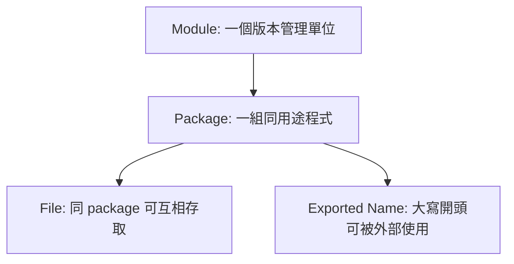

# 01. 環境與專案結構

Go 專案的第一個重點不是語法，而是「程式如何被組織、編譯、測試」。Go 的工具鏈很完整，學會 `go` 指令等於學會一半日常工作流。

## Go 工具鏈

| 指令 | 用途 | 常用時機 |
|---|---|---|
| `go version` | 查看版本 | 確認環境 |
| `go mod init` | 建立 module | 新專案開始 |
| `go run` | 編譯後立即執行 | 快速驗證 |
| `go test` | 執行測試 | 每次改程式後 |
| `go build` | 建立執行檔 | 發布或部署前 |
| `go fmt` | 格式化程式 | 提交前 |
| `go doc` | 查文件 | 看標準庫 API |

## Module、Package、File 的關係



## 建立專案

```bash
mkdir hello-go
cd hello-go
go mod init example.com/hello-go
```

`go.mod` 會記錄 module 名稱與 Go 版本：

```go
module example.com/hello-go

go 1.22
```

## 最小程式

```go
package main

import "fmt"

func main() {
	fmt.Println("Hello, Go")
}
```

| 語法 | 說明 |
|---|---|
| `package main` | 可被編譯成執行檔 |
| `import "fmt"` | 匯入標準庫格式化輸出套件 |
| `func main()` | 程式進入點 |
| `fmt.Println` | 呼叫 package 中的大寫公開函式 |

## 實務專案結構

```text
my-service/
├── go.mod
├── cmd/
│   └── api/
│       └── main.go
├── internal/
│   ├── service/
│   └── repository/
└── pkg/
```

| 目錄 | 角色 |
|---|---|
| `cmd/` | 放不同執行檔入口 |
| `internal/` | 只允許本 module 內使用，適合放核心商業邏輯 |
| `pkg/` | 可被外部 import 的 reusable 套件 |

## 常見錯誤

| 錯誤 | 原因 | 修正 |
|---|---|---|
| `package command-line-arguments is not a main package` | 執行了非 `main` package | 改跑正確入口或用 `go test` |
| `no required module provides package` | module 或 import path 不正確 | 檢查 `go.mod` 與 import |
| 小寫函式外部不能用 | Go 用大小寫控制可見性 | 需要公開就大寫開頭 |

## 小練習

1. 建立一個新資料夾並執行 `go mod init`。
2. 寫一個 `main.go` 印出你的名字。
3. 建立另一個 package，放一個大寫開頭函式，再從 `main` 呼叫它。
