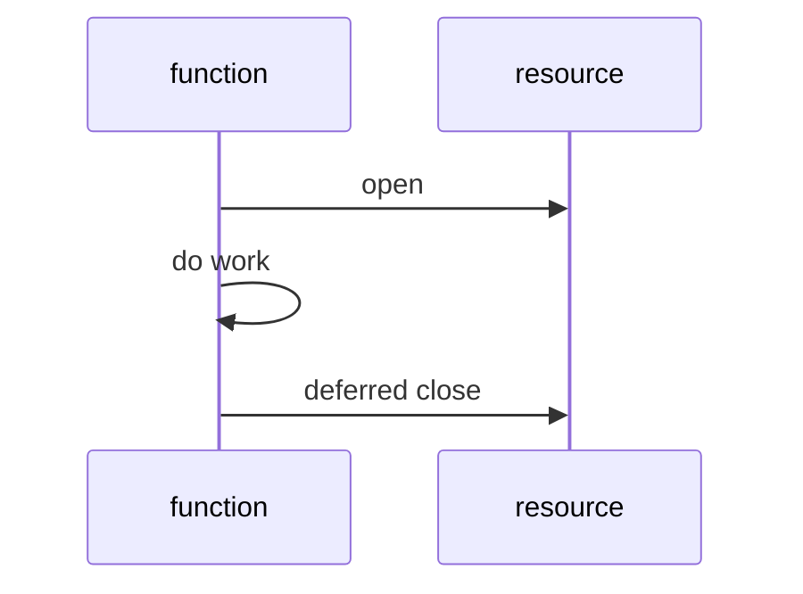

# 02. 基礎語法

Go 語法的特色是明確、少分支。你會常看到一件事：Go 寧願多寫一行，也不讓讀者猜。

## 變數宣告

| 寫法 | 範例 | 適合時機 |
|---|---|---|
| `var name type` | `var age int` | 需要明確型別或 package scope |
| `var name = value` | `var name = "Gopher"` | 讓編譯器推斷 |
| `:=` | `count := 3` | 函式內最常用 |
| 多變數 | `x, y := 1, 2` | 同時取得多回傳值 |

```go
var age int
name := "Gopher"
score, passed := 95, true
```

## 零值

Go 變數宣告後一定有值，這叫 zero value。

| 型別 | 零值 |
|---|---|
| `int`、`float64` | `0` |
| `bool` | `false` |
| `string` | `""` |
| pointer、slice、map、channel、function、interface | `nil` |

```go
var total int
var title string
var ok bool

fmt.Println(total, title, ok)
```

## 常數

```go
const MaxRetry = 3
const ServiceName = "crawler"
```

常數在編譯期確定，適合放不會因執行環境改變的值。

## 型別轉換

Go 不做隱式數字轉換。

```go
var count int = 10
var ratio float64 = float64(count) / 3.0
```

| 語言習慣 | Go 作法 |
|---|---|
| 自動把 int 轉 float | 必須手動 `float64(count)` |
| 字串與數字相加 | 使用 `fmt.Sprintf` 或 `strconv` |
| 任意型別比較 | 只有 comparable 型別能用 `==` |

## 流程控制

### if

```go
if score >= 60 {
	fmt.Println("pass")
} else {
	fmt.Println("retry")
}
```

Go 的 `if` 可以先宣告短變數：

```go
if value, ok := cache["user:1"]; ok {
	fmt.Println(value)
}
```

### switch

```go
switch status {
case "new":
	fmt.Println("create")
case "done":
	fmt.Println("archive")
default:
	fmt.Println("ignore")
}
```

Go 的 `switch` 預設不會 fallthrough。

### for

Go 只有 `for`，沒有 `while`。

```go
for i := 0; i < 3; i++ {
	fmt.Println(i)
}

for running {
	doWork()
}

for {
	break
}
```

## defer

`defer` 會在函式結束前執行，常用於釋放資源。

```go
file, err := os.Open("data.txt")
if err != nil {
	return err
}
defer file.Close()
```



## 常見錯誤

| 錯誤 | 說明 | 建議 |
|---|---|---|
| 在函式外使用 `:=` | `:=` 只能在函式內 | package scope 用 `var` |
| 忘記處理 `err` | Go 不用 exception 傳遞一般錯誤 | 每個錯誤都要決策 |
| 在 loop 裡大量 `defer` | defer 到函式結束才執行 | 長迴圈中手動 close |

## 小練習

1. 寫一個函式判斷分數等級。
2. 用 `switch` 處理 `new`、`running`、`done` 狀態。
3. 寫一段開檔案後用 `defer` 關閉的程式。
