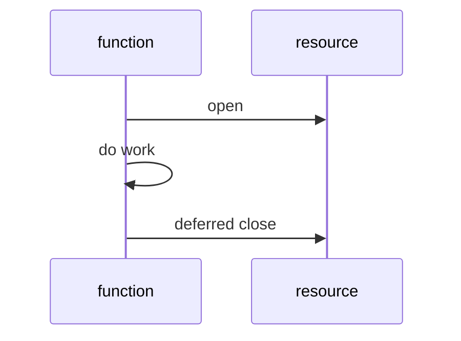
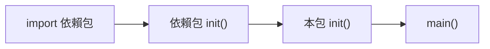

# 02. 基礎語法

Go 語法的特色是明確、少分支。你會常看到一件事：Go 寧願多寫一行，也不讓讀者猜。

## 變數宣告

| 寫法 | 範例 | 適合時機 |
|---|---|---|
| `var name type` | `var age int` | 需要明確型別或 package scope |
| `var name = value` | `var name = "Gopher"` | 讓編譯器推斷 |
| `:=` | `count := 3` | 函式內最常用 |
| 多變數 | `x, y := 1, 2` | 同時取得多回傳值 |

```go
var age int
name := "Gopher"
score, passed := 95, true
```

## 資料型別定義與長度

Go 的型別系統是靜態、強型別的。以下是所有內建型別及其記憶體大小。

### 整數型別

| 型別 | 大小 (bytes) | 大小 (bits) | 值範圍 | 說明 |
|---|---:|---:|---|---|
| `int8` | 1 | 8 | -128 ~ 127 | 有號 8 位元 |
| `int16` | 2 | 16 | -32,768 ~ 32,767 | 有號 16 位元 |
| `int32` | 4 | 32 | -2,147,483,648 ~ 2,147,483,647 | 有號 32 位元，等同 `rune` |
| `int64` | 8 | 64 | -9.2×10¹⁸ ~ 9.2×10¹⁸ | 有號 64 位元 |
| `int` | 4 或 8 | 32 或 64 | 依平台 | **最常用**，64 位元系統上為 8 bytes |
| `uint8` | 1 | 8 | 0 ~ 255 | 無號 8 位元，等同 `byte` |
| `uint16` | 2 | 16 | 0 ~ 65,535 | 無號 16 位元 |
| `uint32` | 4 | 32 | 0 ~ 4,294,967,295 | 無號 32 位元 |
| `uint64` | 8 | 64 | 0 ~ 1.8×10¹⁹ | 無號 64 位元 |
| `uint` | 4 或 8 | 32 或 64 | 依平台 | 無號，跟隨系統位元數 |
| `uintptr` | 4 或 8 | 32 或 64 | 依平台 | 存指標位址用，低階操作 |

### 浮點數型別

| 型別 | 大小 (bytes) | 精度 | 說明 |
|---|---:|---|---|
| `float32` | 4 | ~7 位有效數字 | 單精度 IEEE 754 |
| `float64` | 8 | ~15 位有效數字 | **最常用**，雙精度 IEEE 754 |

### 複數型別

| 型別 | 大小 (bytes) | 組成 | 說明 |
|---|---:|---|---|
| `complex64` | 8 | 2 × float32 | 複數（實部 + 虛部） |
| `complex128` | 16 | 2 × float64 | 複數（實部 + 虛部） |

### 布林與字串

| 型別 | 大小 (bytes) | 說明 |
|---|---:|---|
| `bool` | 1 | `true` 或 `false` |
| `string` | 16 | header（pointer 8 + length 8），實際字串資料在 heap |

### 別名型別

| 別名 | 實際型別 | 大小 (bytes) | 用途 |
|---|---|---:|---|
| `byte` | `uint8` | 1 | 原始位元組，常用於 I/O |
| `rune` | `int32` | 4 | Unicode code point，處理文字 |

### 複合型別的記憶體結構

| 型別 | Header 大小 (bytes) | 說明 |
|---|---:|---|
| `slice` | 24 | pointer(8) + length(8) + capacity(8) |
| `map` | 8 | pointer to hash table |
| `channel` | 8 | pointer to channel struct |
| `interface` | 16 | type pointer(8) + data pointer(8) |
| `func` | 8 | pointer to function |
| `pointer` | 8 | 64 位元系統上的位址 |

> **工程經驗**：日常開發用 `int` 和 `float64` 就好。只有在效能敏感（如大量資料陣列）、網路協議解析、或嵌入式系統才需要指定精確位元數的型別。

```go
// 查看型別大小
import "unsafe"

fmt.Println(unsafe.Sizeof(int(0)))       // 8（64 位元系統）
fmt.Println(unsafe.Sizeof(float64(0)))   // 8
fmt.Println(unsafe.Sizeof(""))           // 16（string header）
fmt.Println(unsafe.Sizeof([]int{}))      // 24（slice header）
```

## 零值

Go 變數宣告後一定有值，這叫 zero value。

| 型別 | 零值 |
|---|---|
| `int`、`float64` | `0` |
| `bool` | `false` |
| `string` | `""` |
| pointer、slice、map、channel、function、interface | `nil` |

```go
var total int
var title string
var ok bool

fmt.Println(total, title, ok)
```

## 常數

```go
const MaxRetry = 3
const ServiceName = "crawler"
```

常數在編譯期確定，適合放不會因執行環境改變的值。

## 型別轉換

Go 不做隱式數字轉換。

```go
var count int = 10
var ratio float64 = float64(count) / 3.0
```

| 語言習慣 | Go 作法 |
|---|---|
| 自動把 int 轉 float | 必須手動 `float64(count)` |
| 字串與數字相加 | 使用 `fmt.Sprintf` 或 `strconv` |
| 任意型別比較 | 只有 comparable 型別能用 `==` |

## 流程控制

### if

```go
if score >= 60 {
	fmt.Println("pass")
} else {
	fmt.Println("retry")
}
```

Go 的 `if` 可以先宣告短變數：

```go
if value, ok := cache["user:1"]; ok {
	fmt.Println(value)
}
```

### switch

```go
switch status {
case "new":
	fmt.Println("create")
case "done":
	fmt.Println("archive")
default:
	fmt.Println("ignore")
}
```

Go 的 `switch` 預設不會 fallthrough。

### for

Go 只有 `for`，沒有 `while`。

```go
for i := 0; i < 3; i++ {
	fmt.Println(i)
}

for running {
	doWork()
}

for {
	break
}
```

## defer

`defer` 會在函式結束前執行，常用於釋放資源。

```go
file, err := os.Open("data.txt")
if err != nil {
	return err
}
defer file.Close()
```



## 常見錯誤

| 錯誤 | 說明 | 建議 |
|---|---|---|
| 在函式外使用 `:=` | `:=` 只能在函式內 | package scope 用 `var` |
| 忘記處理 `err` | Go 不用 exception 傳遞一般錯誤 | 每個錯誤都要決策 |
| 在 loop 裡大量 `defer` | defer 到函式結束才執行 | 長迴圈中手動 close |

## `iota` 與枚舉模式

Go 沒有 `enum` 關鍵字，但 `iota` 搭配 `const` block 可以做出型別安全的枚舉。

```go
type Status int

const (
	StatusNew     Status = iota // 0
	StatusRunning               // 1
	StatusDone                  // 2
	StatusFailed                // 3
)
```

`iota` 從 0 開始，每一行加 1。可以搭配位運算做 bitmask：

```go
type Permission int

const (
	PermRead    Permission = 1 << iota // 1
	PermWrite                          // 2
	PermExecute                        // 4
)

// 組合使用
access := PermRead | PermWrite // 3
```

| 技巧 | 範例 | 說明 |
|---|---|---|
| 跳過值 | `_ = iota` 佔位 | 用 blank identifier 跳過 |
| 起始非零 | `iota + 1` | 第一個值從 1 開始 |
| 搭配 `String()` | 實作 `Stringer` interface | 讓 `fmt.Println` 輸出可讀名稱 |

```go
func (s Status) String() string {
	names := [...]string{"new", "running", "done", "failed"}
	if int(s) < len(names) {
		return names[s]
	}
	return "unknown"
}
```

## `init()` 函式

`init()` 在 `main()` 之前自動執行，每個檔案可以有多個 `init()`。

```go
var defaultTimeout time.Duration

func init() {
	defaultTimeout = 5 * time.Second
}
```



| 適合用 `init()` 的場景 | 不適合的場景 |
|---|---|
| 註冊 driver（如 `database/sql`） | 複雜的初始化邏輯 |
| 設定 package 級別預設值 | 有錯誤需要回傳的初始化 |
| 驗證編譯期假設 | 依賴外部服務的初始化 |

> **工程經驗**：`init()` 容易讓程式啟動順序變得不透明。實務上偏好顯式的 `New()` 或 `Setup()` 函式，只在框架級的 driver 註冊才用 `init()`。

## Blank Identifier `_`

`_` 是 Go 的「我知道有這個值，但我不需要它」語法。

```go
// 忽略不需要的回傳值
_, err := strconv.Atoi("123")

// 強制 interface 滿足檢查（編譯期驗證）
var _ io.Writer = (*MyWriter)(nil)

// import side-effect only（觸發 init）
import _ "net/http/pprof"

// range 只需要 value
for _, v := range items {
	process(v)
}
```

| 用途 | 範例 |
|---|---|
| 忽略回傳值 | `_, err := fn()` |
| 編譯期 interface 檢查 | `var _ Interface = (*Type)(nil)` |
| Side-effect import | `import _ "pkg"` |
| 忽略 range index | `for _, v := range s` |

## 型別別名 vs 型別定義

```go
// 型別定義：建立全新型別，不能直接與原型別互換
type UserID int64

// 型別別名：完全等同原型別，可互換
type ID = int64
```

| 比較 | 型別定義 `type A B` | 型別別名 `type A = B` |
|---|---|---|
| 新型別 | 是 | 否 |
| 可加 method | 是 | 否（除非原型別在同 package） |
| 相互賦值 | 需要轉換 | 直接可用 |
| 使用場景 | 業務語意（`UserID`、`Money`） | 漸進式重構、跨套件別名 |

## `fmt` 格式化動詞速查

| 動詞 | 說明 | 範例輸出 |
|---|---|---|
| `%v` | 預設格式 | `{1 Amy}` |
| `%+v` | 帶欄位名 | `{ID:1 Name:Amy}` |
| `%#v` | Go 語法表示 | `main.User{ID:1, Name:"Amy"}` |
| `%T` | 型別 | `main.User` |
| `%d` | 十進位整數 | `42` |
| `%x` | 十六進位 | `2a` |
| `%f` | 浮點數 | `3.141593` |
| `%.2f` | 指定精度 | `3.14` |
| `%s` | 字串 | `hello` |
| `%q` | 帶引號字串 | `"hello"` |
| `%p` | 指標位址 | `0xc000018080` |
| `%t` | 布林值 | `true` |
| `%w` | 錯誤包裝（`fmt.Errorf` 專用） | — |

```go
user := User{ID: 1, Name: "Amy"}
fmt.Printf("default:   %v\n", user)
fmt.Printf("verbose:   %+v\n", user)
fmt.Printf("go-syntax: %#v\n", user)
fmt.Printf("type:      %T\n", user)
```

## 小練習

1. 寫一個函式判斷分數等級。
2. 用 `switch` 處理 `new`、`running`、`done` 狀態。
3. 寫一段開檔案後用 `defer` 關閉的程式。
4. 用 `iota` 定義一組 HTTP method 常數，並實作 `String()` 方法。
5. 寫一個 `var _ Interface = (*Type)(nil)` 的編譯期檢查。
6. 用 `%+v` 和 `%#v` 印出一個 struct，觀察差異。
