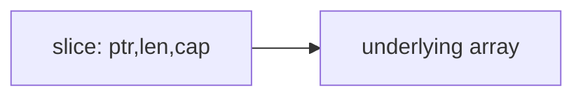
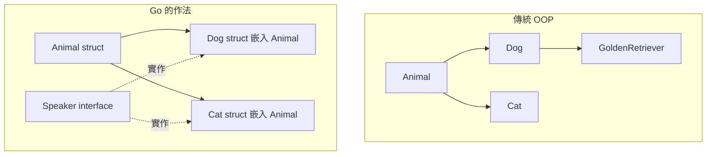
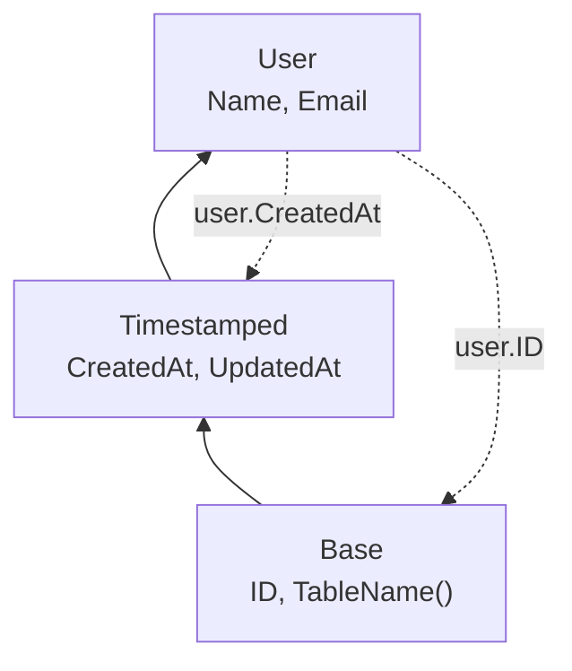
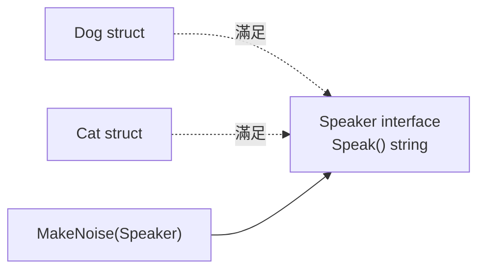

# 03. 資料結構與物件感

Go 沒有 class，但它不是不能做物件導向。Go 的物件感來自 `struct + method + interface + composition`。

## array 與 slice

| 類型 | 長度 | 常用程度 | 說明 |
|---|---:|---|---|
| array | 固定 | 較少 | `[3]int` 和 `[4]int` 是不同型別 |
| slice | 可變 | 很常用 | 對底層 array 的視窗 |

```go
arr := [3]int{1, 2, 3}
nums := []int{1, 2, 3}
nums = append(nums, 4)
```



## map

```go
scores := map[string]int{
	"amy": 90,
	"bob": 75,
}

score, ok := scores["amy"]
```

| 操作 | 範例 |
|---|---|
| 新增 / 更新 | `scores["cat"] = 88` |
| 讀取並判斷存在 | `v, ok := scores["cat"]` |
| 刪除 | `delete(scores, "cat")` |

注意：map 不是 thread-safe，多 goroutine 同時讀寫要加鎖或改用 channel 設計。

## 泛型集合套件 (Go 1.21+)

Go 1.21 引入了強大的 `slices` 和 `maps` 標準庫，利用泛型省去了大量手寫迴圈的麻煩。

### `slices` 套件

```go
import "slices"

nums := []int{1, 5, 3, 2, 4}

// 排序與反轉
slices.Sort(nums)             // [1, 2, 3, 4, 5]
slices.Reverse(nums)          // [5, 4, 3, 2, 1]

// 搜尋與判斷
found := slices.Contains(nums, 3)     // true
idx := slices.Index(nums, 5)          // 0
maxVal := slices.Max(nums)            // 5

// 比較與複製
clone := slices.Clone(nums)           // 建立新底層 array 的副本
isEqual := slices.Equal(nums, clone)  // true

// 刪除與插入
nums = slices.Delete(nums, 1, 3)      // 刪除 index 1 到 2，變成 [5, 2, 1]
nums = slices.Insert(nums, 1, 9, 8)   // 在 index 1 插入，變成 [5, 9, 8, 2, 1]

// 搭配自訂比較函式
type User struct{ Age int }
users := []User{{Age: 20}, {Age: 10}}
slices.SortFunc(users, func(a, b User) int {
	return cmp.Compare(a.Age, b.Age)  // 需 import "cmp"
})
```

### `maps` 套件

```go
import "maps"

m1 := map[string]int{"a": 1, "b": 2}

// 複製 map
m2 := maps.Clone(m1)

// 判斷相等
isEqual := maps.Equal(m1, m2) // true

// 刪除符合條件的 key-value
maps.DeleteFunc(m1, func(k string, v int) bool {
	return v < 2
}) // m1 變成 {"b": 2}

// Go 1.23+ 補充：提取 Keys 和 Values (回傳 iterator)
// for k := range maps.Keys(m1) { ... }
```

## string、byte、rune

| 型別 | 意義 | 常見用途 |
|---|---|---|
| `byte` | `uint8` | 原始位元組 |
| `rune` | `int32` | Unicode code point |
| `string` | 唯讀 byte sequence | 文字 |

```go
text := "台灣Go"
fmt.Println(len(text))         // 8（byte 數，台=3B, 灣=3B, Go=2B）
fmt.Println(len([]rune(text))) // 4（字元數）

// 正確遍歷 Unicode 字串
for i, r := range text {
	fmt.Printf("index=%d rune=%c\n", i, r)
}
```

### `strings` 常用函式

```go
s := "  Hello, Go World!  "

// 判斷
strings.Contains(s, "Go")        // true
strings.HasPrefix(s, "  Hello")  // true
strings.HasSuffix(s, "World!  ") // true
strings.Count(s, "o")            // 2

// 轉換
strings.ToUpper(s)               // 大寫
strings.ToLower(s)               // 小寫
strings.TrimSpace(s)             // "Hello, Go World!"（去除前後空白）
strings.Trim(s, " !")            // 去除指定字元
strings.Replace(s, "Go", "Rust", 1)  // 替換第一個
strings.ReplaceAll(s, "o", "0")      // 替換全部

// 分割與合併
parts := strings.Split("a,b,c", ",")   // ["a","b","c"]
fields := strings.Fields("  a b  c  ") // ["a","b","c"]（按空白分割）
joined := strings.Join(parts, "-")     // "a-b-c"

// 查找
strings.Index(s, "Go")          // 回傳位置（-1 表示不存在）
strings.TrimPrefix(s, "  ")     // 去除指定前綴
strings.TrimSuffix(s, "  ")     // 去除指定後綴
strings.Cut(s, ",")             // before, after, found（Go 1.18+，優於 Split）
```

### `strings.Builder` — 高效字串拼接

在迴圈中用 `+` 拼接字串會每次建立新 string（O(n²) 複雜度），應改用 `strings.Builder`：

```go
// ✗ 低效：每次 += 都新建 string
var result string
for i := 0; i < 1000; i++ {
	result += strconv.Itoa(i) + ","
}

// ✓ 高效：strings.Builder 直接寫入 buffer
var sb strings.Builder
sb.Grow(4096) // 可選：預先分配容量，減少 reallocation
for i := 0; i < 1000; i++ {
	sb.WriteString(strconv.Itoa(i))
	sb.WriteByte(',')
}
result := sb.String()
```

| strings.Builder 方法 | 用途 |
|---|---|
| `WriteString(s)` | 寫入字串 |
| `WriteByte(b)` | 寫入單一 byte |
| `WriteRune(r)` | 寫入 rune（Unicode） |
| `Grow(n)` | 預先分配至少 n byte 空間 |
| `String()` | 取得最終字串 |
| `Reset()` | 清空（可配合 sync.Pool 重用）|

### `strconv` — 型別轉換

```go
// string → 數字
n, err := strconv.Atoi("42")         // string → int（最常用）
i64, err := strconv.ParseInt("42", 10, 64)  // 指定 base 和 bit size
f, err := strconv.ParseFloat("3.14", 64)
b, err := strconv.ParseBool("true")

// 數字 → string
s := strconv.Itoa(42)              // int → string（最常用）
s = strconv.FormatInt(42, 16)      // int → hex string "2a"
s = strconv.FormatFloat(3.14, 'f', 2, 64) // "3.14"
s = strconv.FormatBool(true)       // "true"

// fmt.Sprintf 也可以，但 strconv 更快（不需 reflection）
s = fmt.Sprintf("%d", 42) // 較慢但格式更彈性
```

### `regexp` — 正規表示式基礎

```go
import "regexp"

// 編譯 pattern（建議用 MustCompile 在套件層級，而不是每次請求時 Compile）
var emailRegex = regexp.MustCompile(`^[a-zA-Z0-9._%+\-]+@[a-zA-Z0-9.\-]+\.[a-zA-Z]{2,}$`)

// 判斷是否匹配
if !emailRegex.MatchString(email) {
	return errors.New("invalid email")
}

// 取得 match
re := regexp.MustCompile(`(\d+)-(\d+)`)
matches := re.FindStringSubmatch("2024-01") // ["2024-01", "2024", "01"]

// 全部 match
all := re.FindAllString("1-2 and 3-4", -1) // ["1-2", "3-4"]

// 取代
result := re.ReplaceAllString("2024-01", "$2/$1") // "01/2024"
```

> **工程經驗**：`regexp.Compile` 是耗時操作，應在套件 init 時或 `var` 層級預先編譯（用 `MustCompile`），而不是在每次 HTTP request 裡呼叫。


## struct

struct 是 Go 最重要的資料建模工具，扮演其他語言中 `class` 的角色。

```go
type User struct {
	ID        int
	Name      string
	Email     string
	CreatedAt time.Time
}

// 建立方式
user1 := User{ID: 1, Name: "Amy"}                    // 具名欄位（推薦）
user2 := User{1, "Amy", "amy@example.com", time.Now()} // 位置欄位（不推薦，加欄位就爆）
user3 := new(User)                                     // 零值指標
user4 := &User{ID: 1}                                  // 取位址
```

### Struct 初始化比較

| 方式 | 語法 | 適合時機 |
|---|---|---|
| 具名欄位 | `User{Name: "Amy"}` | **最常用**，清楚且安全 |
| 位置欄位 | `User{1, "Amy", ...}` | 避免使用，加欄位就壞 |
| `new` | `new(User)` | 需要零值指標 |
| `&` 取址 | `&User{Name: "Amy"}` | 需要指標 |
| 零值 | `var u User` | 零值就夠用時 |

### Constructor Pattern

Go 沒有建構子，慣用 `NewXxx` 函式取代。

```go
func NewUser(name, email string) *User {
	return &User{
		ID:        generateID(),
		Name:      name,
		Email:     email,
		CreatedAt: time.Now(),
	}
}

// 使用
user := NewUser("Amy", "amy@example.com")
```

> **工程經驗**：回傳 `*User`（指標）是最常見的模式。需要做驗證時回傳 `(*User, error)`。

### Struct Tag

Tag 是附加在欄位上的元資料字串，供反射 (reflection) 讀取。

```go
type User struct {
	ID        int       `json:"id"                db:"id"`
	Name      string    `json:"name"              db:"user_name"`
	Email     string    `json:"email,omitempty"    db:"email"`
	Password  string    `json:"-"                  db:"password"`
	CreatedAt time.Time `json:"created_at"         db:"created_at"`
}
```

| Tag 語法 | 說明 |
|---|---|
| `json:"name"` | JSON 序列化欄位名 |
| `json:"name,omitempty"` | 零值時省略 |
| `json:"-"` | 不參與序列化 |
| `db:"column_name"` | 資料庫欄位映射 |
| `validate:"required"` | 驗證規則 |
| `yaml:"key"` | YAML 序列化 |

### 匿名 struct

```go
// 一次性使用，不需要定義型別
config := struct {
	Host string
	Port int
}{
	Host: "localhost",
	Port: 8080,
}

// 常見用途：測試的 table-driven test
tests := []struct {
	name string
	input int
	want  int
}{
	{"positive", 5, 25},
	{"zero", 0, 0},
}
```

---

## pointer

```go
func rename(user *User, name string) {
	user.Name = name
}
```

| 使用 pointer 的理由 | 說明 |
|---|---|
| 修改原物件 | 傳值會複製 |
| 避免大型 struct 複製 | 節省成本 |
| 表示可選值 | `nil` 代表沒有 |

---

## method 與 receiver

```go
func (u User) DisplayName() string {
	return fmt.Sprintf("%d:%s", u.ID, u.Name)
}

func (u *User) Rename(name string) {
	u.Name = name
}
```

### Value Receiver vs Pointer Receiver

| 比較 | Value Receiver `(u User)` | Pointer Receiver `(u *User)` |
|---|---|---|
| 接收到 | struct 的副本 | struct 的指標 |
| 可修改原物件 | 否 | **是** |
| 適合 | 小 struct、唯讀操作 | 大 struct、有狀態修改 |
| nil 安全 | 是（收到副本） | 需要自行檢查 nil |
| 慣例 | 同一型別盡量統一 | **混用會造成混亂** |

```go
// 慣例：同一個型別統一用 pointer receiver
type Server struct {
	addr    string
	running bool
}

func (s *Server) Start() error { s.running = true; return nil }
func (s *Server) Stop()        { s.running = false }
func (s *Server) Addr() string { return s.addr } // 即使唯讀，也用 *Server 保持一致
```

### Method Set 規則

這個規則決定了型別能滿足哪些 interface：

| 型別 | Method Set 包含 |
|---|---|
| `T`（值） | 所有 value receiver 的 method |
| `*T`（指標） | 所有 value receiver + 所有 pointer receiver 的 method |

```go
type Saver interface {
	Save() error
}

type Doc struct{}
func (d *Doc) Save() error { return nil } // pointer receiver

var s Saver
s = &Doc{} // ✓ *Doc 有 Save()
s = Doc{}  // ✗ 編譯錯誤！Doc（值）沒有 Save()
```

> **工程經驗**：這是 Go 最常見的 interface 滿足錯誤。如果 method 用了 pointer receiver，只有 `*T` 能滿足 interface，`T` 不行。

---

## 組合取代繼承 (Composition over Inheritance)

Go 沒有 `class`、沒有 `extends`、沒有 `inheritance`。Go 用兩個機制實現物件導向：

1. **Struct embedding（結構嵌入）** — 組合 + 方法提升
2. **Interface** — 行為抽象



### Struct Embedding（結構嵌入）

嵌入是 Go 最接近「繼承」的機制，但本質是**組合**。

```go
// 基礎型別
type Animal struct {
	Name   string
	Age    int
}

func (a Animal) Speak() string {
	return a.Name + " makes a sound"
}

func (a Animal) Info() string {
	return fmt.Sprintf("%s, age %d", a.Name, a.Age)
}
```

```go
// 嵌入 Animal
type Dog struct {
	Animal        // 嵌入（不是欄位名稱）
	Breed  string
}

func (d Dog) Speak() string {
	return d.Name + " barks!"  // 覆蓋 Animal.Speak()
}

// 使用
dog := Dog{
	Animal: Animal{Name: "Buddy", Age: 3},
	Breed:  "Golden Retriever",
}

fmt.Println(dog.Name)      // "Buddy"（提升的欄位）
fmt.Println(dog.Info())    // "Buddy, age 3"（提升的方法）
fmt.Println(dog.Speak())   // "Buddy barks!"（覆蓋的方法）

// 仍然可以存取被覆蓋的原方法
fmt.Println(dog.Animal.Speak()) // "Buddy makes a sound"
```

### 提升規則 (Promotion)

| 規則 | 說明 |
|---|---|
| 嵌入型別的欄位被**提升** | `dog.Name` 等同 `dog.Animal.Name` |
| 嵌入型別的方法被**提升** | `dog.Info()` 等同 `dog.Animal.Info()` |
| 外層方法**覆蓋**嵌入方法 | `Dog.Speak()` 覆蓋 `Animal.Speak()` |
| 被覆蓋的方法仍可存取 | `dog.Animal.Speak()` 可直接呼叫 |
| 嵌入不是繼承 | Dog **不是** Animal 的子型別 |

### 多層嵌入

```go
type Base struct {
	ID int
}

func (b Base) TableName() string { return "base" }

type Timestamped struct {
	Base
	CreatedAt time.Time
	UpdatedAt time.Time
}

type User struct {
	Timestamped
	Name  string
	Email string
}

user := User{
	Timestamped: Timestamped{
		Base:      Base{ID: 1},
		CreatedAt: time.Now(),
	},
	Name: "Amy",
}

fmt.Println(user.ID)          // 從 Base 提升上來
fmt.Println(user.CreatedAt)   // 從 Timestamped 提升上來
fmt.Println(user.TableName()) // 從 Base 提升上來
```



### 嵌入指標

```go
type Logger struct{}
func (l *Logger) Log(msg string) { fmt.Println(msg) }

type Service struct {
	*Logger  // 嵌入指標
	Name string
}

// 注意：嵌入指標時，必須初始化，否則是 nil
svc := Service{
	Logger: &Logger{},
	Name:   "api",
}
svc.Log("started") // ✓

// 忘記初始化會 panic
bad := Service{Name: "api"}
bad.Log("oops") // panic: nil pointer dereference
```

| 嵌入方式 | 語法 | 注意 |
|---|---|---|
| 值嵌入 | `Animal` | 自動有零值，安全 |
| 指標嵌入 | `*Logger` | 必須手動初始化，否則 nil panic |

### 嵌入 Interface

struct 也可以嵌入 interface，這是一種進階模式。

```go
type Reader interface {
	Read(p []byte) (n int, err error)
}

// 嵌入 interface：只需實作你要覆蓋的方法
type CountingReader struct {
	Reader        // 嵌入 interface
	BytesRead int
}

func (cr *CountingReader) Read(p []byte) (int, error) {
	n, err := cr.Reader.Read(p)  // 委託給內部 Reader
	cr.BytesRead += n
	return n, err
}
```

> **工程經驗**：嵌入 interface 常用於 decorator pattern 或測試中部分 mock 某個 interface。

---

## 組合 vs 繼承：完整比較

| 比較項目 | 傳統 OOP (Java/C#) | Go |
|---|---|---|
| 關鍵字 | `extends` / `class` | struct embedding |
| 關係 | Dog **is-a** Animal | Dog **has-a** Animal |
| 型別相容 | 子類別可以當父類別用 | 嵌入型別不能互相替代 |
| 多重繼承 | 多數語言不支持 | 可以嵌入多個 struct |
| 方法覆寫 | `@Override` | 直接定義同名方法 |
| 存取原方法 | `super.method()` | `obj.EmbeddedType.Method()` |
| 抽象方法 | `abstract` | interface |
| 建構子 | `constructor` | `NewXxx()` 函式 |
| 多型 | 透過繼承 | 透過 interface |

### Go 的多型透過 Interface，不透過繼承

```go
// 定義行為（interface）
type Speaker interface {
	Speak() string
}

// 不同型別各自實作
type Dog struct{ Name string }
func (d Dog) Speak() string { return d.Name + " barks" }

type Cat struct{ Name string }
func (c Cat) Speak() string { return c.Name + " meows" }

// 多型使用
func MakeNoise(s Speaker) {
	fmt.Println(s.Speak())
}

MakeNoise(Dog{Name: "Buddy"})  // "Buddy barks"
MakeNoise(Cat{Name: "Kitty"})  // "Kitty meows"
```



### 嵌入 + Interface 的協同使用

這是 Go 最常見的「繼承替代」模式：

```go
// 共用行為用 struct 嵌入
type BaseRepository struct {
	db *sql.DB
}

func (r *BaseRepository) Close() error {
	return r.db.Close()
}

// 用 interface 定義行為
type UserRepository interface {
	GetByID(ctx context.Context, id int) (*User, error)
	Save(ctx context.Context, user *User) error
	Close() error
}

// 嵌入 + 實作 interface
type PostgresUserRepo struct {
	*BaseRepository  // 繼承 Close()
}

func (r *PostgresUserRepo) GetByID(ctx context.Context, id int) (*User, error) {
	// 實作查詢...
}

func (r *PostgresUserRepo) Save(ctx context.Context, user *User) error {
	// 實作儲存...
}

// PostgresUserRepo 透過嵌入的 Close() + 自己的 GetByID/Save 滿足 UserRepository
var _ UserRepository = (*PostgresUserRepo)(nil)
```

### 名稱衝突（Diamond Problem 的 Go 版本）

多個嵌入型別有相同名稱的欄位或方法時：

```go
type A struct{}
func (A) Hello() string { return "A" }

type B struct{}
func (B) Hello() string { return "B" }

type C struct {
	A
	B
}

// c.Hello() → 編譯錯誤！ambiguous selector
// 必須明確指定：
c := C{}
fmt.Println(c.A.Hello()) // "A"
fmt.Println(c.B.Hello()) // "B"

// 解法：在 C 上定義自己的 Hello() 覆蓋
func (c C) Hello() string { return c.A.Hello() }
```

| 情況 | 結果 |
|---|---|
| 只有一個嵌入型別有 `Hello()` | 自動提升 |
| 多個嵌入型別都有 `Hello()` | 編譯錯誤（ambiguous） |
| 外層自己定義了 `Hello()` | 外層覆蓋，不衝突 |

---

## 常見錯誤

| 錯誤 | 原因 | 修正 |
|---|---|---|
| 對 nil map 寫入 | map 尚未初始化 | 用 `make(map[string]int)` |
| 誤以為 slice 複製資料 | slice 複製的是 header | 需要獨立資料時用 `copy` |
| range string 用 byte index | 中文等多 byte 字元會踩坑 | 用 `for _, r := range text` |
| 嵌入指標未初始化 | `*Logger` 沒給值就是 nil | 建構時一定要初始化嵌入指標 |
| 誤認嵌入是繼承 | `Dog` 不能賦值給 `Animal` 變數 | 用 interface 做多型 |
| 位置初始化 struct | 加新欄位就壞 | 一律用具名欄位初始化 |
| method set 不匹配 | 值型別不含 pointer receiver 方法 | 用 `&T{}` 而非 `T{}` |

## 小練習

1. 建立 `User` struct，加入 `Rename` method。
2. 用 map 統計字串中的 rune 出現次數。
3. 寫一個函式複製 slice，確認修改新 slice 不影響舊 slice。
4. 建立 `Animal` → `Dog` 嵌入關係，覆蓋 `Speak()` 方法。
5. 定義 `Speaker` interface，讓 `Dog` 和 `Cat` 都滿足它。
6. 嵌入兩個有相同方法名稱的 struct，觀察編譯錯誤並解決。
7. 寫一個 `NewUser` constructor，回傳 `(*User, error)`。
