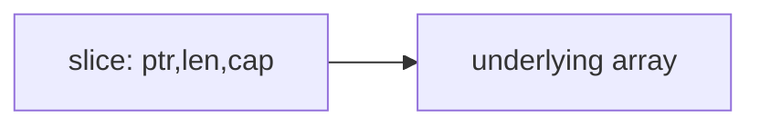

# 03. 資料結構與物件感

Go 沒有 class，但它不是不能做物件導向。Go 的物件感來自 `struct + method + interface + composition`。

## array 與 slice

| 類型 | 長度 | 常用程度 | 說明 |
|---|---:|---|---|
| array | 固定 | 較少 | `[3]int` 和 `[4]int` 是不同型別 |
| slice | 可變 | 很常用 | 對底層 array 的視窗 |

```go
arr := [3]int{1, 2, 3}
nums := []int{1, 2, 3}
nums = append(nums, 4)
```



## map

```go
scores := map[string]int{
	"amy": 90,
	"bob": 75,
}

score, ok := scores["amy"]
```

| 操作 | 範例 |
|---|---|
| 新增 / 更新 | `scores["cat"] = 88` |
| 讀取並判斷存在 | `v, ok := scores["cat"]` |
| 刪除 | `delete(scores, "cat")` |

注意：map 不是 thread-safe，多 goroutine 同時讀寫要加鎖或改用 channel 設計。

## string、byte、rune

| 型別 | 意義 | 常見用途 |
|---|---|---|
| `byte` | `uint8` | 原始位元組 |
| `rune` | `int32` | Unicode code point |
| `string` | 唯讀 byte sequence | 文字 |

```go
text := "台灣Go"
fmt.Println(len(text))        // byte 數
fmt.Println(len([]rune(text))) // 字元概念
```

## struct

```go
type User struct {
	ID   int
	Name string
}

user := User{ID: 1, Name: "Amy"}
```

struct 是 Go 最重要的資料建模工具。

## pointer

```go
func rename(user *User, name string) {
	user.Name = name
}
```

| 使用 pointer 的理由 | 說明 |
|---|---|
| 修改原物件 | 傳值會複製 |
| 避免大型 struct 複製 | 節省成本 |
| 表示可選值 | `nil` 代表沒有 |

## method 與 receiver

```go
func (u User) DisplayName() string {
	return fmt.Sprintf("%d:%s", u.ID, u.Name)
}

func (u *User) Rename(name string) {
	u.Name = name
}
```

| Receiver | 行為 |
|---|---|
| value receiver | 收到副本，適合不可變或小 struct |
| pointer receiver | 可修改原物件，適合大 struct 或有狀態 |

## composition

Go 用嵌入 struct 做組合，而不是繼承。

```go
type Audit struct {
	CreatedBy string
}

type Order struct {
	Audit
	ID string
}
```

## 常見錯誤

| 錯誤 | 原因 | 修正 |
|---|---|---|
| 對 nil map 寫入 | map 尚未初始化 | 用 `make(map[string]int)` |
| 誤以為 slice 複製資料 | slice 複製的是 header | 需要獨立資料時用 `copy` |
| range string 用 byte index | 中文等多 byte 字元會踩坑 | 用 `for _, r := range text` |

## 小練習

1. 建立 `User` struct，加入 `Rename` method。
2. 用 map 統計字串中的 rune 出現次數。
3. 寫一個函式複製 slice，確認修改新 slice 不影響舊 slice。
