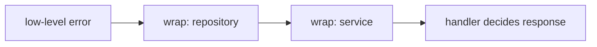

# 04. 函式、錯誤、介面、泛型

Go 的抽象能力不靠複雜語法，而靠幾個簡單元件：函式、多回傳值、error、interface、generics。

## 函式與多回傳值

```go
func divide(a, b int) (int, error) {
	if b == 0 {
		return 0, errors.New("divide by zero")
	}
	return a / b, nil
}
```

| 回傳值 | 說明 |
|---|---|
| 第一個值 | 成功結果 |
| `error` | 失敗原因，成功時為 `nil` |

## error handling

Go 的錯誤處理是顯式的。

```go
value, err := divide(10, 2)
if err != nil {
	return fmt.Errorf("calculate score: %w", err)
}
fmt.Println(value)
```

| API | 用途 |
|---|---|
| `errors.New` | 建立固定錯誤 |
| `fmt.Errorf("%w")` | 包裝錯誤並保留原錯 |
| `errors.Is` | 判斷錯誤鏈是否包含某錯 |
| `errors.As` | 取出特定錯誤型別 |



## interface

Interface 描述「行為」，不描述「資料」。

```go
type Store interface {
	Save(ctx context.Context, key string, value []byte) error
}
```

任何型別只要實作同名 method，就自動滿足 interface，不需要宣告 implements。

## Duck typing

```go
type MemoryStore struct {
	data map[string][]byte
}

func (s *MemoryStore) Save(ctx context.Context, key string, value []byte) error {
	s.data[key] = value
	return nil
}
```

| 傳統 OOP | Go |
|---|---|
| class implements interface | method set 自動滿足 |
| interface 常在型別旁宣告 | interface 常在使用端宣告 |
| inheritance reuse | composition reuse |

## Generics

Go 泛型適合處理「型別不同，但演算法相同」的場景。

```go
func First[T any](items []T) (T, bool) {
	var zero T
	if len(items) == 0 {
		return zero, false
	}
	return items[0], true
}
```

| 約束 | 意義 |
|---|---|
| `any` | 任意型別 |
| `comparable` | 可用 `==` / `!=` |
| `~int` | 底層型別是 int 的自訂型別也可 |

## 實務取捨

| 問題 | 建議 |
|---|---|
| 要不要一開始就抽 interface？ | 先從具體型別開始，有第二個實作或測試需求再抽 |
| error 要不要包？ | 跨層傳遞時包，讓上層知道發生在哪個情境 |
| 泛型要不要大量用？ | 泛型是工具，不是風格。重複演算法明顯時再用 |

## 常見錯誤

| 錯誤 | 說明 | 修正 |
|---|---|---|
| 回傳 `nil` concrete pointer 給 interface | interface 內有 type，整體不等於 nil | 明確回傳 `nil` interface |
| interface 放太大 | 使用端很難 mock | 小 interface，例如只放 `Read` 或 `Save` |
| 泛型取代所有 interface | 兩者用途不同 | 行為抽象用 interface，容器/演算法用泛型 |

## 小練習

1. 寫一個 `Divide` 函式，回傳 `(int, error)`。
2. 建立 `Writer` interface，讓兩個 struct 實作它。
3. 寫一個泛型 `Contains[T comparable]` 函式。
