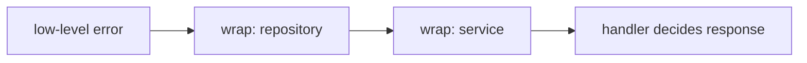

# 04. 函式、錯誤、介面、泛型

Go 的抽象能力不靠複雜語法，而靠幾個簡單元件：函式、多回傳值、error、interface、generics。

## 函式與多回傳值

```go
func divide(a, b int) (int, error) {
	if b == 0 {
		return 0, errors.New("divide by zero")
	}
	return a / b, nil
}
```

| 回傳值 | 說明 |
|---|---|
| 第一個值 | 成功結果 |
| `error` | 失敗原因，成功時為 `nil` |

### 具名回傳值 (Named Return)

```go
// 具名回傳：可在 defer 中修改回傳值
func readFile(path string) (content []byte, err error) {
	f, err := os.Open(path)
	if err != nil {
		return // bare return，等同 return content, err
	}
	defer func() {
		f.Close()
		if err != nil {
			err = fmt.Errorf("readFile %s: %w", path, err) // 修改具名 err
		}
	}()
	return io.ReadAll(f)
}
```

| 具名回傳值 | 說明 |
|---|---|
| 可用 `return`（bare return） | 回傳當前具名變數的值 |
| 可在 defer 中修改 | 適合統一做 error wrapping |
| 缺點：可讀性降低 | 函式長時容易混淆，短函式才考慮使用 |

### 函式作為一等公民 (First-Class Function)

```go
// 函式型別宣告
type Handler func(ctx context.Context, input string) (string, error)

// 接收函式作為參數（callback / strategy pattern）
func retry(ctx context.Context, fn func() error, maxAttempts int) error {
	for i := 0; i < maxAttempts; i++ {
		if err := fn(); err == nil {
			return nil
		}
		time.Sleep(time.Duration(i+1) * time.Second)
	}
	return errors.New("max retries exceeded")
}

// 回傳函式（middleware / decorator pattern）
func withLogging(fn func(int) int) func(int) int {
	return func(n int) int {
		result := fn(n)
		slog.Info("called", "input", n, "output", result)
		return result
	}
}

// 立即呼叫函式（IIFE，常用在 goroutine）
go func() {
	doWork()
}()
```

### 閉包 (Closure) 與陷阱

閉包會捕獲（capture）外部變數的**參考**，而不是值的副本：

```go
// ✗ 陷阱：所有 goroutine 共享同一個 i（Go 1.21 以前）
for i := 0; i < 3; i++ {
	go func() {
		fmt.Println(i) // 可能全部印出 3
	}()
}

// ✓ 解法 1：透過參數傳入（Go 1.21 以前的慣例）
for i := 0; i < 3; i++ {
	go func(i int) {
		fmt.Println(i) // 印出 0, 1, 2
	}(i)
}

// ✓ 解法 2：建立新變數（Go 1.21 以前）
for i := 0; i < 3; i++ {
	i := i // 遮蔽外層 i，建立新的迴圈變數
	go func() {
		fmt.Println(i)
	}()
}
```

> **Go 1.22 已修正此問題**：`for` 迴圈的每次迭代會建立新的獨立變數，不再需要以上 workaround。但閱讀舊代碼時仍需理解此陷阱。

### `defer` 進階行為

**行為 1：參數在 defer 宣告時立即估值**

```go
func printDefer() {
	x := 1
	defer fmt.Println(x) // x 此時已估值為 1
	x = 2
	// 函式結束，印出 1（不是 2）
}
```

**行為 2：修改具名回傳值**

```go
func double(n int) (result int) {
	defer func() {
		result *= 2 // 在函式 return 後，修改即將回傳的值
	}()
	result = n
	return // bare return：result = n，然後 defer 讓它 = n*2
}
// double(5) 回傳 10
```

**行為 3：LIFO（後進先出）**

```go
defer fmt.Println("first")
defer fmt.Println("second")
defer fmt.Println("third")
// 輸出順序：third → second → first
```

| defer 使用時機 | 說明 |
|---|---|
| 資源釋放 | `defer f.Close()`, `defer rows.Close()` |
| Unlock | `defer mu.Unlock()` |
| 統一 error wrapping | 搭配具名回傳值 |
| Recover | `defer func() { recover() }()` |


## error handling

Go 的錯誤處理是顯式的。

```go
value, err := divide(10, 2)
if err != nil {
	return fmt.Errorf("calculate score: %w", err)
}
fmt.Println(value)
```

| API | 用途 |
|---|---|
| `errors.New` | 建立固定錯誤 |
| `fmt.Errorf("%w")` | 包裝錯誤並保留原錯 |
| `errors.Is` | 判斷錯誤鏈是否包含某錯 |
| `errors.As` | 取出特定錯誤型別 |
| `errors.Join` | **(Go 1.20+)** 合併多個錯誤 |

### 合併錯誤 (`errors.Join`)

在併發情境下（例如多個 goroutine 各自獨立執行任務），我們常需要把多個發生的錯誤合併成一個回傳：

```go
func fetchAll(urls []string) error {
	var errs []error
	var wg sync.WaitGroup
	var mu sync.Mutex // 保護 errs slice

	for _, url := range urls {
		wg.Add(1)
		go func(u string) {
			defer wg.Done()
			if err := fetch(u); err != nil {
				mu.Lock()
				errs = append(errs, err)
				mu.Unlock()
			}
		}(url)
	}
	wg.Wait()

	// Go 1.20+ 新增：合併所有錯誤
	return errors.Join(errs...)
}
```

> **注意**：`errors.Join` 會將多個錯誤用換行符號連接起來。被 `Join` 包裝的錯誤，依然能用 `errors.Is` 逐一檢查。

### 錯誤檢查：`Is` vs `As`

- **`errors.Is(err, target)`**：用來比對「特定的錯誤變數 (值)」。例如 `if errors.Is(err, sql.ErrNoRows)`。
- **`errors.As(err, &target)`**：用來提取「特定的錯誤型別」。例如當你需要拿到自訂錯誤結構裡的 HTTP 狀態碼時：

```go
// 自訂錯誤型別
type APIError struct {
	Code int
	Msg  string
}
func (e *APIError) Error() string { return e.Msg }

// 提取並使用
var apiErr *APIError
if errors.As(err, &apiErr) {
	fmt.Printf("HTTP Status: %d\n", apiErr.Code)
}
```



## interface

Interface 描述「行為」，不描述「資料」。

```go
type Store interface {
	Save(ctx context.Context, key string, value []byte) error
}
```

任何型別只要實作同名 method，就自動滿足 interface，不需要宣告 implements。

## Duck typing

```go
type MemoryStore struct {
	data map[string][]byte
}

func (s *MemoryStore) Save(ctx context.Context, key string, value []byte) error {
	s.data[key] = value
	return nil
}
```

| 傳統 OOP | Go |
|---|---|
| class implements interface | method set 自動滿足 |
| interface 常在型別旁宣告 | interface 常在使用端宣告 |
| inheritance reuse | composition reuse |

## Generics

Go 泛型適合處理「型別不同，但演算法相同」的場景。

```go
func First[T any](items []T) (T, bool) {
	var zero T
	if len(items) == 0 {
		return zero, false
	}
	return items[0], true
}
```

| 約束 | 意義 |
|---|---|
| `any` | 任意型別 |
| `comparable` | 可用 `==` / `!=` |
| `~int` | 底層型別是 int 的自訂型別也可 |

## 實務取捨

| 問題 | 建議 |
|---|---|
| 要不要一開始就抽 interface？ | 先從具體型別開始，有第二個實作或測試需求再抽 |
| error 要不要包？ | 跨層傳遞時包，讓上層知道發生在哪個情境 |
| 泛型要不要大量用？ | 泛型是工具，不是風格。重複演算法明顯時再用 |

## 常見錯誤

| 錯誤 | 說明 | 修正 |
|---|---|---|
| 回傳 `nil` concrete pointer 給 interface | interface 內有 type，整體不等於 nil | 明確回傳 `nil` interface |
| interface 放太大 | 使用端很難 mock | 小 interface，例如只放 `Read` 或 `Save` |
| 泛型取代所有 interface | 兩者用途不同 | 行為抽象用 interface，容器/演算法用泛型 |

## 小練習

1. 寫一個 `Divide` 函式，回傳 `(int, error)`。
2. 建立 `Writer` interface，讓兩個 struct 實作它。
3. 寫一個泛型 `Contains[T comparable]` 函式。
