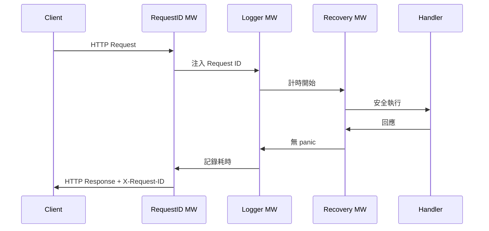
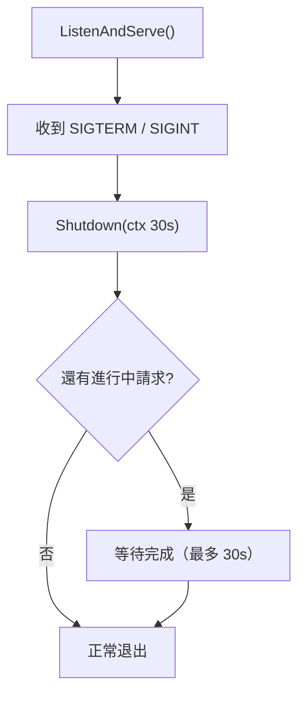

# 05. 實務標準庫

Go 標準庫很強，很多後端服務不用一開始就裝框架。先熟標準庫，之後選框架才知道取捨。

---

## JSON

```go
type User struct {
	ID    int    `json:"id"`
	Name  string `json:"name"`
	Email string `json:"email,omitempty"` // 零值時省略
	Pass  string `json:"-"`               // 永遠不輸出
}

// 序列化
body, err := json.Marshal(user)

// 反序列化
var u User
err = json.Unmarshal(body, &u)

// 串流解碼（適合大型 JSON 或 HTTP Body）
decoder := json.NewDecoder(r.Body)
decoder.DisallowUnknownFields() // 嚴格模式：不允許未知欄位
err = decoder.Decode(&u)
```

| Tag | 說明 |
|---|---|
| `json:"name"` | 指定欄位名 |
| `json:"name,omitempty"` | 零值時省略 |
| `json:"-"` | 永遠不輸出（如密碼） |

---

## 檔案

```go
data, err := os.ReadFile("config.json")
if err != nil {
	return err
}
```

| API | 用途 |
|---|---|
| `os.ReadFile` | 一次讀完整檔 |
| `os.WriteFile` | 一次寫完整檔 |
| `os.Open` | 串流讀取 |
| `bufio.Scanner` | 逐行讀取 |

---

## HTTP Client

```go
client := &http.Client{Timeout: 3 * time.Second}
req, err := http.NewRequestWithContext(ctx, http.MethodGet, url, nil)
if err != nil {
	return err
}
resp, err := client.Do(req)
if err != nil {
	return err
}
defer resp.Body.Close() // 永遠記得關
body, err := io.ReadAll(resp.Body)
```

> ⚠️ 永遠不要用沒有 Timeout 的 default client。`defer resp.Body.Close()` 是必須的。

---

## HTTP Server — 完整設定

### `http.Server` 關鍵參數

直接使用 `http.ListenAndServe` 是反模式；正確做法是建立完整的 `http.Server`：

```go
srv := &http.Server{
	Addr:           ":8080",
	Handler:        mux,
	ReadTimeout:    5 * time.Second,  // 讀取完整請求的最大時間
	WriteTimeout:   10 * time.Second, // 寫入完整回應的最大時間
	IdleTimeout:    60 * time.Second, // Keep-alive 連線閒置最大時間
	MaxHeaderBytes: 1 << 20,          // 1 MB
}
```

| 參數 | 未設定的風險 |
|---|---|
| `ReadTimeout` | 攻擊者慢慢送 header，佔用連線（Slowloris 攻擊） |
| `WriteTimeout` | Handler 跑太久不會被中斷 |
| `IdleTimeout` | Keep-alive 連線無限期持有 |

### Go 1.22 路由增強

Go 1.22 的 `ServeMux` 原生支援 Method + 路徑參數，基本場景不需要第三方 router：

```go
mux := http.NewServeMux()

// Method + Path routing（Go 1.22+）
mux.HandleFunc("GET /users/{id}", func(w http.ResponseWriter, r *http.Request) {
	id := r.PathValue("id")           // 取得路徑參數
	fmt.Fprintf(w, "user id: %s", id)
})

mux.HandleFunc("POST /users", createUserHandler)
mux.HandleFunc("DELETE /users/{id}", deleteUserHandler)
mux.HandleFunc("GET /health", healthHandler)
```

### `http.Handler` 介面

理解這個介面是寫 Middleware 的基礎：

```go
type Handler interface {
	ServeHTTP(ResponseWriter, *Request)
}

// HandlerFunc 讓普通函式滿足 Handler interface
type HandlerFunc func(ResponseWriter, *Request)
func (f HandlerFunc) ServeHTTP(w ResponseWriter, r *Request) { f(w, r) }
```

---

## Middleware 模式

Middleware 的型別是 `func(http.Handler) http.Handler`，接受一個 handler，回傳包裝後的 handler。

```go
// 組合多個 Middleware（從左到右，最左最先執行）
func Chain(h http.Handler, middlewares ...func(http.Handler) http.Handler) http.Handler {
	for i := len(middlewares) - 1; i >= 0; i-- {
		h = middlewares[i](h)
	}
	return h
}
```

### 常用 Middleware 實作

```go
// 1. Logger Middleware
func LoggerMiddleware(next http.Handler) http.Handler {
	return http.HandlerFunc(func(w http.ResponseWriter, r *http.Request) {
		start := time.Now()
		next.ServeHTTP(w, r)
		slog.Info("request",
			"method", r.Method,
			"path", r.URL.Path,
			"duration", time.Since(start),
		)
	})
}

// 2. Recovery Middleware（捕獲 panic，避免整個服務崩潰）
func RecoveryMiddleware(next http.Handler) http.Handler {
	return http.HandlerFunc(func(w http.ResponseWriter, r *http.Request) {
		defer func() {
			if err := recover(); err != nil {
				slog.Error("panic recovered", "error", err)
				http.Error(w, "Internal Server Error", http.StatusInternalServerError)
			}
		}()
		next.ServeHTTP(w, r)
	})
}

// 3. Request ID（每個請求注入唯一 ID，方便追蹤）
type ctxKey string
const reqIDKey ctxKey = "request_id"

func RequestIDMiddleware(next http.Handler) http.Handler {
	return http.HandlerFunc(func(w http.ResponseWriter, r *http.Request) {
		id := fmt.Sprintf("%d", time.Now().UnixNano()) // 簡化示意，生產用 uuid
		ctx := context.WithValue(r.Context(), reqIDKey, id)
		w.Header().Set("X-Request-ID", id)
		next.ServeHTTP(w, r.WithContext(ctx))
	})
}
```

### 組合使用

```go
mux := http.NewServeMux()
mux.HandleFunc("GET /users/{id}", getUserHandler)

// 由外到內：RequestID → Logger → Recovery → Handler
handler := Chain(mux,
	RequestIDMiddleware,
	LoggerMiddleware,
	RecoveryMiddleware,
)

srv := &http.Server{Addr: ":8080", Handler: handler}
```



---

## Graceful Shutdown

生產服務必須處理 OS Signal（如 Kubernetes 滾動部署時的 SIGTERM），等待處理中的請求完成後再退出。

```go
func main() {
	mux := http.NewServeMux()
	mux.HandleFunc("GET /health", func(w http.ResponseWriter, r *http.Request) {
		w.WriteHeader(http.StatusOK)
	})

	srv := &http.Server{
		Addr:         ":8080",
		Handler:      mux,
		ReadTimeout:  5 * time.Second,
		WriteTimeout: 10 * time.Second,
	}

	// 在背景啟動 server
	go func() {
		slog.Info("server starting", "addr", srv.Addr)
		if err := srv.ListenAndServe(); !errors.Is(err, http.ErrServerClosed) {
			slog.Error("server error", "err", err)
			os.Exit(1)
		}
	}()

	// 等待 OS Signal（SIGTERM 或 Ctrl+C）
	quit := make(chan os.Signal, 1)
	signal.Notify(quit, syscall.SIGINT, syscall.SIGTERM)
	<-quit

	slog.Info("shutting down...")

	// 給予最多 30 秒讓進行中的請求完成
	ctx, cancel := context.WithTimeout(context.Background(), 30*time.Second)
	defer cancel()

	if err := srv.Shutdown(ctx); err != nil {
		slog.Error("forced shutdown", "err", err)
	}
	slog.Info("server exited")
}
```



---

## `database/sql` 資料庫操作

`database/sql` 是 Go 的標準資料庫介面，透過驅動（driver）支援各種資料庫。

### 初始化與連線池

```go
import (
	"database/sql"
	_ "github.com/lib/pq" // PostgreSQL 驅動（side-effect import 自動註冊）
)

db, err := sql.Open("postgres", "host=localhost user=app dbname=mydb sslmode=disable")
if err != nil {
	log.Fatal(err)
}

// 連線池調校（生產必設）
db.SetMaxOpenConns(25)                 // 最多同時開啟的連線數
db.SetMaxIdleConns(10)                 // 閒置連線保留數（應 <= MaxOpenConns）
db.SetConnMaxLifetime(5 * time.Minute) // 連線最長存活時間（避免資料庫強制斷線）
db.SetConnMaxIdleTime(1 * time.Minute) // 閒置超時主動關閉

// 驗證連線是否可用
if err := db.PingContext(ctx); err != nil {
	log.Fatal("db ping failed:", err)
}
```

### 查詢 (Query)

```go
// ── 多筆查詢 ───────────────────────────────
rows, err := db.QueryContext(ctx,
	"SELECT id, name FROM users WHERE active = $1", true)
if err != nil {
	return nil, err
}
defer rows.Close() // 不 Close 會持有連線

var users []User
for rows.Next() {
	var u User
	if err := rows.Scan(&u.ID, &u.Name); err != nil {
		return nil, err
	}
	users = append(users, u)
}
if err := rows.Err(); err != nil { // 必查：迭代中的錯誤
	return nil, err
}

// ── 單筆查詢 ───────────────────────────────
var u User
err = db.QueryRowContext(ctx, "SELECT id, name FROM users WHERE id = $1", id).
	Scan(&u.ID, &u.Name)
if errors.Is(err, sql.ErrNoRows) {
	return nil, ErrNotFound // 轉換成業務層 error，不要洩漏 sql 層細節
}
```

### 寫入 (Exec)

```go
result, err := db.ExecContext(ctx,
	"INSERT INTO users (name, email) VALUES ($1, $2)",
	name, email,
)
if err != nil {
	return err
}
id, _ := result.LastInsertId()      // MySQL 適用
rows, _ := result.RowsAffected()    // 所有資料庫適用
```

### Transaction

```go
func transferMoney(ctx context.Context, db *sql.DB, from, to int64, amount int) error {
	tx, err := db.BeginTx(ctx, nil)
	if err != nil {
		return err
	}
	// 核心慣例：defer Rollback
	// 若 Commit 成功，Rollback 是 no-op（不會雙重操作）
	defer tx.Rollback()

	if _, err = tx.ExecContext(ctx,
		"UPDATE accounts SET balance = balance - $1 WHERE id = $2",
		amount, from,
	); err != nil {
		return err // defer 執行 Rollback
	}

	if _, err = tx.ExecContext(ctx,
		"UPDATE accounts SET balance = balance + $1 WHERE id = $2",
		amount, to,
	); err != nil {
		return err
	}

	return tx.Commit() // 成功 Commit 後，defer Rollback 是 no-op
}
```

> ⚠️ **SQL Injection 防範**：永遠使用佔位符（`$1`、`?`），絕不拼接用戶輸入進 SQL 字串。

| 場景 | 安全 ✓ | 危險 ✗ |
|---|---|---|
| 傳遞參數 | `QueryContext(ctx, "WHERE id=$1", id)` | `"WHERE id=" + id` |
| 動態表名 | 白名單驗證後再組合 | 直接用用戶輸入 |

---

## `log/slog` 結構化日誌 (Go 1.21+)

`log/slog` 是官方的結構化日誌套件，輸出機器可解析的 JSON，是現代雲原生服務的標準。

### 基本用法

```go
import "log/slog"

slog.Info("server started", "port", 8080)
slog.Warn("config missing", "key", "timeout", "using_default", 30)
slog.Error("db failed", "err", err, "retry", 3)
```

### JSON Handler（生產環境必備）

```go
func main() {
	// 設定 JSON 輸出（可搭配 ELK / CloudWatch / GCP Logging）
	logger := slog.New(slog.NewJSONHandler(os.Stdout, &slog.HandlerOptions{
		Level:     slog.LevelInfo,  // 控制最低輸出等級
		AddSource: true,            // 包含檔名與行號
	}))
	slog.SetDefault(logger)

	slog.Info("ready", "addr", ":8080")
	// {"time":"...","level":"INFO","source":{"function":"main.main","file":"main.go","line":12},"msg":"ready","addr":":8080"}
}
```

### 四個日誌等級

| 等級 | 用途 |
|---|---|
| `Debug` | 開發追蹤（生產通常不輸出）|
| `Info` | 正常流程事件 |
| `Warn` | 非預期但可繼續的狀況 |
| `Error` | 需要處理的錯誤（通常帶 `"err", err`）|

### Logger 與 Context 整合（請求追蹤）

```go
type ctxLogKey struct{}

// Middleware 中建立帶有 request ID 的 logger，存入 context
func loggerMiddleware(next http.Handler) http.Handler {
	return http.HandlerFunc(func(w http.ResponseWriter, r *http.Request) {
		reqLogger := slog.Default().With(
			"request_id", r.Header.Get("X-Request-ID"),
			"method", r.Method,
			"path", r.URL.Path,
		)
		ctx := context.WithValue(r.Context(), ctxLogKey{}, reqLogger)
		next.ServeHTTP(w, r.WithContext(ctx))
	})
}

// 在業務邏輯中取出 logger
func logFromCtx(ctx context.Context) *slog.Logger {
	if l, ok := ctx.Value(ctxLogKey{}).(*slog.Logger); ok {
		return l
	}
	return slog.Default()
}
```

### slog vs 其他套件

| 套件 | 優點 | 適用 |
|---|---|---|
| `log/slog` | 官方標準、零依賴 | **新專案首選** |
| `go.uber.org/zap` | 極致效能、零 allocation | 高吞吐量，Go < 1.21 |
| `rs/zerolog` | 最低 allocation | 對記憶體敏感 |

---

## 亂數產生 `math/rand/v2` (Go 1.22+)

Go 1.22 引入了全新的 `math/rand/v2`，解決了舊版 `math/rand` 的多項痛點（例如需要手動 Seed、效能瓶頸、以及過時的演算法）。

### 新版用法 (推薦)

```go
import "math/rand/v2"

// 直接使用全域函式，不需再手動呼叫 rand.Seed()
n := rand.IntN(100)        // 產生 0 ~ 99 的整數
f := rand.Float64()        // 產生 0.0 ~ 1.0 的浮點數
```

### 新舊版比較

| 比較點 | 舊版 `math/rand` | 新版 `math/rand/v2` |
|---|---|---|
| 初始化 | 必須 `rand.Seed(time.Now().UnixNano())` | **全自動 Seed**，開箱即用 |
| 效能與演算法 | 較舊的 Mitchell & Reeds LFSR | **ChaCha8 / PCG**，更快更安全 |
| 函式命名 | `rand.Intn(100)` | `rand.IntN(100)` (遵守 Go 命名慣例) |
| 全域鎖問題 | 高併發下會有 mutex 競爭 | 改進的併發效能 |

> ⚠️ **安全警告**：不管是 v1 還是 v2，`math/rand` 都**不是**密碼學安全的！若要產生密碼、Token 或加解密用的隨機數，請務必使用 `crypto/rand`。

---

## Testing

```go
// 基本測試
func TestAdd(t *testing.T) {
	if got := Add(1, 2); got != 3 {
		t.Fatalf("Add(1,2) = %d, want 3", got)
	}
}

// Table-driven test（推薦慣例）
func TestGrade(t *testing.T) {
	tests := []struct {
		name  string
		score int
		want  string
	}{
		{"pass", 80, "pass"},
		{"fail", 50, "fail"},
		{"boundary", 60, "pass"},
	}
	for _, tt := range tests {
		t.Run(tt.name, func(t *testing.T) {
			if got := Grade(tt.score); got != tt.want {
				t.Fatalf("got %q, want %q", got, tt.want)
			}
		})
	}
}

// Benchmark
func BenchmarkJoin(b *testing.B) {
	for i := 0; i < b.N; i++ {
		_ = strings.Join([]string{"a", "b", "c"}, ",")
	}
}
```

---

## 常見錯誤

| 錯誤 | 說明 | 修正 |
|---|---|---|
| HTTP client 沒 timeout | 服務可能卡住 | `http.Client{Timeout: 3*time.Second}` |
| 沒關 `resp.Body` | goroutine / 連線 leak | `defer resp.Body.Close()` |
| 用 `http.ListenAndServe` | 無法 graceful shutdown | 改用 `http.Server` + `Shutdown` |
| 直接拼接 SQL | SQL Injection 漏洞 | 使用佔位符 `$1`, `?` |
| 忘記 `rows.Close()` | 持有 DB 連線不釋放 | `defer rows.Close()` |
| 忘記 `rows.Err()` | 迭代中錯誤被吞 | 迴圈後必須 check |
| 忽略 `sql.ErrNoRows` | 查無資料未處理 | `errors.Is(err, sql.ErrNoRows)` |
| 用 `log.Println` | 無結構、難以解析 | 改用 `slog.Info` |

---

## 小練習

1. 寫一個完整 HTTP Server，包含 Logger Middleware 和 Recovery Middleware，並設定所有 Timeout。
2. 實作 `GET /users/{id}` 路由，使用 `r.PathValue("id")` 取得路徑參數。
3. 用 `database/sql` 對 SQLite 進行 INSERT / SELECT / Transaction。
4. 將應用程式的日誌改為 JSON 格式輸出，並加入 `"service": "api"` 固定欄位。
5. 用 `signal.Notify` 實作 Graceful Shutdown，確認 Ctrl+C 後印出 "server exited"。
