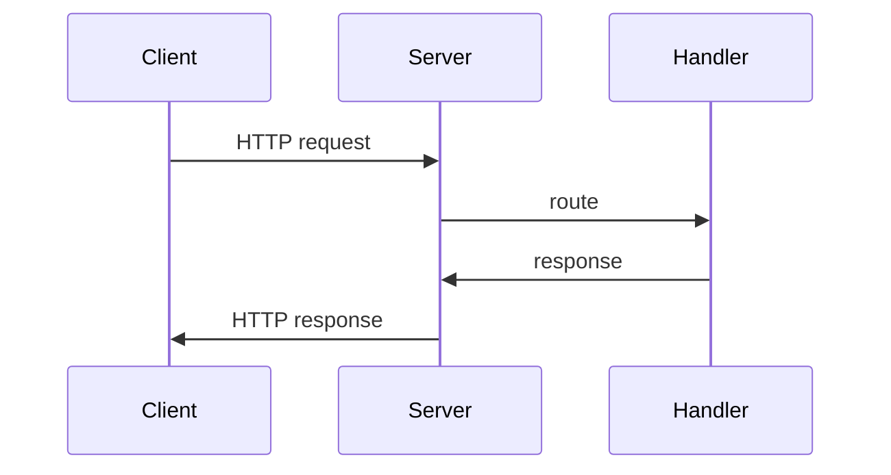

# 05. 實務標準庫

Go 標準庫很強，很多後端服務不用一開始就裝框架。先熟標準庫，之後選框架才知道取捨。

## JSON

```go
type User struct {
	ID   int    `json:"id"`
	Name string `json:"name"`
}

body, err := json.Marshal(User{ID: 1, Name: "Amy"})
```

| Tag | 說明 |
|---|---|
| `json:"id"` | 指定 JSON 欄位名 |
| `json:"name,omitempty"` | 零值時省略 |
| `json:"-"` | 不輸出 |

## 檔案

```go
data, err := os.ReadFile("config.json")
if err != nil {
	return err
}
```

| API | 用途 |
|---|---|
| `os.ReadFile` | 一次讀完整檔 |
| `os.WriteFile` | 一次寫完整檔 |
| `os.Open` | 串流讀取 |
| `bufio.Scanner` | 逐行讀取 |

## HTTP client

```go
client := &http.Client{Timeout: 3 * time.Second}
req, err := http.NewRequestWithContext(ctx, http.MethodGet, url, nil)
if err != nil {
	return err
}
resp, err := client.Do(req)
```

實務上要避免直接用沒有 timeout 的 default client。

## HTTP server

```go
mux := http.NewServeMux()
mux.HandleFunc("/health", func(w http.ResponseWriter, r *http.Request) {
	w.WriteHeader(http.StatusOK)
	_, _ = w.Write([]byte("ok"))
})
```



## Testing

Go 測試檔用 `_test.go` 結尾。

```go
func TestAdd(t *testing.T) {
	got := Add(1, 2)
	if got != 3 {
		t.Fatalf("got %d, want 3", got)
	}
}
```

## Table-driven test

```go
func TestGrade(t *testing.T) {
	tests := []struct {
		name  string
		score int
		want  string
	}{
		{"pass", 80, "pass"},
		{"fail", 50, "fail"},
	}

	for _, tt := range tests {
		t.Run(tt.name, func(t *testing.T) {
			if got := Grade(tt.score); got != tt.want {
				t.Fatalf("got %s, want %s", got, tt.want)
			}
		})
	}
}
```

## Benchmark

```go
func BenchmarkJoin(b *testing.B) {
	for i := 0; i < b.N; i++ {
		_ = strings.Join([]string{"a", "b", "c"}, ",")
	}
}
```

## 常見錯誤

| 錯誤 | 說明 | 修正 |
|---|---|---|
| HTTP client 沒 timeout | 服務可能卡住 | 設 `http.Client{Timeout: ...}` |
| 測試只測 happy path | 錯誤分支會壞 | 加上 table-driven cases |
| JSON struct 欄位小寫 | 小寫欄位不會被 marshal | 需要輸出就大寫欄位 |

## 小練習

1. 寫一個 struct 並轉成 JSON。
2. 寫一個 `/health` HTTP handler。
3. 對一個 `Grade(score int)` 函式寫 table-driven test。
