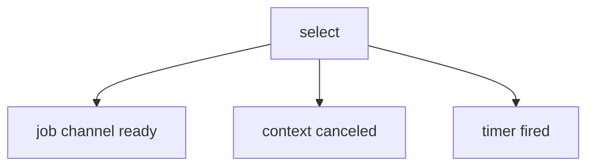
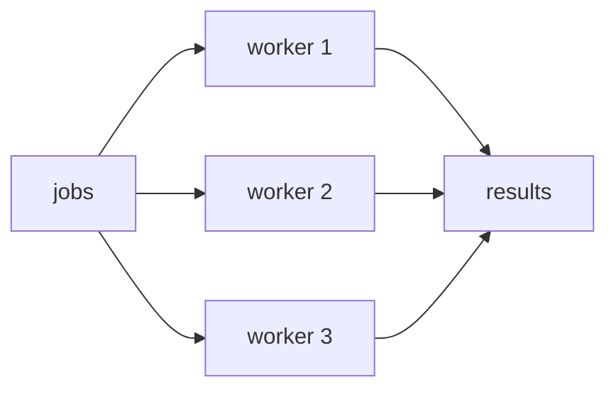
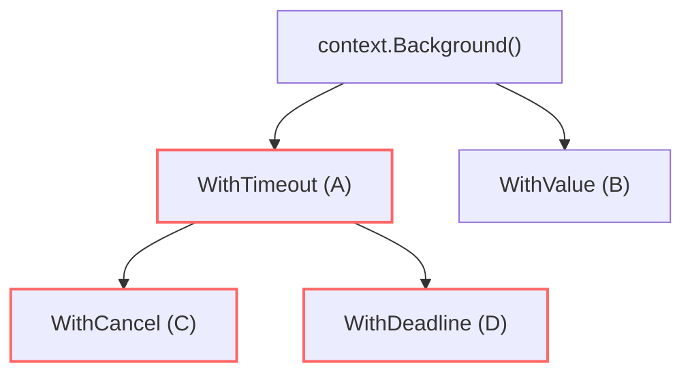
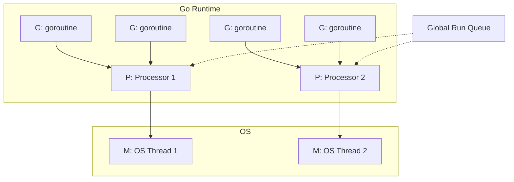
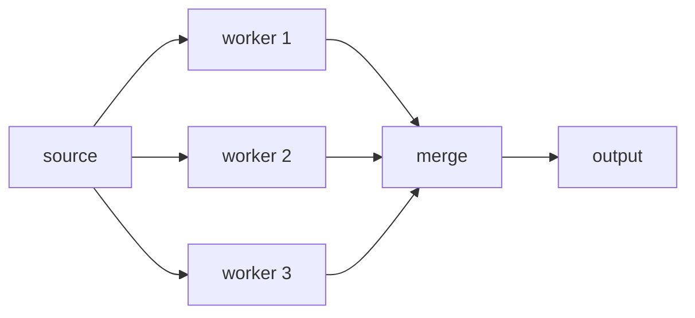

# 06. 併發程式設計

Go 的招牌能力是併發。重點不是「開很多 goroutine」，而是「清楚管理生命週期、資料所有權與取消」。

## goroutine

```go
go func() {
	fmt.Println("run in background")
}()
```

goroutine 很便宜，但不是免費。大量 goroutine 仍然要有邊界。

## channel

```go
jobs := make(chan int)

go func() {
	jobs <- 1
	close(jobs)
}()

for job := range jobs {
	fmt.Println(job)
}
```

| Channel 類型 | 說明 |
|---|---|
| unbuffered | 傳送與接收同步 |
| buffered | 容量內可暫存 |
| receive-only | `<-chan T` |
| send-only | `chan<- T` |

## select

```go
select {
case job := <-jobs:
	handle(job)
case <-ctx.Done():
	return ctx.Err()
}
```



## sync primitives

| 工具 | 用途 |
|---|---|
| `sync.WaitGroup` | 等一組 goroutine 完成 |
| `sync.Mutex` / `RWMutex` | 保護共享資料（多讀少寫用 RWMutex） |
| `sync.Once` | 保證只執行一次（如 singleton 初始化） |
| `sync.OnceValues` | (Go 1.21+) 只執行一次並回傳值/錯誤 |
| `sync.Map` | 併發安全的 map（適合讀多寫少，如快取） |
| `sync.Pool` | 物件池，減輕 GC 壓力（Chapter 10 詳述） |
| `sync/atomic` | 低階無鎖 (Lock-free) 原子操作 |

### `sync.OnceValues` (Go 1.21+)

實務上初始化常會回傳結果或錯誤，過去需要 `sync.Once` 搭配外部變數，現在更簡潔：

```go
var loadConfig = sync.OnceValues(func() (*Config, error) {
	// 讀取檔案、解析 JSON 等耗時且只需一次的操作
	return parseConfig()
})

// 任何 goroutine 呼叫，都只會執行一次
cfg, err := loadConfig()
```

### `sync.Map` vs `map` + `sync.Mutex`

| 比較 | 一般 `map` + `Mutex` | `sync.Map` |
|---|---|---|
| 寫入效能 | 寫入很快 | 寫入較慢（底層設計複雜） |
| 讀取效能 | 有 lock 競爭 | 讀取極快（特定情況無鎖） |
| 型別安全 | 強型別（如 `map[string]int`） | 弱型別（`any`，需斷言） |
| 最佳場景 | **大部分情況** | **讀多寫少**（如 cache）、key 不重疊的併發寫入 |

### `sync/atomic` (無鎖操作)

當只需要保護單一數字或指標時，用 atomic 比 Mutex 輕量非常多。Go 1.19+ 引入了泛型風格的 atomic，更好用：

```go
var counter atomic.Int64 // Go 1.19+ 語法

// 併發安全的加法
counter.Add(1)

// 安全的讀取
fmt.Println(counter.Load())
```

## Worker pool

```go
func worker(id int, jobs <-chan int, results chan<- int) {
	for job := range jobs {
		results <- job * 2
	}
}
```



## context cancellation

```go
// 1. 建立帶有 timeout 的 context
ctx, cancel := context.WithTimeout(context.Background(), 2*time.Second)
defer cancel() // 重要：離開作用域時提早釋放資源

// 2. 傳給會耗時的操作（如 HTTP 請求、DB 查詢）
req, err := http.NewRequestWithContext(ctx, http.MethodGet, url, nil)
```

### Context Tree (取消的傳遞)

Context 是樹狀結構。當父節點被取消，所有子節點都會被取消。這對於微服務的連鎖請求取消非常重要。


*圖解：當 B timeout 時，其子節點 D 和 E 也會自動收到取消信號，但 A 和 C 不受影響。*

### Context 的四大核心 API (Go 1.7+)

| API | 用途 | 說明 |
|---|---|---|
| `WithCancel` | 手動取消 | 回傳 `cancel` func，呼叫即取消該 ctx 及其子節點 |
| `WithTimeout` | 超時取消 | 相對時間（例如：3 秒後取消） |
| `WithDeadline` | 定時取消 | 絕對時間（例如：晚上 12 點取消） |
| `WithValue` | 傳遞請求範圍資料 | 例如 TraceID、User Token。**絕對不要用來傳遞可選參數！** |

### Context 現代進階 API (Go 1.20+)

隨著 Go 發展，Context 生態系加入了兩個極度重要的功能，解決了過去的痛點：

| API | 版本 | 解決的痛點 |
|---|---|---|
| `WithCancelCause` | **1.20** | **取消原因追蹤**：以前只知道 `context canceled`，現在可以附帶具體的 `error`。<br>透過 `context.Cause(ctx)` 取得。 |
| `WithoutCancel` | **1.21** | **剝離取消信號**：保留原 ctx 的 Value，但移除 Cancel/Timeout。<br>極度適合用於**啟動非同步背景任務**（如 HTTP 回應後寫入 Log/DB）。 |

```go
// 1. context.Cause 範例 (Go 1.20+)
ctx, cancel := context.WithCancelCause(context.Background())
cancel(errors.New("db connection failed"))

fmt.Println(ctx.Err())           // "context canceled" (相容舊版)
fmt.Println(context.Cause(ctx))  // "db connection failed" (精確原因)

// 2. context.WithoutCancel 範例 (Go 1.21+)
func handleRequest(w http.ResponseWriter, r *http.Request) {
	// r.Context() 會在 request 結束時被自動 cancel
	
	// 若想在背景寫入 audit log，不能直接傳 r.Context()
	// 舊解法：傳 context.Background() (會遺失 TraceID 等 Value)
	// 新解法：WithoutCancel 保留 Value 但不受 HTTP 結束影響
	bgCtx := context.WithoutCancel(r.Context())
	
	go writeAuditLog(bgCtx, "user_login")
	w.Write([]byte("ok"))
}
```

> **工程經驗：WithValue Anti-Pattern**
> 新手常把參數塞進 context.Value，導致函式簽章看不出依賴，且失去編譯期型別檢查。
> **正確做法**：`WithValue` 只用來放「即使沒有也不影響核心業務邏輯」的資料，如 TraceID、Logger、Auth 狀態。

## Goroutine 排程模型：GMP

Go runtime 用 GMP 模型排程 goroutine，這是理解併發效能的基礎。



| 元件 | 全名 | 說明 |
|---|---|---|
| **G** | Goroutine | 使用者的併發單位，初始 stack 僅 2-8 KB |
| **M** | Machine | 對應 OS thread，執行 goroutine 的實體 |
| **P** | Processor | 邏輯處理器，數量 = `GOMAXPROCS`（預設 = CPU 核數） |

| 關鍵行為 | 說明 |
|---|---|
| Work stealing | P 的 local queue 空了，會從其他 P 偷任務 |
| Preemptive scheduling | Go 1.14+ 支持非合作式搶占 |
| Goroutine stack growth | 初始小 stack，需要時自動擴展（連續 stack） |
| `runtime.Gosched()` | 手動讓出 CPU 時間片 |

## Channel 進階模式

### Fan-out / Fan-in



```go
// Fan-out：多個 goroutine 從同一個 channel 讀取
func fanOut(in <-chan int, workers int) []<-chan int {
	outs := make([]<-chan int, workers)
	for i := 0; i < workers; i++ {
		outs[i] = worker(in)
	}
	return outs
}

// Fan-in：把多個 channel 合併成一個
func fanIn(channels ...<-chan int) <-chan int {
	out := make(chan int)
	var wg sync.WaitGroup
	for _, ch := range channels {
		wg.Add(1)
		go func(c <-chan int) {
			defer wg.Done()
			for v := range c {
				out <- v
			}
		}(ch)
	}
	go func() {
		wg.Wait()
		close(out)
	}()
	return out
}
```

### Pipeline

每個 stage 是獨立 goroutine，透過 channel 串接：

```go
func generate(nums ...int) <-chan int {
	out := make(chan int)
	go func() {
		defer close(out)
		for _, n := range nums {
			out <- n
		}
	}()
	return out
}

func square(in <-chan int) <-chan int {
	out := make(chan int)
	go func() {
		defer close(out)
		for n := range in {
			out <- n * n
		}
	}()
	return out
}

// 使用：generate → square → 消費
for v := range square(generate(1, 2, 3)) {
	fmt.Println(v) // 1, 4, 9
}
```

### Done Channel Pattern

用關閉 channel 廣播取消信號：

```go
done := make(chan struct{})

go func() {
	defer close(done)
	// 觸發取消的邏輯
}()

// 多個 goroutine 監聽
select {
case <-done:
	return
case result := <-work:
	process(result)
}
```

### Semaphore（限制併發數）

```go
sem := make(chan struct{}, 10) // 最多 10 個併發

for _, task := range tasks {
	sem <- struct{}{} // 獲取 token
	go func(t Task) {
		defer func() { <-sem }() // 釋放 token
		process(t)
	}(task)
}
```

## `errgroup`：優雅的錯誤收集

`sync/errgroup` 是 `WaitGroup` + error 收集的升級版，實務中極常使用。

```go
import "golang.org/x/sync/errgroup"

g, ctx := errgroup.WithContext(context.Background())

for _, url := range urls {
	g.Go(func() error {
		return fetch(ctx, url)
	})
}

if err := g.Wait(); err != nil {
	log.Fatal(err) // 回傳第一個錯誤
}
```

| 比較 | `sync.WaitGroup` | `errgroup.Group` |
|---|---|---|
| 錯誤處理 | 需要額外 channel 或 mutex | 內建，回傳第一個 error |
| Context 取消 | 手動管理 | `WithContext` 自動取消其他 goroutine |
| 限制併發 | 手動實作 semaphore | `g.SetLimit(n)` |
| 適合場景 | 不需要錯誤回報 | 需要知道是否有任一 goroutine 失敗 |

## 效能考量

| 問題 | 建議 |
|---|---|
| Channel vs Mutex 怎麼選？ | 傳遞資料所有權 → channel；保護共享狀態 → mutex |
| Goroutine stack 多大？ | 初始 2-8 KB，自動增長到 GB 級。但大量 goroutine 仍需注意記憶體 |
| Buffered channel 容量多少？ | 不確定就用 unbuffered；有明確批次大小才用 buffered |
| `GOMAXPROCS` 要設嗎？ | 通常不需要，Go 預設用全部 CPU。容器內注意 `automaxprocs` |

## Goroutine Leak 偵測

Goroutine leak 是生產環境最常見的併發 bug 之一。

```go
// 監控方式：定期觀察 goroutine 數量
fmt.Println("goroutines:", runtime.NumGoroutine())
```

| 常見 leak 原因 | 解法 |
|---|---|
| Channel 沒有 receiver | 確保每個 send 都有對應的 receive |
| 忘記 `close(ch)` | 由 sender 負責 close |
| 沒有監聽 `ctx.Done()` | 每個長期運行的 goroutine 都要有退出路徑 |
| `select` 沒有 default 或 cancel case | 加上 `case <-ctx.Done()` |

```go
// 測試中使用 goleak 偵測
import "go.uber.org/goleak"

func TestMain(m *testing.M) {
	goleak.VerifyTestMain(m)
}
```

## 常見錯誤

| 錯誤 | 原因 | 修正 |
|---|---|---|
| goroutine leak | channel 沒關或沒監聽 cancel | 每個 goroutine 都能因 context 結束 |
| 對 closed channel send | 關閉者不清楚 | 由 sender 負責 close |
| map concurrent write | map 非 thread-safe | 加 mutex 或集中到單一 goroutine |
| worker 無上限 | 流量一高就爆 | 用 worker pool 或 semaphore |
| loop variable capture | goroutine 捕獲到同一個變數 | Go 1.22+ 已修正；舊版用參數傳入 |

## 小練習

1. 開 3 個 worker 處理 10 個 job。
2. 加上 `context.WithTimeout`，超時就停止。
3. 用 `sync.Mutex` 保護一個計數器。
4. 實作一個 3 stage 的 pipeline：生成數字 → 平方 → 過濾偶數。
5. 用 `errgroup` 並行 fetch 3 個 URL，任一失敗就取消全部。
6. 用 `runtime.NumGoroutine()` 確認你的程式結束時沒有 goroutine leak。
