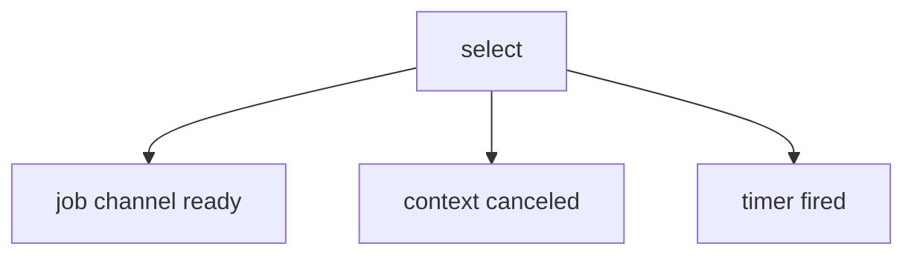
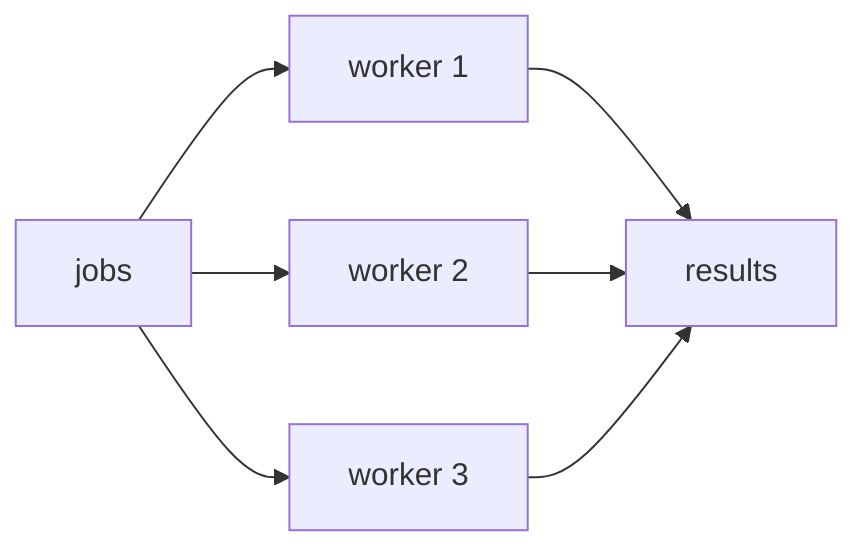

# 06. 併發程式設計

Go 的招牌能力是併發。重點不是「開很多 goroutine」，而是「清楚管理生命週期、資料所有權與取消」。

## goroutine

```go
go func() {
	fmt.Println("run in background")
}()
```

goroutine 很便宜，但不是免費。大量 goroutine 仍然要有邊界。

## channel

```go
jobs := make(chan int)

go func() {
	jobs <- 1
	close(jobs)
}()

for job := range jobs {
	fmt.Println(job)
}
```

| Channel 類型 | 說明 |
|---|---|
| unbuffered | 傳送與接收同步 |
| buffered | 容量內可暫存 |
| receive-only | `<-chan T` |
| send-only | `chan<- T` |

## select

```go
select {
case job := <-jobs:
	handle(job)
case <-ctx.Done():
	return ctx.Err()
}
```



## sync primitives

| 工具 | 用途 |
|---|---|
| `sync.WaitGroup` | 等一組 goroutine 完成 |
| `sync.Mutex` | 保護共享資料 |
| `sync.RWMutex` | 多讀少寫 |
| `sync.Once` | 只執行一次 |
| `sync/atomic` | 低階原子計數 |

## Worker pool

```go
func worker(id int, jobs <-chan int, results chan<- int) {
	for job := range jobs {
		results <- job * 2
	}
}
```



## context cancellation

```go
ctx, cancel := context.WithTimeout(context.Background(), 2*time.Second)
defer cancel()

req, err := http.NewRequestWithContext(ctx, http.MethodGet, url, nil)
```

context 應由上層傳入，下層負責尊重取消。

## 常見錯誤

| 錯誤 | 原因 | 修正 |
|---|---|---|
| goroutine leak | channel 沒關或沒監聽 cancel | 每個 goroutine 都能因 context 結束 |
| 對 closed channel send | 關閉者不清楚 | 由 sender 負責 close |
| map concurrent write | map 非 thread-safe | 加 mutex 或集中到單一 goroutine |
| worker 無上限 | 流量一高就爆 | 用 worker pool 或 semaphore |

## 小練習

1. 開 3 個 worker 處理 10 個 job。
2. 加上 `context.WithTimeout`，超時就停止。
3. 用 `sync.Mutex` 保護一個計數器。
