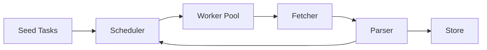
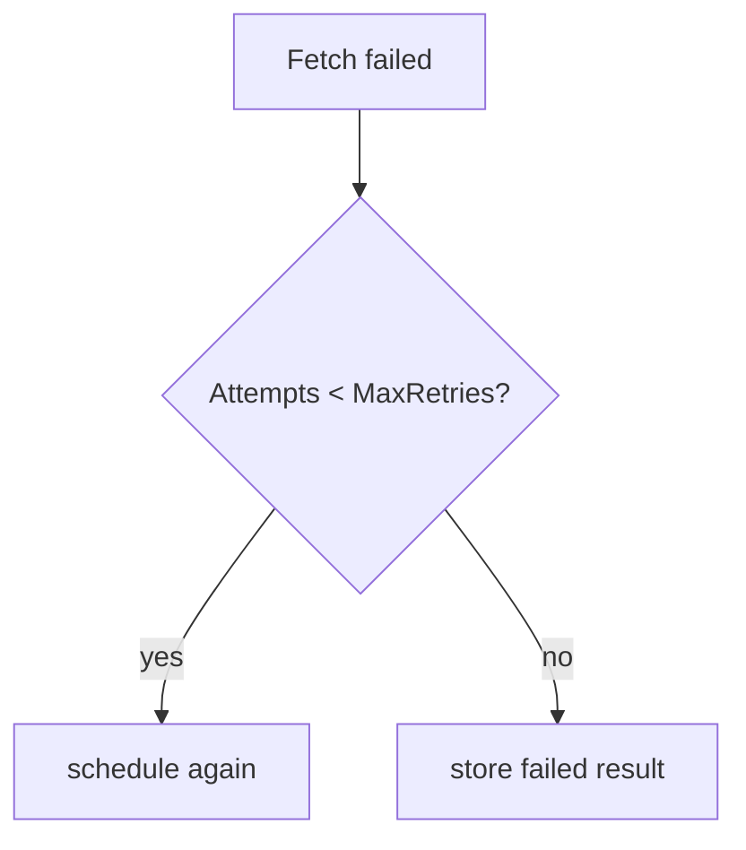

# 07. 大型專案：並發爬蟲 / 任務系統

這一章把前面的語法整合成一個實務專案：並發爬蟲 / 任務系統。它不是追求最強爬蟲，而是示範可維護的 Go 架構。

## 核心流程



## 核心介面

| 元件 | 責任 |
|---|---|
| `Task` | 描述待處理任務，例如 URL、深度、重試次數 |
| `Fetcher` | 取得資料，實作可替換成 HTTP、測試假資料、檔案 |
| `Parser` | 解析資料，產生標題與新連結 |
| `Scheduler` | 控制 worker pool、queue、retry、取消 |
| `Store` | 儲存結果，先用記憶體實作 |

## 為什麼用 interface

爬蟲最容易踩到「測試依賴外部網站」的問題，所以 `Fetcher` 和 `Store` 做成 interface。測試時可以換成 fake fetcher，不需要真的打網路。

```go
type Fetcher interface {
	Fetch(ctx context.Context, task Task) (FetchedPage, error)
}
```

## 併發設計

| 問題 | 專案做法 |
|---|---|
| 任務太多 | 使用固定 worker pool |
| 外部服務太慢 | HTTP timeout + context |
| 暫時性失敗 | retry 有上限 |
| 需要停止 | 每個 worker 監聽 `ctx.Done()` |
| 結果共享 | `MemoryStore` 用 mutex 保護 |

## Rate limit

rate limit 用 `time.Ticker` 控制每次 fetch 的間隔，避免 worker 同時對外部服務造成過大壓力。

```go
if c.rateLimit > 0 {
	select {
	case <-ticker.C:
	case <-ctx.Done():
		return
	}
}
```

## Retry

retry 不應該無限重試。本專案把重試次數記在 `Task.Attempts`，超過 `MaxRetries` 就記錄失敗。



## 如何執行

```bash
go test ./project-concurrent-crawler/...
go run ./project-concurrent-crawler/cmd/crawler
```

## 讀程式順序

1. 先看 `crawler/types.go` 理解資料模型與介面。
2. 再看 `crawler/crawler.go` 理解 scheduler 與 worker pool。
3. 接著看 `crawler/fetcher.go`、`crawler/parser.go`、`crawler/store.go`。
4. 最後看測試，理解如何用 fake fetcher 驗證併發流程。

## 小練習

1. 把 `MaxDepth` 改成 2，觀察任務數量變化。
2. 新增一個 `FileStore`，把結果寫成 JSON lines。
3. 對 retry 分支新增更多測試案例。
