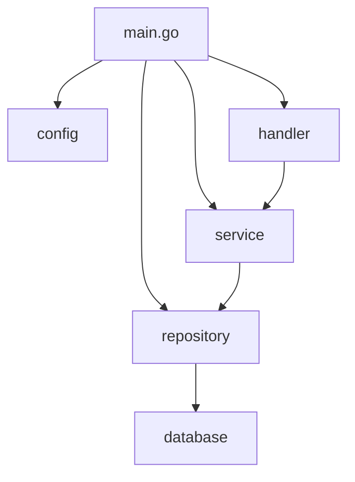
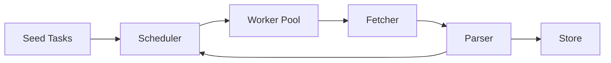
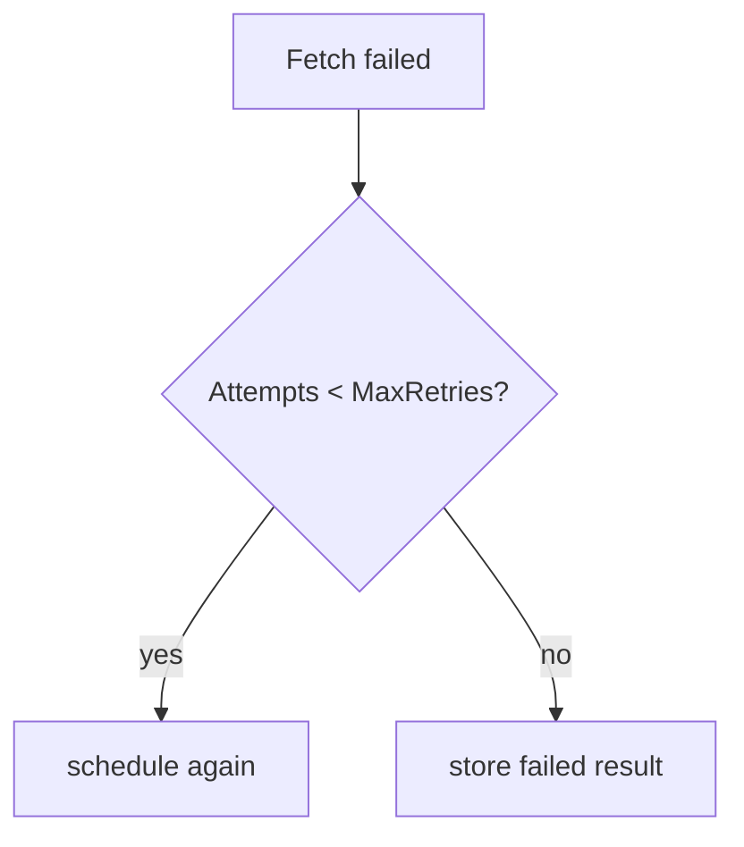

# 07. 大型專案：架構設計與實務

這一章分兩部分：先建立通用的 Go 大型專案架構觀念，再用並發爬蟲 / 任務系統做完整示範。

## 通用大型專案目錄結構

Go 社區有共識但沒有官方強制標準。以下是經過實務驗證的目錄佈局：

```text
my-service/
├── cmd/                    # 執行檔入口（每個子目錄 = 一個 binary）
│   ├── api/
│   │   └── main.go
│   ├── worker/
│   │   └── main.go
│   └── migrate/
│       └── main.go
├── internal/               # 只有本 module 能 import（Go 編譯器強制）
│   ├── config/             # 設定讀取與 struct
│   ├── domain/             # 核心商業邏輯、entity、interface
│   ├── service/            # 應用層：串接 domain 與 infrastructure
│   ├── repository/         # 資料存取實作（DB、cache）
│   ├── handler/            # HTTP / gRPC handler
│   └── middleware/         # HTTP middleware
├── pkg/                    # 可被外部 module import 的公用工具
│   ├── logger/
│   └── httputil/
├── api/                    # API 定義檔（OpenAPI、protobuf）
├── configs/                # 設定檔範本
├── scripts/                # 建構 / 部署腳本
├── deployments/            # Docker、K8s、Terraform
├── docs/                   # 文件
├── go.mod
├── go.sum
├── Makefile
└── README.md
```

| 目錄 | 角色 | 決策要點 |
|---|---|---|
| `cmd/` | 每個子目錄對應一個 `main.go` | 保持極薄，只做 wire-up |
| `internal/` | Go 強制只有本 module 能用 | 放所有核心邏輯 |
| `pkg/` | 可被外部 import | 慎用，只放真正通用的工具 |
| `api/` | API schema 定義 | protobuf、OpenAPI spec |
| `configs/` | 設定檔範本 | `.env.example`、`config.yaml.example` |
| `deployments/` | 部署相關 | Dockerfile、docker-compose、K8s manifests |

> **工程經驗**：不要一開始就建滿所有目錄。從 `cmd/` + `internal/` 開始，有需求再擴展。過度結構化的專案比結構不足的更難維護。

## Dependency Injection（不用框架）

Go 社區偏好手動 wire，不用 DI container。

```go
// cmd/api/main.go — 手動 wire-up
func main() {
	cfg := config.Load()

	db := repository.NewPostgres(cfg.DatabaseURL)
	cache := repository.NewRedis(cfg.RedisURL)

	userRepo := repository.NewUserRepo(db)
	userService := service.NewUserService(userRepo, cache)
	userHandler := handler.NewUserHandler(userService)

	mux := http.NewServeMux()
	userHandler.Register(mux)

	log.Fatal(http.ListenAndServe(cfg.Addr, mux))
}
```



| 方式 | 優點 | 缺點 |
|---|---|---|
| 手動 wire | 清楚、可追蹤、編譯期檢查 | 依賴多時程式碼冗長 |
| `wire`（Google） | 程式碼生成，減少 boilerplate | 學習成本、多一步生成 |
| `fx`（Uber） | 反射式 DI container | 執行期才發現錯誤 |

## Configuration 管理

遵循 12-Factor App 精神：設定來自環境變數，程式內用 struct 承接。

```go
type Config struct {
	Addr        string `env:"ADDR"         envDefault:":8080"`
	DatabaseURL string `env:"DATABASE_URL" required:"true"`
	LogLevel    string `env:"LOG_LEVEL"    envDefault:"info"`
}

func Load() Config {
	var cfg Config
	if err := env.Parse(&cfg); err != nil {
		log.Fatal(err)
	}
	return cfg
}
```

| 層次 | 來源 | 優先順序 |
|---|---|---|
| 預設值 | 程式碼內 / struct tag | 最低 |
| 設定檔 | `configs/config.yaml` | 中 |
| 環境變數 | `export DATABASE_URL=...` | 最高 |

## Makefile 慣例

```makefile
.PHONY: build test lint run docker

APP_NAME := my-service
VERSION  := $(shell git describe --tags --always)

build:
	go build -ldflags "-X main.version=$(VERSION)" -o bin/$(APP_NAME) ./cmd/api

test:
	go test -race -cover ./...

lint:
	golangci-lint run ./...

run:
	go run ./cmd/api

docker:
	docker build -t $(APP_NAME):$(VERSION) .
```

---

## 實戰案例：並發爬蟲 / 任務系統

以下把前面的語法整合成一個實務專案：並發爬蟲 / 任務系統。它不是追求最強爬蟲，而是示範可維護的 Go 架構。

## 核心流程



## 核心介面

| 元件 | 責任 |
|---|---|
| `Task` | 描述待處理任務，例如 URL、深度、重試次數 |
| `Fetcher` | 取得資料，實作可替換成 HTTP、測試假資料、檔案 |
| `Parser` | 解析資料，產生標題與新連結 |
| `Scheduler` | 控制 worker pool、queue、retry、取消 |
| `Store` | 儲存結果，先用記憶體實作 |

## 為什麼用 interface

爬蟲最容易踩到「測試依賴外部網站」的問題，所以 `Fetcher` 和 `Store` 做成 interface。測試時可以換成 fake fetcher，不需要真的打網路。

```go
type Fetcher interface {
	Fetch(ctx context.Context, task Task) (FetchedPage, error)
}
```

## 併發設計

| 問題 | 專案做法 |
|---|---|
| 任務太多 | 使用固定 worker pool |
| 外部服務太慢 | HTTP timeout + context |
| 暫時性失敗 | retry 有上限 |
| 需要停止 | 每個 worker 監聽 `ctx.Done()` |
| 結果共享 | `MemoryStore` 用 mutex 保護 |

## Rate limit

rate limit 用 `time.Ticker` 控制每次 fetch 的間隔，避免 worker 同時對外部服務造成過大壓力。

```go
if c.rateLimit > 0 {
	select {
	case <-ticker.C:
	case <-ctx.Done():
		return
	}
}
```

## Retry

retry 不應該無限重試。本專案把重試次數記在 `Task.Attempts`，超過 `MaxRetries` 就記錄失敗。



## 如何執行

```bash
go test ./project-concurrent-crawler/...
go run ./project-concurrent-crawler/cmd/crawler
```

## 第二階段專案：production API + worker

如果並發爬蟲已經讓你理解 worker pool、retry、store abstraction，下一步就不該停在 toy project。這個教材已經附了一個更接近實務服務的第二階段專案：`production-api-worker/`。

```text
production-api-worker/
├── cmd/
│   ├── api-worker/      # HTTP API + queue 啟動入口
│   └── migrate/         # migration CLI
├── internal/
│   ├── api/             # handler / routing / metrics endpoint
│   ├── app/             # service / transaction boundary
│   ├── domain/          # 核心型別
│   ├── observability/   # slog + Prometheus + OpenTelemetry
│   ├── repository/      # memory / Postgres store
│   └── worker/          # bounded queue + graceful shutdown
├── docker-compose.yml
└── README.md
```

| 對比面向 | `project-concurrent-crawler` | `production-api-worker` |
|---|---|---|
| 學習重點 | worker pool、parser、retry | API、transaction、queue、observability、部署 |
| 外部依賴 | 幾乎沒有 | Postgres、OTLP、Docker Compose |
| 驗證方式 | `go test` 為主 | `go test` + `docker compose up --build` |
| 專案階段 | 教學型大型專案 | 接近 production 的服務骨架 |

### API 合約與相容性

production service 的對外邊界不是 handler 程式碼本身，而是「使用端可以依賴的合約」。如果沒有明確的合約文件與測試，重構 handler、調整錯誤訊息或新增欄位時，很容易無意間破壞前端、CLI 或其他服務。

| 合約面向 | 必須固定的內容 | 破壞風險 |
|---|---|---|
| Endpoint | method、path、path parameter | client 找不到路由或誤用動詞 |
| Request schema | 必填欄位、型別、大小限制 | 舊 client 送出的 payload 被拒絕 |
| Response schema | HTTP status、JSON 欄位、狀態 enum | client decode 失敗或狀態判斷錯誤 |
| Error envelope | `error.code`、`error.message` | client 無法用穩定 code 做分支 |
| Observability | route label、trace span name、metrics label、`X-Request-ID` | dashboard、alert 與 incident log 無法對照 |

`production-api-worker/docs/api-contract.md` 示範了最小可維護合約：`POST /jobs`、`GET /jobs/{id}`、health endpoint、metrics endpoint、錯誤格式與 release gate。這不是要把文件寫成百科，而是讓每次 release 都能回答三個問題：

1. 這次變更是否改了使用端看得到的 HTTP 合約？
2. 若改了，是否向後相容？
3. 若不相容，是否需要新版本路由、feature flag 或 migration 計畫？

### Request Correlation 與可排障性

Production service 的 observability 不是「有 metrics endpoint」就結束。當使用者回報一個失敗 request 時，工程師必須能從 response header 找到同一筆 structured log 與 trace span。`production-api-worker` 用 `X-Request-ID` 做最小關聯：

| 關聯位置 | 固定內容 |
|---|---|
| HTTP response | 永遠回傳 `X-Request-ID`；若 client 已提供則原樣保留 |
| Structured log | `request_id`、`method`、`route`、`error_code` |
| Trace attribute | `request.id`、`http.route` |
| Contract test | `TestRequestIDContract` 固定自動產生與 header 回傳行為 |

這類欄位也屬於外部操作合約。改掉 route label、span name 或 request id header，可能不會讓單元測試失敗，卻會讓 dashboard、alert rule、客服查詢與 incident review 失去關聯。

### Contract Test Gate

合約文件需要測試保護。`production-api-worker/internal/api` 的 contract test 應至少固定：

```bash
cd production-api-worker
go test ./internal/api -run 'Test.*Contract' -count=1
```

| 測試項 | 檢查內容 |
|---|---|
| 成功建立 job | `202 Accepted`、`Content-Type: application/json`、`id/name/payload/status` |
| 不合法 request | `400 Bad Request`、`error.code=invalid_input` |
| 找不到資源 | `404 Not Found`、`error.code=not_found` |
| Queue full | `503 Service Unavailable`、`error.code=queue_full` |
| Request ID | client header 原樣回傳；未提供時產生 `req-*` |

> 工程經驗：內部重構可以自由，但外部合約要保守。若需要破壞性變更，先新增新路由或新欄位，讓舊 client 有遷移窗口。

### Service Lifecycle：ready、draining、shutdown

Production service 的生命週期要分清楚三件事：process 是否活著、是否還能接新流量、已接收的背景工作是否已處理完。`production-api-worker` 用 `/livez`、`/readyz` 與 queue drain 示範這個差異。

| 階段 | `/livez` | `/readyz` | 主要行為 |
|---|---:|---:|---|
| Ready | 200 | 200 | 正常接收 API request 與 queue job |
| Draining | 200 | 503 | 停止對外導流，既有 request 仍可在 deadline 內完成 |
| Queue drain | 200 | 503 | 不再接新 job，等待已排入 queue 的工作完成 |
| Forced cancel | 可能結束 | 503 | drain deadline 到期才取消 worker context |

這個流程避免兩種常見錯誤：第一，process 還活著但其實已準備關閉，load balancer 仍繼續送流量；第二，收到 signal 立刻 cancel worker context，導致 queue 裡已接受的 job 被中斷。

### 建議閱讀順序

1. 先完成 `crawler/types.go`、`crawler/crawler.go` 的 worker / queue 心智模型。
2. 再看 `production-api-worker/internal/app/service.go`，理解 service transaction boundary。
3. 接著讀 `internal/api/handler.go` 與 `internal/observability/observability.go`，把 HTTP、metrics、tracing 串起來。
4. 再看 `internal/lifecycle/readiness.go` 與 `cmd/api-worker/main.go`，理解 ready / draining / queue drain。
5. 對照 `docs/api-contract.md` 與 `internal/api/handler_test.go`，理解合約文件如何被測試守住。
6. 最後跑 `docker compose up --build`，驗證 migration、API、worker、metrics 整體鏈路。

## 讀程式順序

1. 先看 `crawler/types.go` 理解資料模型與介面。
2. 再看 `crawler/crawler.go` 理解 scheduler 與 worker pool。
3. 接著看 `crawler/fetcher.go`、`crawler/parser.go`、`crawler/store.go`。
4. 最後看測試，理解如何用 fake fetcher 驗證併發流程。

## 小練習

1. 把 `MaxDepth` 改成 2，觀察任務數量變化。
2. 新增一個 `FileStore`，把結果寫成 JSON lines。
3. 對 retry 分支新增更多測試案例。
4. 參照 `production-api-worker`，幫 crawler 加上 metrics 與 graceful shutdown。
