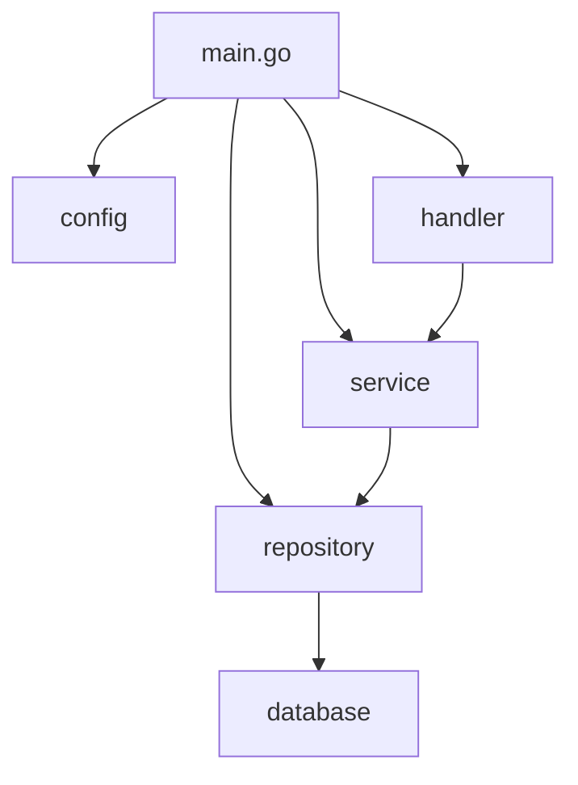
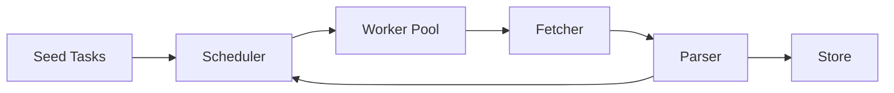
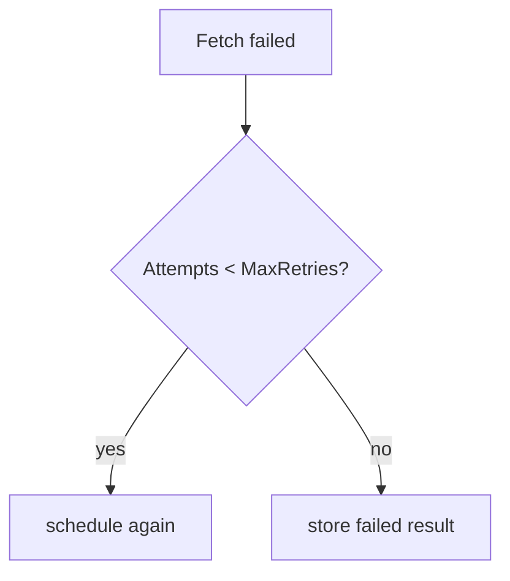

# 07. 大型專案：架構設計與實務

這一章分兩部分：先建立通用的 Go 大型專案架構觀念，再用並發爬蟲 / 任務系統做完整示範。

## 通用大型專案目錄結構

Go 社區有共識但沒有官方強制標準。以下是經過實務驗證的目錄佈局：

```text
my-service/
├── cmd/                    # 執行檔入口（每個子目錄 = 一個 binary）
│   ├── api/
│   │   └── main.go
│   ├── worker/
│   │   └── main.go
│   └── migrate/
│       └── main.go
├── internal/               # 只有本 module 能 import（Go 編譯器強制）
│   ├── config/             # 設定讀取與 struct
│   ├── domain/             # 核心商業邏輯、entity、interface
│   ├── service/            # 應用層：串接 domain 與 infrastructure
│   ├── repository/         # 資料存取實作（DB、cache）
│   ├── handler/            # HTTP / gRPC handler
│   └── middleware/         # HTTP middleware
├── pkg/                    # 可被外部 module import 的公用工具
│   ├── logger/
│   └── httputil/
├── api/                    # API 定義檔（OpenAPI、protobuf）
├── configs/                # 設定檔範本
├── scripts/                # 建構 / 部署腳本
├── deployments/            # Docker、K8s、Terraform
├── docs/                   # 文件
├── go.mod
├── go.sum
├── Makefile
└── README.md
```

| 目錄 | 角色 | 決策要點 |
|---|---|---|
| `cmd/` | 每個子目錄對應一個 `main.go` | 保持極薄，只做 wire-up |
| `internal/` | Go 強制只有本 module 能用 | 放所有核心邏輯 |
| `pkg/` | 可被外部 import | 慎用，只放真正通用的工具 |
| `api/` | API schema 定義 | protobuf、OpenAPI spec |
| `configs/` | 設定檔範本 | `.env.example`、`config.yaml.example` |
| `deployments/` | 部署相關 | Dockerfile、docker-compose、K8s manifests |

> **工程經驗**：不要一開始就建滿所有目錄。從 `cmd/` + `internal/` 開始，有需求再擴展。過度結構化的專案比結構不足的更難維護。

## Dependency Injection（不用框架）

Go 社區偏好手動 wire，不用 DI container。

```go
// cmd/api/main.go — 手動 wire-up
func main() {
	cfg := config.Load()

	db := repository.NewPostgres(cfg.DatabaseURL)
	cache := repository.NewRedis(cfg.RedisURL)

	userRepo := repository.NewUserRepo(db)
	userService := service.NewUserService(userRepo, cache)
	userHandler := handler.NewUserHandler(userService)

	mux := http.NewServeMux()
	userHandler.Register(mux)

	log.Fatal(http.ListenAndServe(cfg.Addr, mux))
}
```



| 方式 | 優點 | 缺點 |
|---|---|---|
| 手動 wire | 清楚、可追蹤、編譯期檢查 | 依賴多時程式碼冗長 |
| `wire`（Google） | 程式碼生成，減少 boilerplate | 學習成本、多一步生成 |
| `fx`（Uber） | 反射式 DI container | 執行期才發現錯誤 |

## Configuration 管理

遵循 12-Factor App 精神：設定來自環境變數，程式內用 struct 承接。

```go
type Config struct {
	Addr        string `env:"ADDR"         envDefault:":8080"`
	DatabaseURL string `env:"DATABASE_URL" required:"true"`
	LogLevel    string `env:"LOG_LEVEL"    envDefault:"info"`
}

func Load() Config {
	var cfg Config
	if err := env.Parse(&cfg); err != nil {
		log.Fatal(err)
	}
	return cfg
}
```

| 層次 | 來源 | 優先順序 |
|---|---|---|
| 預設值 | 程式碼內 / struct tag | 最低 |
| 設定檔 | `configs/config.yaml` | 中 |
| 環境變數 | `export DATABASE_URL=...` | 最高 |

## Makefile 慣例

```makefile
.PHONY: build test lint run docker

APP_NAME := my-service
VERSION  := $(shell git describe --tags --always)

build:
	go build -ldflags "-X main.version=$(VERSION)" -o bin/$(APP_NAME) ./cmd/api

test:
	go test -race -cover ./...

lint:
	golangci-lint run ./...

run:
	go run ./cmd/api

docker:
	docker build -t $(APP_NAME):$(VERSION) .
```

---

## 實戰案例：並發爬蟲 / 任務系統

以下把前面的語法整合成一個實務專案：並發爬蟲 / 任務系統。它不是追求最強爬蟲，而是示範可維護的 Go 架構。

## 核心流程



## 核心介面

| 元件 | 責任 |
|---|---|
| `Task` | 描述待處理任務，例如 URL、深度、重試次數 |
| `Fetcher` | 取得資料，實作可替換成 HTTP、測試假資料、檔案 |
| `Parser` | 解析資料，產生標題與新連結 |
| `Scheduler` | 控制 worker pool、queue、retry、取消 |
| `Store` | 儲存結果，先用記憶體實作 |

## 為什麼用 interface

爬蟲最容易踩到「測試依賴外部網站」的問題，所以 `Fetcher` 和 `Store` 做成 interface。測試時可以換成 fake fetcher，不需要真的打網路。

```go
type Fetcher interface {
	Fetch(ctx context.Context, task Task) (FetchedPage, error)
}
```

## 併發設計

| 問題 | 專案做法 |
|---|---|
| 任務太多 | 使用固定 worker pool |
| 外部服務太慢 | HTTP timeout + context |
| 暫時性失敗 | retry 有上限 |
| 需要停止 | 每個 worker 監聽 `ctx.Done()` |
| 結果共享 | `MemoryStore` 用 mutex 保護 |

## Rate limit

rate limit 用 `time.Ticker` 控制每次 fetch 的間隔，避免 worker 同時對外部服務造成過大壓力。

```go
if c.rateLimit > 0 {
	select {
	case <-ticker.C:
	case <-ctx.Done():
		return
	}
}
```

## Retry

retry 不應該無限重試。本專案把重試次數記在 `Task.Attempts`，超過 `MaxRetries` 就記錄失敗。



## 如何執行

```bash
go test ./project-concurrent-crawler/...
go run ./project-concurrent-crawler/cmd/crawler
```

## 讀程式順序

1. 先看 `crawler/types.go` 理解資料模型與介面。
2. 再看 `crawler/crawler.go` 理解 scheduler 與 worker pool。
3. 接著看 `crawler/fetcher.go`、`crawler/parser.go`、`crawler/store.go`。
4. 最後看測試，理解如何用 fake fetcher 驗證併發流程。

## 小練習

1. 把 `MaxDepth` 改成 2，觀察任務數量變化。
2. 新增一個 `FileStore`，把結果寫成 JSON lines。
3. 對 retry 分支新增更多測試案例。
