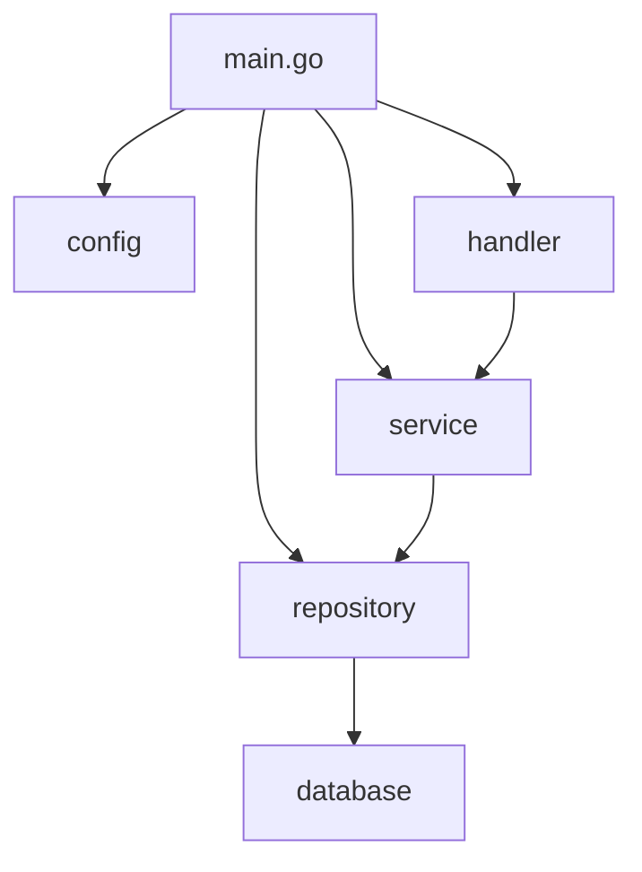
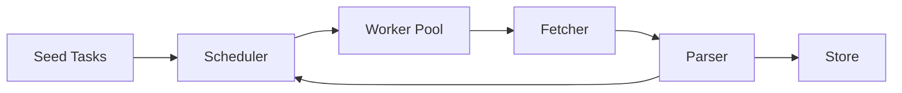
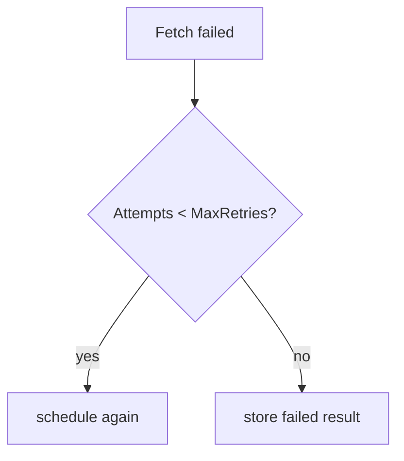

# 07. 大型專案：架構設計與實務

這一章分兩部分：先建立通用的 Go 大型專案架構觀念，再用並發爬蟲 / 任務系統做完整示範。

## 通用大型專案目錄結構

Go 社區有共識但沒有官方強制標準。以下是經過實務驗證的目錄佈局：

```text
my-service/
├── cmd/                    # 執行檔入口（每個子目錄 = 一個 binary）
│   ├── api/
│   │   └── main.go
│   ├── worker/
│   │   └── main.go
│   └── migrate/
│       └── main.go
├── internal/               # 只有本 module 能 import（Go 編譯器強制）
│   ├── config/             # 設定讀取與 struct
│   ├── domain/             # 核心商業邏輯、entity、interface
│   ├── service/            # 應用層：串接 domain 與 infrastructure
│   ├── repository/         # 資料存取實作（DB、cache）
│   ├── handler/            # HTTP / gRPC handler
│   └── middleware/         # HTTP middleware
├── pkg/                    # 可被外部 module import 的公用工具
│   ├── logger/
│   └── httputil/
├── api/                    # API 定義檔（OpenAPI、protobuf）
├── configs/                # 設定檔範本
├── scripts/                # 建構 / 部署腳本
├── deployments/            # Docker、K8s、Terraform
├── docs/                   # 文件
├── go.mod
├── go.sum
├── Makefile
└── README.md
```

| 目錄 | 角色 | 決策要點 |
|---|---|---|
| `cmd/` | 每個子目錄對應一個 `main.go` | 保持極薄，只做 wire-up |
| `internal/` | Go 強制只有本 module 能用 | 放所有核心邏輯 |
| `pkg/` | 可被外部 import | 慎用，只放真正通用的工具 |
| `api/` | API schema 定義 | protobuf、OpenAPI spec |
| `configs/` | 設定檔範本 | `.env.example`、`config.yaml.example` |
| `deployments/` | 部署相關 | Dockerfile、docker-compose、K8s manifests |

> **工程經驗**：不要一開始就建滿所有目錄。從 `cmd/` + `internal/` 開始，有需求再擴展。過度結構化的專案比結構不足的更難維護。

## Dependency Injection（不用框架）

Go 社區偏好手動 wire，不用 DI container。

```go
// cmd/api/main.go — 手動 wire-up
func main() {
	cfg := config.Load()

	db := repository.NewPostgres(cfg.DatabaseURL)
	cache := repository.NewRedis(cfg.RedisURL)

	userRepo := repository.NewUserRepo(db)
	userService := service.NewUserService(userRepo, cache)
	userHandler := handler.NewUserHandler(userService)

	mux := http.NewServeMux()
	userHandler.Register(mux)

	log.Fatal(http.ListenAndServe(cfg.Addr, mux))
}
```



| 方式 | 優點 | 缺點 |
|---|---|---|
| 手動 wire | 清楚、可追蹤、編譯期檢查 | 依賴多時程式碼冗長 |
| `wire`（Google） | 程式碼生成，減少 boilerplate | 學習成本、多一步生成 |
| `fx`（Uber） | 反射式 DI container | 執行期才發現錯誤 |

## Configuration 管理

遵循 12-Factor App 精神：設定來自環境變數，程式內用 struct 承接。

```go
type Config struct {
	Addr        string `env:"ADDR"         envDefault:":8080"`
	DatabaseURL string `env:"DATABASE_URL" required:"true"`
	LogLevel    string `env:"LOG_LEVEL"    envDefault:"info"`
}

func Load() Config {
	var cfg Config
	if err := env.Parse(&cfg); err != nil {
		log.Fatal(err)
	}
	return cfg
}
```

| 層次 | 來源 | 優先順序 |
|---|---|---|
| 預設值 | 程式碼內 / struct tag | 最低 |
| 設定檔 | `configs/config.yaml` | 中 |
| 環境變數 | `export DATABASE_URL=...` | 最高 |

Production service 不應讓錯誤設定 silent fallback。像 `PORT=http`、`QUEUE_SIZE=0`、`WORKERS=-1` 這類部署錯誤應在啟動時 fail fast，而不是悄悄套用預設值。

```go
cfg, err := config.Load()
if err != nil {
	log.Fatalf("load config: %v", err)
}
```

| 設定項 | 驗證重點 | 失敗策略 |
|---|---|---|
| `PORT` | 1-65535 的 TCP port | 啟動失敗 |
| `QUEUE_SIZE` | 正整數 | 啟動失敗 |
| `WORKERS` | 正整數 | 啟動失敗 |
| `DATABASE_URL` | 空值時明確切換 memory mode | 不可誤判為 Postgres mode |

## Makefile 慣例

```makefile
.PHONY: build test lint run docker

APP_NAME := my-service
VERSION  := $(shell git describe --tags --always)

build:
	go build -ldflags "-X main.version=$(VERSION)" -o bin/$(APP_NAME) ./cmd/api

test:
	go test -race -cover ./...

lint:
	golangci-lint run ./...

run:
	go run ./cmd/api

docker:
	docker build -t $(APP_NAME):$(VERSION) .
```

---

## 實戰案例：並發爬蟲 / 任務系統

以下把前面的語法整合成一個實務專案：並發爬蟲 / 任務系統。它不是追求最強爬蟲，而是示範可維護的 Go 架構。

## 核心流程



## 核心介面

| 元件 | 責任 |
|---|---|
| `Task` | 描述待處理任務，例如 URL、深度、重試次數 |
| `Fetcher` | 取得資料，實作可替換成 HTTP、測試假資料、檔案 |
| `Parser` | 解析資料，產生標題與新連結 |
| `Scheduler` | 控制 worker pool、queue、retry、取消 |
| `Store` | 儲存結果，先用記憶體實作 |

## 為什麼用 interface

爬蟲最容易踩到「測試依賴外部網站」的問題，所以 `Fetcher` 和 `Store` 做成 interface。測試時可以換成 fake fetcher，不需要真的打網路。

```go
type Fetcher interface {
	Fetch(ctx context.Context, task Task) (FetchedPage, error)
}
```

## 併發設計

| 問題 | 專案做法 |
|---|---|
| 任務太多 | 使用固定 worker pool |
| 外部服務太慢 | HTTP timeout + context |
| 暫時性失敗 | retry 有上限 |
| 需要停止 | 每個 worker 監聽 `ctx.Done()` |
| 結果共享 | `MemoryStore` 用 mutex 保護 |

## Rate limit

rate limit 用 `time.Ticker` 控制每次 fetch 的間隔，避免 worker 同時對外部服務造成過大壓力。

```go
if c.rateLimit > 0 {
	select {
	case <-ticker.C:
	case <-ctx.Done():
		return
	}
}
```

## Retry

retry 不應該無限重試。本專案把重試次數記在 `Task.Attempts`，超過 `MaxRetries` 就記錄失敗。



## 如何執行

```bash
go test ./project-concurrent-crawler/...
go run ./project-concurrent-crawler/cmd/crawler
```

## 第二階段專案：production API + worker

如果並發爬蟲已經讓你理解 worker pool、retry、store abstraction，下一步就不該停在 toy project。這個教材已經附了一個更接近實務服務的第二階段專案：`production-api-worker/`。

```text
production-api-worker/
├── cmd/
│   ├── api-worker/      # HTTP API + queue 啟動入口
│   └── migrate/         # migration CLI
├── internal/
│   ├── api/             # handler / routing / metrics endpoint
│   ├── app/             # service / transaction boundary
│   ├── domain/          # 核心型別
│   ├── migration/       # SQL migration runner / version contract
│   ├── observability/   # slog + Prometheus + OpenTelemetry
│   ├── repository/      # memory / Postgres store
│   └── worker/          # bounded queue + graceful shutdown
├── docker-compose.yml
└── README.md
```

| 對比面向 | `project-concurrent-crawler` | `production-api-worker` |
|---|---|---|
| 學習重點 | worker pool、parser、retry | API、API key security contract、rate limit contract、request body limit contract、HTTP server timeout contract、worker failure contract、queue backpressure contract、transaction、context-aware retry、request timeout contract、queue shutdown safety、observability、部署 |
| 外部依賴 | 幾乎沒有 | Postgres、OTLP、Docker Compose |
| 驗證方式 | `go test` 為主 | `go test` + `docker compose up --build` |
| 專案階段 | 教學型大型專案 | 接近 production 的服務骨架 |

### API 合約與相容性

production service 的對外邊界不是 handler 程式碼本身，而是「使用端可以依賴的合約」。如果沒有明確的合約文件與測試，重構 handler、調整錯誤訊息或新增欄位時，很容易無意間破壞前端、CLI 或其他服務。

| 合約面向 | 必須固定的內容 | 破壞風險 |
|---|---|---|
| Endpoint | method、path、path parameter | client 找不到路由或誤用動詞 |
| Request schema | 必填欄位、型別、大小限制、unknown field、trailing JSON | 舊 client 送出的 payload 被拒絕，或錯誤 request 被誤當 500 |
| Request decoding contract | `TestRequestDecodingContract`、`DisallowUnknownFields`、單一 JSON value、`node scripts/check-request-decoding-contract.mjs` | handler 重構後可能重新接受 typo 欄位、trailing JSON 或把 client error 誤分類成 500 |
| Idempotency key contract | `Idempotency-Key`、`TestIdempotencyKeyContract`、`TestCreateJobIdempotencyKeyContract`、`node scripts/check-idempotency-key-contract.mjs` | client timeout retry 可能重複建立 job、重複 enqueue，造成下游副作用或資料重複 |
| API latency metrics contract | `api_request_duration_seconds`、route / method / status labels、`TestAPILatencyMetricsContract`、`node scripts/check-api-latency-metrics-contract.mjs` | API 延遲只能從 log 或 trace 推測，缺少可告警與可聚合的 Prometheus histogram |
| Response schema | HTTP status、JSON 欄位、狀態 enum | client decode 失敗或狀態判斷錯誤 |
| Error envelope | `error.code`、`error.message` | client 無法用穩定 code 做分支 |
| Observability | route label、trace span name、metrics label、`X-Request-ID` | dashboard、alert 與 incident log 無法對照 |
| OTLP collector contract | `production-api-worker/otel-collector.yaml`、OTLP gRPC `0.0.0.0:4317`、`debug exporter`、Compose endpoint | trace 程式碼存在，但 collector pipeline 或 Compose endpoint 漂移後無法收 span |
| Trace shutdown contract | `node scripts/check-trace-shutdown-contract.mjs`、`TestTraceShutdownContract`、3 秒 bounded shutdown、api-worker exit hook | exporter flush 或 provider shutdown 在 process exit 時無 deadline，導致 graceful shutdown 無法預測 |
| API security | `API_KEY`、Bearer token、公開 health endpoint、安全標頭 | 業務 endpoint 或 metrics 無條件公開，或 health check 被認證擋住 |
| API security contract gate | `node scripts/check-api-security-contract.mjs`、`TestAPIKeyAuthContract`、`TestSecurityHeadersContract`、OpenAPI `bearerAuth`、CI 入口 | 文件寫了 API key，但測試、OpenAPI 或 workflow 漂移後無法阻擋 regression |
| Secret handling governance contract gate | `node scripts/check-secret-handling-governance-contract.mjs`、`make secret-handling-governance-check`、secret rotation owner、incident artifact redaction | 教學 token、pprof token、scrape auth 或 trace/log artifact 出現 hard-coded production credentials 或未遮蔽外流 |
| CORS allowlist contract | `CORS_ALLOWED_ORIGINS`、exact origin、preflight `204`、blocked origin `403` | 為了讓瀏覽器前端能呼叫 API 而誤開 `Access-Control-Allow-Origin: *` |
| Request body limit contract | `REQUEST_BODY_LIMIT_BYTES`、`http.MaxBytesReader`、`413 payload_too_large` | 大型 payload 或誤用 client 直接消耗 handler memory / decode 時間 |
| HTTP server timeout contract | `HTTP_READ_HEADER_TIMEOUT`、`HTTP_READ_TIMEOUT`、`HTTP_WRITE_TIMEOUT`、`HTTP_IDLE_TIMEOUT`、`HTTP_SHUTDOWN_TIMEOUT`、`QUEUE_DRAIN_TIMEOUT` | slow client、卡住的 response 或過長 drain 讓部署與容量行為不可預測 |
| Worker failure contract | `TestWorkerFailureResultContract`、`worker_jobs_total{result="failed"}`、duration metric、`node scripts/check-worker-failure-contract.mjs` | worker processor 失敗只留在 log，無法用 metrics 或 CI gate 發現 |
| Queue backpressure contract | `TestQueueBackpressureContract`、`domain.ErrQueueFull`、`503 queue_full`、`worker_jobs_total{result="dropped"}`、`node scripts/check-queue-backpressure-contract.mjs` | queue 滿載行為分散在 handler / service / worker，重構後可能錯回 500 或漏記 dropped metric |
| Rate limit contract | `RATE_LIMIT_REQUESTS_PER_MINUTE`、per-client IP、`429 rate_limited`、`Retry-After` | 單一 client 持續打爆 handler、queue 或 DB，或 health check 被錯誤限速 |
| Trusted proxy client IP contract gate | `TRUSTED_PROXY_CIDRS`、`X-Forwarded-For`、untrusted `RemoteAddr` fallback、`node scripts/check-trusted-proxy-contract.mjs` | 服務在 reverse proxy 後方時誤信任外部直連偽造 header，導致 rate limit key 被繞過 |
| OpenAPI contract | `api/openapi.yaml`、request/response schema、error code、auth scheme | Markdown 文件與前端 mock / SDK / API gateway review 漂移 |
| Readiness lifecycle contract | `/livez=200`、`/readyz=200/503`、`TestReadinessContract`、`node scripts/check-readiness-contract.mjs` | deployment health probe 漂移，rolling deploy 時導流系統無法正確停止新 request |
| Panic recovery contract | `TestPanicRecoveryContract`、`500 internal_error` JSON、request id header、`node scripts/check-panic-recovery-contract.mjs` | panic 造成連線中斷、非 JSON 錯誤、洩漏內部細節，或文件 / CI 入口漂移 |
| Request timeout | `504 request_timeout` JSON、request id header | handler deadline exceeded 被誤分類成 `500 internal_error`，client 無法區分 timeout 與 bug |
| Retry cancellation contract | deadlock backoff、request context、shutdown deadline、`node scripts/check-retry-cancellation-contract.mjs` | request 已取消後仍繼續重試 DB 交易或排入 queue |
| Startup config | port、queue size、worker count、optional endpoint | 錯誤 env 被 silent fallback，容量與部署設定不一致 |
| Prometheus config contract gate | `node scripts/check-prometheus-config-contract.mjs`、scrape job、rule_files、alert rules、Compose monitoring profile、API key scrape auth 風險 | Prometheus 設定或 alert rules 漂移後，metrics scrape / alert loading 只在人工測試時才被發現 |
| Operational observability contract gate | `node scripts/check-operational-observability-contract.mjs`、runbook、Prometheus scrape config、alert rules、Compose monitoring profile | observability 只剩 metrics/log 概念，缺少 incident workflow、告警與監控 profile 的 release gate |
| Migration contract gate | migration env、timeout、schema version、SQL 檔命名、`node scripts/check-migration-contract.mjs` | 重複套用 schema、release 後無法追蹤 DB 版本，或文件 / CI / Go tests 漂移 |
| Worker shutdown contract | `node scripts/check-worker-shutdown-contract.mjs`、enqueue 與 close 的同步邊界、`ErrClosed`、shutdown tests | shutdown 期間可能送入已關閉 channel，造成 panic |
| Shutdown signal contract | `SIGINT`、`SIGTERM`、readiness draining、HTTP shutdown、queue drain | Docker / Kubernetes 發出 `SIGTERM` 時未進入 graceful shutdown |
| CI quality gate static gate | `node scripts/check-ci-quality-gate-contract.mjs`、root course、production contracts、race/coverage、govulncheck、Docker build、Compose smoke | workflow 重整後漏掉 dependency verify、漏洞掃描、競態檢查或部署 smoke |
| Contract gate inventory | `node scripts/check-contract-gate-inventory-contract.mjs`、45 個 root contract checker、GitHub Actions 呼叫清單 | 新增 checker 後沒有進入 CI、Makefile 或教材入口，導致 release gate 漂移 |
| Docs publishing contract gate | `node scripts/check-docs-publishing-contract.mjs`、`docs/index.html`、GitHub Pages link fix、HTML 主頁教程回鏈 | 首頁同步後 Release Notes、補充教材入口或回主頁連結在 Pages 上漂移 |
| Production workflow contract gate | `node scripts/check-production-workflow-contract.mjs`、standalone workflow、contract tests、race/coverage、govulncheck、Docker smoke | production worker 抽成獨立 repo 時 workflow 退化成只跑快速測試 |
| Syntax flow SVG contract gate | `node scripts/check-syntax-flow-svg-contract.mjs`、25 個 syntax flow、標準流程圖符號、SVG metadata、blueprint renderer | 視覺化語法教材退回不可維護圖檔、缺少 accessibility metadata 或 docs/來源漂移 |
| Go ReleaseNote contract gate | `node scripts/check-go-release-notes-contract.mjs`、Go 1.1-1.26 報告、根目錄與 Pages 同步、最新 patch 訊號 | ReleaseNote 產生器或 Pages 同步後遺失官方來源、支援狀態、必要報告區塊或 Go 1.26.4 / Go 1.25.11 patch revisions |
| Release artifact chain contract gate | `node scripts/check-release-artifact-chain-contract.mjs`、審查報告、內容需要更新的部分、更新資料、VERSION、CHANGELOG、docs/index | 發版缺少可回查 artifact chain，導致審查結論、修正清單與推送紀錄無法對齊 |
| Dependency governance static gate | `node scripts/check-dependency-governance-contract.mjs`、`go mod verify`、`go list -m -u all`、`govulncheck ./...`、離線限制說明 | 新增 module 或 workflow 重整後漏掉 dependency integrity、可更新版本盤點或漏洞掃描 |
| Supply chain artifact governance contract gate | `node scripts/check-supply-chain-artifact-governance-contract.mjs`、SBOM、image signing、provenance / attestation、artifact retention、promotion approval、release evidence owner | release promotion 只保留 commit/tag，沒有可審核的 artifact evidence |
| Performance benchmark governance contract | `node scripts/check-performance-benchmark-governance-contract.mjs`、benchmark A/B、`benchstat old.txt new.txt`、pprof、metrics | API / worker / queue hot path 改動只跑功能測試，未留下可比較的效能證據 |
| Docker build contract | `node scripts/check-docker-build-contract.mjs`、Dockerfile、`CGO_ENABLED=0`、`api-worker` / `migrate` binaries、`distroless/static-debian12`、CI build tags | Dockerfile 或 workflow tag 漂移，導致 production image 與 release gate 不一致 |
| Compose runtime env contract | `node scripts/check-compose-runtime-env-contract.mjs`、`make compose-runtime-env-check`、`docker-compose.yml`、runtime env、service dependency、monitoring profile | Compose deployment env 或 dependency 漂移，導致 smoke test 前的設定面不可追蹤 |

`production-api-worker/docs/api-contract.md` 示範了最小可維護合約：`POST /jobs`、`GET /jobs/{id}`、health endpoint、metrics endpoint、錯誤格式與 release gate。`production-api-worker/api/openapi.yaml` 則把同一份合約轉成 machine-readable OpenAPI artifact，讓前端 mock、SDK 產生、API gateway review 與 contract diff 可以共用同一份 schema。這不是要把文件寫成百科，而是讓每次 release 都能回答三個問題：

1. 這次變更是否改了使用端看得到的 HTTP 合約？
2. 若改了，是否向後相容？
3. 若不相容，是否需要新版本路由、feature flag 或 migration 計畫？

### Shutdown signal contract

服務生命週期不只處理 local Ctrl+C。`production-api-worker` 的 `api-worker` 需要同時監聽 `SIGINT` 與 `SIGTERM`，讓本機中斷、Docker stop、Compose rolling update 與 Kubernetes rolling deploy 都能進入同一套 draining 流程。

```bash
cd production-api-worker
go test ./cmd/api-worker -run 'TestMonitoredSignalsContract' -count=1
```

若只監聽 `os.Interrupt`，正式部署收到 `SIGTERM` 時可能直接離開 process，導致 `/readyz` 沒有先轉 503、HTTP server 沒有停止接新 request、queue 也沒有時間 drain。

### Request Correlation 與可排障性

Production service 的 observability 不是「有 metrics endpoint」就結束。當使用者回報一個失敗 request 時，工程師必須能從 response header 找到同一筆 structured log 與 trace span。`production-api-worker` 用 `X-Request-ID` 做最小關聯：

| 關聯位置 | 固定內容 |
|---|---|
| HTTP response | 永遠回傳 `X-Request-ID`；若 client 已提供則原樣保留 |
| Structured log | `request_id`、`method`、`route`、`error_code` |
| Trace attribute | `request.id`、`http.route` |
| Contract test | `TestRequestIDContract` 固定自動產生與 header 回傳行為 |

這類欄位也屬於外部操作合約。改掉 route label、span name 或 request id header，可能不會讓單元測試失敗，卻會讓 dashboard、alert rule、客服查詢與 incident review 失去關聯。

OpenTelemetry 也需要 deployment contract。`production-api-worker/otel-collector.yaml` 固定 OTLP gRPC receiver `0.0.0.0:4317` 與本地 `debug exporter`，`docker-compose.yml` 則固定 `OTEL_EXPORTER_OTLP_ENDPOINT=otel-collector:4317`。這不是正式 APM 架構，而是教學用的最小 trace pipeline：先確定 API span 真的能送到 collector，再由正式環境把 exporter 換成 Tempo、Jaeger、OTLP backend 或雲端平台。

OTLP export governance contract gate 進一步固定 production 替換邊界：local `debug exporter` 不可被誤當成正式 tracing backend；Tempo、Jaeger、OTLP backend 或雲端 APM 需保留 backend owner、sampling rate、retention window、sensitive attribute redaction 與 trace data owner。

Trace shutdown contract 由 `node scripts/check-trace-shutdown-contract.mjs` 固定：`Observability.Shutdown` 必須用 3 秒 bounded context 呼叫 trace provider shutdown，`api-worker` process exit 也必須保留 `obs.Shutdown(context.Background())` hook。這讓 exporter flush 不會在 rolling deploy、測試清理或本機 Ctrl+C 後無限等待。

```bash
node scripts/check-otel-collector-contract.mjs
node scripts/check-otel-export-governance-contract.mjs
cd production-api-worker && make otel-check
cd production-api-worker && make otel-export-governance-check
```

### API Security Contract

教學專案常為了好跑而省略認證，但 production 教材至少要示範「可公開」與「需保護」的 HTTP 邊界。`production-api-worker` 使用可選 `API_KEY` 做最小 security contract：local mode 可留空，部署時設定後，業務 endpoint 與 metrics endpoint 需要 Bearer token。

| Endpoint | 安全邊界 | 原因 |
|---|---|---|
| `POST /jobs`、`GET /jobs/{id}` | `Authorization: Bearer <API_KEY>` | 避免未授權建立或查詢工作 |
| `GET /metrics` | `Authorization: Bearer <API_KEY>` | metrics 可能洩漏 route、status、容量與錯誤訊號 |
| `GET /livez`、`GET /readyz` | 公開 | load balancer / orchestrator 需要不用業務 token 即可探測 |
| 所有 response | `nosniff`、`DENY`、`no-referrer` | 固定基本安全標頭，避免不同 handler 漏設 |

這不是完整 IAM 設計；真正的 production 仍應評估 OAuth2、mTLS、API gateway、WAF、rate limit 與 secret rotation。教材這裡先固定最小可測邊界，避免讀者把「能跑」誤解成「可上線」。

### Contract Test Gate

合約文件需要測試保護。`production-api-worker/internal/api` 的 contract test 應至少固定：

```bash
cd production-api-worker
go test ./internal/api -run 'Test.*Contract' -count=1
```

| 測試項 | 檢查內容 |
|---|---|
| 成功建立 job | `202 Accepted`、`Content-Type: application/json`、`id/name/payload/status` |
| 不合法 request | malformed JSON、unknown field、trailing JSON、空白 name 都回 `400 Bad Request`、`error.code=invalid_input` |
| Request decoding contract | `TestRequestDecodingContract` 與 `node scripts/check-request-decoding-contract.mjs` 固定 strict decoder、OpenAPI、README、章節與 CI 入口 |
| Idempotency key contract | `Idempotency-Key` header、memory/Postgres lookup、migration unique index、`TestIdempotencyKeyContract` 與 `node scripts/check-idempotency-key-contract.mjs` 固定 retry-safe create |
| API latency metrics contract | `api_request_duration_seconds` histogram、route / method / status labels、`TestAPILatencyMetricsContract` 與 `node scripts/check-api-latency-metrics-contract.mjs` 固定 API latency SLI |
| Service transaction boundary contract | `sql.TxOptions{Isolation: sql.LevelReadCommitted}`、commit 後 enqueue、queue-full failed 回寫、`TestServiceTransactionBoundaryContract` 與 `node scripts/check-service-transaction-boundary-contract.mjs` 固定 service / queue 邊界 |
| Trace shutdown contract | `Observability.Shutdown`、3 秒 bounded context、`TestTraceShutdownContract` 與 `node scripts/check-trace-shutdown-contract.mjs` 固定 trace provider shutdown |
| 找不到資源 | `404 Not Found`、`error.code=not_found` |
| Queue full | `503 Service Unavailable`、`error.code=queue_full` |
| Request ID | client header 原樣回傳；未提供時產生 `req-*` |
| Request correlation contract | `X-Request-ID`、request context、structured log `request_id`、trace attribute `request.id` 與 `node scripts/check-request-correlation-contract.mjs` |
| API security contract gate | `API_KEY` 啟用後 `/jobs`、`/metrics` 未帶 token 回 `401 unauthorized`，health endpoint 仍公開，並由 `node scripts/check-api-security-contract.mjs` 固定 |
| Worker failure contract | worker processor 成功/失敗都寫入 `worker_jobs_total` result label，並由 `node scripts/check-worker-failure-contract.mjs` 固定 |
| Queue backpressure contract | bounded queue 滿載時回 `domain.ErrQueueFull`，API 對外回 `503 queue_full`，並由 `node scripts/check-queue-backpressure-contract.mjs` 固定 |
| Retry cancellation contract | deadlock retry backoff 遇到 `ctx.Done()` 需停止，並由 `node scripts/check-retry-cancellation-contract.mjs` 固定 |
| Security headers | 所有 response 保留 `X-Content-Type-Options`、`X-Frame-Options`、`Referrer-Policy` |
| CORS allowlist | allowed origin preflight 回 `204` 與 `Access-Control-Allow-Origin`；blocked origin preflight 回 `403` 且不回 CORS header |
| Request body limit | oversized `POST /jobs` 回 `413 payload_too_large` 並保留 `X-Request-ID` |
| HTTP server timeout | server read header / read / write / idle / shutdown / queue drain timeout 由 config 集中套用 |
| Rate limit | 每個 client IP 超過 `RATE_LIMIT_REQUESTS_PER_MINUTE` 時回 `429 rate_limited` 與 `Retry-After` |
| Trusted proxy client IP contract gate | 只有 `TRUSTED_PROXY_CIDRS` 命中的來源可採用 `X-Forwarded-For` 第一個 IP，並由 `node scripts/check-trusted-proxy-contract.mjs` 固定 |
| Panic recovery contract | handler panic 仍回 `500`、`error.code=internal_error` 與原 `X-Request-ID`，並由 `node scripts/check-panic-recovery-contract.mjs` 固定 |
| Readiness lifecycle contract | `/livez`、`/readyz`、ready/draining status 與 public probes 由 `node scripts/check-readiness-contract.mjs` 固定 |
| Request timeout | handler deadline exceeded 仍回 `504`、`error.code=request_timeout` 與原 `X-Request-ID` |

> 工程經驗：內部重構可以自由，但外部合約要保守。若需要破壞性變更，先新增新路由或新欄位，讓舊 client 有遷移窗口。

### Request Decoding 與輸入邊界

HTTP handler 的第一個 production 邊界是 request decoder。`json.Decoder` 預設允許一些容易被忽略的情況，例如只 decode 第一個 JSON value，或把 unknown field 交給後續流程無聲略過。對 API contract 來說，這些都應該明確化，否則 client typo 可能長期潛伏，真正出錯時又被誤分類成 `500 internal_error`。

`production-api-worker` 的 `POST /jobs` 使用獨立的 `decodeJobInput` gate：

| 檢查 | 合約行為 |
|---|---|
| Malformed JSON | `400 invalid_input` |
| Unknown field | `400 invalid_input` |
| Trailing JSON value | `400 invalid_input` |
| 空白 `name` | `400 invalid_input` |
| Body 超過 `REQUEST_BODY_LIMIT_BYTES` | `413 payload_too_large` |

這類檢查不只是「表單驗證」，而是 API 相容性的一部分。當欄位命名、payload 限制或 decoder 嚴格度改變時，都應該進入 contract test 與 release note。

### Panic Recovery 與錯誤邊界

Go 的 `panic/recover` 不應拿來取代一般錯誤處理，但 production HTTP server 需要在最外層 handler 邊界做 recover。原因不是要吞掉 bug，而是避免未預期 panic 讓 client 看到連線中斷、HTML 錯誤頁或 panic 細節。

`production-api-worker` 的 routes 順序是：request context middleware 建立 `X-Request-ID`，metrics middleware 記錄 status，recover middleware 把 panic 轉成穩定 JSON。這讓 panic path 仍然有 request id、structured log 與 metrics label。

| 邊界 | 做法 |
|---|---|
| Handler / service panic | recover middleware 記錄 `panic recovered` structured log |
| Client response | 固定 `500 Internal Server Error` 與 `error.code=internal_error` |
| Request correlation | 原本的 `X-Request-ID` 仍回傳，方便排障 |
| 測試保護 | `TestPanicRecoveryContract` 固定外部錯誤格式 |
| Static gate | `node scripts/check-panic-recovery-contract.mjs` 固定 README、OpenAPI、章節、Makefile 與 CI 入口 |

### Request Timeout 與錯誤分類

Production API 的 timeout 不是未知錯誤。若 handler 建立的 request deadline 到期，上層 client 需要知道這是 timeout path，才能決定是否 retry、降級或回報使用者。因此 `context.DeadlineExceeded` 不應落到 `500 internal_error`。

`production-api-worker/internal/api.Handler.writeError` 會把 deadline exceeded 分類成穩定合約：

| 邊界 | 做法 |
|---|---|
| Handler timeout | 回 `504 Gateway Timeout` |
| Error code | `request_timeout` |
| Request correlation | 原本的 `X-Request-ID` 仍回傳 |
| 測試保護 | `TestRequestTimeoutContract` 固定 timeout 外部行為 |
| Request timeout static gate | `node scripts/check-request-timeout-contract.mjs` 與 `make request-timeout-check` 固定文件、OpenAPI、章節、Makefile 與 CI 入口 |

### Compose Smoke 與端到端啟動合約

`production-api-worker` 的 Docker Compose smoke 不是只確認 image build 成功，而是固定最小 production chain：Postgres、migration、API、worker、readiness 與 metrics 必須一起可用。`scripts/compose-smoke.sh` 保持在 host 端執行，避免把 curl 放進 runtime image，同時驗證 `/livez`、`/readyz`、`POST /jobs`、`GET /jobs/{id}` 與 `/metrics`。

| 邊界 | 做法 |
|---|---|
| 啟動流程 | `docker compose up -d --build` |
| Smoke script | `make compose-smoke` 呼叫 host-side `scripts/compose-smoke.sh` |
| 失敗診斷 | CI 失敗時保留 `docker compose logs --no-color` |
| Compose smoke static gate | `node scripts/check-compose-smoke-contract.mjs` 與 `make compose-smoke-check` 固定文件、runbook、章節、Makefile 與 CI 入口 |

### CI Quality Gate Contract

`production-api-worker` 的 release gate 不能只靠「有 GitHub Actions 檔案」。CI quality gate static gate 會固定 root module 測試、production contract tests、`go mod verify`、`go test -race -cover`、`govulncheck ./...`、Docker build 與 Compose smoke，避免 workflow 重整時只保留快速測試而漏掉部署與安全檢查。

| Gate | 固定內容 |
|---|---|
| Root course | 根目錄範例、docs entry、OpenAPI / runbook / Prometheus / contract static checks |
| Production contracts | `make ci-contract` 對齊 config、migration、API、worker 與 lifecycle contract tests |
| CI contract parity gate | `node scripts/check-ci-contract-parity-contract.mjs` 固定 `make ci-contract` 與 GitHub Actions production contract job 的 API test selector 一致，避免漏跑 `TestCORSAllowedOriginsContract` |
| Operational observability contract gate | `node scripts/check-operational-observability-contract.mjs` 固定 runbook、Prometheus scrape config、alert rules、Compose monitoring profile、API key scrape auth 風險與 CI 入口 |
| Worker shutdown contract | `node scripts/check-worker-shutdown-contract.mjs` 固定 queue close/enqueue mutex、`ErrClosed`、shutdown tests、Makefile 與 CI 入口 |
| Contract gate inventory | `node scripts/check-contract-gate-inventory-contract.mjs` 固定 45 個 root contract checker 都被 GitHub Actions 呼叫，避免 checker 只存在於 repo 沒有進入 release gate |
| Docs publishing contract gate | `node scripts/check-docs-publishing-contract.mjs` 固定 `docs/index.html`、GitHub Pages link fix 與 HTML 主頁教程回鏈，避免 Pages 首頁入口漂移 |
| Production workflow contract gate | `node scripts/check-production-workflow-contract.mjs` 固定 `production-api-worker/.github/workflows/production-api-worker.yml` 的 contract、race/coverage、govulncheck、Docker build、Compose smoke、failure logs 與 cleanup |
| Syntax flow SVG contract gate | `node scripts/check-syntax-flow-svg-contract.mjs` 固定語法流程圖補充頁的 25 個 flow、標準流程圖符號、SVG metadata、blueprint renderer、Makefile 與 CI 入口 |
| Go ReleaseNote contract gate | `node scripts/check-go-release-notes-contract.mjs` 固定 Go 1.1-1.26 專業報告、27 個 ReleaseNote HTML、官方來源、Patch Revisions、支援狀態與 `docs/ReleaseNote/` Pages 同步 |
| Release artifact chain contract gate | `node scripts/check-release-artifact-chain-contract.mjs` 固定審查報告、內容需要更新的部分、更新資料、版本標記、CHANGELOG 與 docs/index 發布同步 |
| Dependency governance static gate | `node scripts/check-dependency-governance-contract.mjs` 固定 root / production module 的 `go mod tidy`、`go mod verify`、`go list -m -u all`、`govulncheck ./...` 與離線處理邊界 |
| Supply chain artifact governance contract gate | `node scripts/check-supply-chain-artifact-governance-contract.mjs` 與 `make supply-chain-artifact-governance-check` 固定 SBOM、image signing、provenance / attestation、artifact retention、promotion approval 與 release evidence owner |
| Performance benchmark governance contract | `node scripts/check-performance-benchmark-governance-contract.mjs` 固定 benchmark A/B、benchstat、pprof、metrics、Makefile 與 CI 入口 |
| Docker build contract | `node scripts/check-docker-build-contract.mjs` 與 `make docker-build-check` 固定 Dockerfile、CGO_ENABLED=0、api-worker / migrate binaries、distroless/static-debian12、Makefile 與 CI build tags |
| Compose runtime env contract | `node scripts/check-compose-runtime-env-contract.mjs` 與 `make compose-runtime-env-check` 固定 Docker Compose runtime env、migration dependency、OTEL endpoint、API_KEY、REQUEST_BODY_LIMIT_BYTES、TRUSTED_PROXY_CIDRS、CORS_ALLOWED_ORIGINS 與 monitoring profile |
| Race / coverage | `go test -race -cover ./... -count=1` 固定併發與覆蓋率 gate |
| Vulnerability scan | root module 與 `production-api-worker` 都需跑 `govulncheck ./...` |
| Docker / smoke | Docker image build 後用 Compose smoke 驗證 `/readyz`、job create/read 與 metrics |
| Static gate | `node scripts/check-ci-quality-gate-contract.mjs` 與 `make ci-quality-gate-check` 固定文件、Makefile 與 CI 入口 |

### Startup Configuration Contract

設定錯誤是 deployment fault，不是可忽略的小問題。`production-api-worker/internal/config` 示範把 env 讀取集中到單一 package，先驗證再 wire service。

| 設定 | 預設 | 合約 |
|---|---:|---|
| `PORT` | `8080` | 必須是 1-65535 |
| `QUEUE_SIZE` | `64` | 必須是正整數 |
| `WORKERS` | `4` | 必須是正整數 |
| `DATABASE_URL` | 空 | 空值時使用 memory store |
| `DATABASE_MAX_OPEN_CONNS` | `25` | 必須是正整數 |
| `DATABASE_MAX_IDLE_CONNS` | `10` | 必須是正整數，且不可大於最大開啟連線數 |
| `DATABASE_CONN_MAX_LIFETIME` | `30m0s` | 必須是正數 duration |
| `OTEL_EXPORTER_OTLP_ENDPOINT` | 空 | 空值時只輸出 stdout trace |

這個案例適合放在第 7 章，因為它強調 `cmd/` 的職責不是堆業務邏輯，而是做 configuration、dependency wiring 與啟動失敗邊界。設定 loader 有自己的 unit test，避免部署環境變更時破壞啟動合約。

Startup config contract gate 會用 `node scripts/check-startup-config-contract.mjs` 固定 `PORT`、`QUEUE_SIZE`、`WORKERS`、`OTEL_EXPORTER_OTLP_ENDPOINT`、config loader、config tests、README、API contract、Makefile 與 CI 入口，避免啟動設定只存在於文件敘述或單一路徑測試。

DB connection pool 也是啟動合約的一部分。若 `SetMaxOpenConns(25)`、`SetMaxIdleConns(10)`、`SetConnMaxLifetime(30*time.Minute)` 直接寫死在 repository，讀者會學到錯誤的維運模型：程式碼編譯值控制 production 容量，而不是部署設定、DB `max_connections` 與 worker 數共同決定。`production-api-worker` 因此把 Postgres pool 參數提升到 config 層，並用 config unit test 固定「idle 不可大於 open」與 duration 格式。

DB pool contract gate 會用 `node scripts/check-db-pool-contract.mjs` 固定 config loader、`OpenPostgresWithPool`、`api-worker` wiring、README、API contract、Makefile 與 CI 入口，避免未來重構只保留文件描述卻漏掉真實 pool 套用。

### Migration Contract 與 Schema 版本

資料庫 migration 是 deployment pipeline 的一部分，不應只是 `os.ReadDir` 後把 SQL 逐檔 `Exec`。Production service 至少要知道哪個 schema version 已套用、重跑 release job 時要略過已完成版本，並用 timeout 防止 lock wait 或網路問題無限卡住。

`production-api-worker` 把 migration 分成兩層：

| 層次 | 職責 |
|---|---|
| `internal/config.LoadMigration` | 驗證 `DATABASE_URL`、`MIGRATIONS_DIR`、`MIGRATION_TIMEOUT` |
| `internal/migration.Runner` | 掃描 SQL 檔、建立 `schema_migrations`、略過已套用版本、transaction apply |
| `cmd/migrate` | 只做 config、DB open / ping 與 runner wire-up |

| 設定 | 預設 | 合約 |
|---|---:|---|
| `DATABASE_URL` | 無 | migration 必填；空值 fail fast |
| `MIGRATIONS_DIR` | `migrations` | 不可為空白 |
| `MIGRATION_TIMEOUT` | `30s` | 必須是正數 duration |

Migration 檔名就是版本 key：`001_init.sql` 會記成 `001_init`。檔名不可空白、不可含 whitespace，避免 release 後出現難以引用的 schema version。每個新 migration 在 transaction 內執行 SQL 並寫入 `schema_migrations`；重跑時若版本已存在，就略過該檔案。

本教材用 `node scripts/check-migration-contract.mjs` 把 migration contract gate 固定在 release flow 內：README、API contract、config loader、migration runner、`cmd/migrate`、Go tests、Makefile 與 GitHub Actions 都必須同時保留，避免 migration 只剩章節說明而沒有可重跑的驗證入口。

### Service Lifecycle：ready、draining、shutdown

Production service 的生命週期要分清楚三件事：process 是否活著、是否還能接新流量、已接收的背景工作是否已處理完。`production-api-worker` 用 `/livez`、`/readyz` 與 queue drain 示範這個差異。

| 階段 | `/livez` | `/readyz` | 主要行為 |
|---|---:|---:|---|
| Ready | 200 | 200 | 正常接收 API request 與 queue job |
| Draining | 200 | 503 | 停止對外導流，既有 request 仍可在 deadline 內完成 |
| Queue drain | 200 | 503 | 不再接新 job，等待已排入 queue 的工作完成 |
| Forced cancel | 可能結束 | 503 | drain deadline 到期才取消 worker context |

`node scripts/check-readiness-contract.mjs` 會把 README、production README、API contract、OpenAPI、handler route、lifecycle state、Go tests、Makefile、GitHub Actions 與整合教程固定在同一個 Readiness lifecycle contract gate，避免 health probe 只存在於 Compose smoke 或章節描述。

這個流程避免兩種常見錯誤：第一，process 還活著但其實已準備關閉，load balancer 仍繼續送流量；第二，收到 signal 立刻 cancel worker context，導致 queue 裡已接受的 job 被中斷。

Queue 本身也要有明確的同步邊界。`production-api-worker/internal/worker.Queue` 用 mutex 同時保護 `closed` 狀態、enqueue send 與 channel close，確保 `ShutdownContext` 開始後的新 enqueue 只會得到 `ErrClosed`，不會在高併發 shutdown path 觸發 `send on closed channel`。

### Retry Cancellation 與交易重試邊界

Deadlock retry 是 production service 常見的保護機制，但 backoff 不能脫離 request context。若 HTTP request 已 timeout、client 已斷線，或服務進入 shutdown draining，service 應停止後續 DB 交易與 queue enqueue，而不是在背景繼續嘗試。

`production-api-worker/internal/app.Service` 的重試策略：

| 情境 | 行為 |
|---|---|
| 第一次交易遇到 `domain.ErrDeadlock` | 記錄 warning，短暫 backoff 後重試 |
| Backoff 期間 `ctx.Done()` | 立即回傳 `context.Canceled` 或 `context.DeadlineExceeded` |
| Context 已取消 | 不再呼叫下一次 `WithTx`，也不 enqueue job |
| 測試保護 | `TestCreateJobStopsDeadlockRetryWhenContextCanceled` 與 `node scripts/check-retry-cancellation-contract.mjs` 固定取消語意 |

這個案例適合放在第 7 章，因為它同時連到 service transaction boundary、context 傳遞、錯誤分類與 worker queue 的副作用控制。

### 建議閱讀順序

1. 先完成 `crawler/types.go`、`crawler/crawler.go` 的 worker / queue 心智模型。
2. 再看 `production-api-worker/internal/app/service.go`，理解 service transaction boundary。
3. 對照 `internal/app/service_test.go`，理解 deadlock retry 如何被 context cancellation 中斷。
4. 接著讀 `internal/api/handler.go` 與 `internal/observability/observability.go`，把 HTTP、metrics、tracing 與 panic recovery 串起來。
5. 對照 `TestAPIKeyAuthContract`、`TestSecurityHeadersContract` 與 `node scripts/check-api-security-contract.mjs`，理解 security middleware 如何保護業務 endpoint 並保留 health probe。
6. 再看 `internal/lifecycle/readiness.go` 與 `cmd/api-worker/main.go`，理解 ready / draining / queue drain。
7. 對照 `docs/api-contract.md` 與 `internal/api/handler_test.go`，理解合約文件如何被測試守住。
8. 再看 `internal/migration/migration.go` 與 `cmd/migrate/main.go`，理解 schema migration 如何被 version table 與 timeout 保護。
9. 最後跑 `docker compose up --build`，驗證 migration、API、worker、metrics 整體鏈路。

## 讀程式順序

1. 先看 `crawler/types.go` 理解資料模型與介面。
2. 再看 `crawler/crawler.go` 理解 scheduler 與 worker pool。
3. 接著看 `crawler/fetcher.go`、`crawler/parser.go`、`crawler/store.go`。
4. 最後看測試，理解如何用 fake fetcher 驗證併發流程。

## 小練習

1. 把 `MaxDepth` 改成 2，觀察任務數量變化。
2. 新增一個 `FileStore`，把結果寫成 JSON lines。
3. 對 retry 分支新增更多測試案例。
4. 參照 `production-api-worker`，幫 crawler 加上 metrics 與 graceful shutdown。
