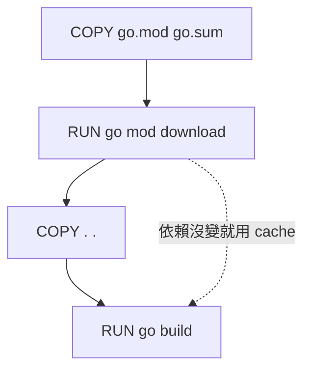

# 09. 執行檔打包與部署

Go 的編譯產出是單一靜態連結的二進制檔案，這是部署上的巨大優勢。這一章涵蓋從 `go build` 到容器化部署的完整流程。

## `go build` 基礎

```bash
# 基本編譯
go build ./cmd/api

# 指定輸出檔名
go build -o bin/myservice ./cmd/api

# 查看編譯過程
go build -v ./cmd/api
```

| Flag | 說明 |
|---|---|
| `-o` | 指定輸出路徑 |
| `-v` | 顯示編譯的 package |
| `-race` | 啟用 race detector（開發/測試用） |
| `-trimpath` | 移除編譯路徑資訊（安全考量） |
| `-tags` | 指定 build tags |

## 交叉編譯

Go 內建交叉編譯，不需要額外工具鏈。

```bash
# Linux AMD64
GOOS=linux GOARCH=amd64 go build -o bin/myservice-linux ./cmd/api

# Linux ARM64（Raspberry Pi 4、AWS Graviton）
GOOS=linux GOARCH=arm64 go build -o bin/myservice-arm64 ./cmd/api

# macOS ARM（Apple Silicon）
GOOS=darwin GOARCH=arm64 go build -o bin/myservice-darwin ./cmd/api

# Windows
GOOS=windows GOARCH=amd64 go build -o bin/myservice.exe ./cmd/api
```

### 常用 GOOS / GOARCH 組合

| GOOS | GOARCH | 用途 |
|---|---|---|
| `linux` | `amd64` | 伺服器、Docker |
| `linux` | `arm64` | ARM 伺服器、Raspberry Pi 4 |
| `linux` | `arm` | Raspberry Pi 3 |
| `darwin` | `arm64` | macOS Apple Silicon |
| `darwin` | `amd64` | macOS Intel |
| `windows` | `amd64` | Windows 桌面/伺服器 |

```bash
# 查看所有支援的平台
go tool dist list
```

### Go 1.26 Release Matrix 檢查

發布前不要只確認「本機可以 build」，而要把 toolchain 版本、目標平台與 runtime 限制寫成可重複的 release gate。

| 檢查項 | 指令 / 設定 | Go 1.26 實務重點 |
|---|---|---|
| Toolchain | `go version` / `go env GOTOOLCHAIN` | CI 與本機應固定到 Go 1.26 最新 patch；自建 Go 需 Go 1.24.6+ bootstrap |
| Module | `go list -m -f '{{.GoVersion}}'` | 新專案可用 `go 1.26`；教學相容 repo 可保留較低版本但要標註 |
| Platform | `go tool dist list` | 移除 `windows/arm`；特殊 FreeBSD/RISC-V 目標需實機或專用 CI |
| macOS runner | GitHub Actions / self-hosted runner 版本 | Go 1.27 起將要求 macOS 13+，舊 macOS 12 runner 應提前淘汰 |
| Wasm | build script / Makefile | Go 1.26 後 `GOWASM=signext,satconv` 不再有意義 |
| Race test | `GOOS=linux GOARCH=riscv64 go test -race` | Go 1.26 的 linux/riscv64 可納入 race detector 驗證 |

## `-ldflags` 注入版本資訊

在編譯時注入版本、commit hash、build time，不用寫死在程式碼中。

```go
// main.go
package main

var (
	version   = "dev"
	commit    = "none"
	buildTime = "unknown"
)

func main() {
	fmt.Printf("version=%s commit=%s built=%s\n", version, commit, buildTime)
}
```

```bash
go build -ldflags "\
  -X main.version=v1.2.3 \
  -X main.commit=$(git rev-parse --short HEAD) \
  -X main.buildTime=$(date -u +%Y-%m-%dT%H:%M:%SZ)" \
  -o bin/myservice ./cmd/api
```

| ldflags | 說明 |
|---|---|
| `-X pkg.var=value` | 設定字串變數的值 |
| `-s` | 去掉 symbol table（減小體積） |
| `-w` | 去掉 DWARF debug info（減小體積） |
| `-s -w` | 最小化二進制（通常減少 20-30%） |

## 靜態連結

```bash
# 完全靜態連結（不依賴 libc，適合 scratch / alpine）
CGO_ENABLED=0 go build -o bin/myservice ./cmd/api
```

| 設定 | 說明 |
|---|---|
| `CGO_ENABLED=0` | 禁用 CGO，產生純 Go 靜態二進制 |
| `CGO_ENABLED=1` | 啟用 CGO，需要系統 C 庫（如 SQLite） |

> **工程經驗**：除非依賴 C library（如 SQLite、某些加密庫），否則優先用 `CGO_ENABLED=0`。但「單一 binary」不等於永遠 100% 靜態：只要啟用 CGO 或連到系統 C library，就要用 `ldd` / `otool -L` / container smoke test 確認實際依賴。

## Build Tags（條件編譯）

```go
//go:build linux
// +build linux

package mypackage

// 這個檔案只在 Linux 上編譯
```

```go
//go:build !production

package debug

// 只在非 production build 時編譯
func DebugLog(msg string) {
	fmt.Println("[DEBUG]", msg)
}
```

```bash
# 指定 build tag
go build -tags production ./cmd/api
```

| 用途 | Tag 範例 |
|---|---|
| 平台專用程式碼 | `//go:build linux` |
| 開發/測試專用 | `//go:build !production` |
| 功能開關 | `//go:build feature_v2` |
| 整合測試 | `//go:build integration` |

## `//go:embed` 嵌入靜態資源

Go 1.16+ 可以把檔案直接嵌入二進制。

```go
import "embed"

//go:embed configs/default.yaml
var defaultConfig []byte

//go:embed templates/*
var templateFS embed.FS

//go:embed static/index.html
var indexHTML string
```

| 嵌入類型 | 變數型別 | 說明 |
|---|---|---|
| 單一檔案 | `[]byte` 或 `string` | 直接讀取內容 |
| 多檔案/目錄 | `embed.FS` | 實作 `fs.FS` 介面 |

```go
// 搭配 HTTP server 使用
mux.Handle("/static/", http.FileServer(http.FS(staticFS)))
```

## Docker 最佳實踐

### Multi-stage Build

```dockerfile
# Stage 1: Build
FROM golang:1.26-alpine AS builder

WORKDIR /app

# 先複製 go.mod/go.sum，利用 Docker cache
COPY go.mod go.sum ./
RUN go mod download

COPY . .
RUN CGO_ENABLED=0 go build \
    -ldflags="-s -w -X main.version=${VERSION}" \
    -o /app/server ./cmd/api

# Stage 2: Run
FROM scratch

COPY --from=builder /app/server /server
COPY --from=builder /etc/ssl/certs/ca-certificates.crt /etc/ssl/certs/

EXPOSE 8080
ENTRYPOINT ["/server"]
```

| Base Image | 大小 | 適合 |
|---|---|---|
| `scratch` | 0 MB | 純靜態二進制，最安全 |
| `gcr.io/distroless/static` | ~2 MB | 比 scratch 多 CA certs 和 tzdata |
| `alpine` | ~5 MB | 需要 shell debug |

### Docker Cache 優化



### Go 1.26 Docker / CI 升級清單

| 檔案 | 需要同步的值 | 常見失誤 |
|---|---|---|
| `go.mod` | `go 1.26` 或明確保留相容版本 | 文字教學說 Go 1.26，但 module 版本沒有註明相容策略 |
| `Dockerfile` | `FROM golang:1.26-alpine` / `golang:1.26` | builder image 停在舊版，導致新語法或新 testing API 無法編譯 |
| GitHub Actions | `actions/setup-go@v5` + `go-version: '1.26.x'` | CI 與開發機版本不一致 |
| Makefile | release matrix 與 `CGO_ENABLED` | 仍輸出已移除或未驗證的平台 |
| dependency gate | `go mod verify` + `govulncheck ./...` | 只跑測試，忽略 module hash 或已知漏洞 |
| smoke test | `docker compose up -d --build && make compose-smoke` | 只 build image，沒有確認容器內 API、migration、DB 與 metrics 可用 |

### Release 前依賴安全 Gate

```bash
go mod tidy
git diff --exit-code -- go.mod go.sum
go mod verify
go list -m -u all
govulncheck ./...
go test -race -cover ./...
```

| Gate | 阻擋 release 的條件 |
|---|---|
| `git diff --exit-code -- go.mod go.sum` | `go mod tidy` 後仍有未提交變更 |
| `go mod verify` | module cache checksum 與 `go.sum` 不一致 |
| `go list -m -u all` | 發現安全修補相關版本但沒有升級理由 |
| `govulncheck ./...` | 目前程式有可達漏洞呼叫路徑 |
| `go test -race -cover ./...` | 單元、整合或競態測試失敗 |

## Makefile 完整範例

```makefile
.PHONY: build test lint run docker clean

APP_NAME := myservice
VERSION  := $(shell git describe --tags --always --dirty)
COMMIT   := $(shell git rev-parse --short HEAD)
BUILD_TIME := $(shell date -u +%Y-%m-%dT%H:%M:%SZ)
LDFLAGS  := -s -w \
  -X main.version=$(VERSION) \
  -X main.commit=$(COMMIT) \
  -X main.buildTime=$(BUILD_TIME)

build:
	CGO_ENABLED=0 go build -ldflags "$(LDFLAGS)" -o bin/$(APP_NAME) ./cmd/api

test:
	go test -race -cover -count=1 ./...

lint:
	golangci-lint run ./...

run:
	go run ./cmd/api

docker:
	docker build --build-arg VERSION=$(VERSION) -t $(APP_NAME):$(VERSION) .

clean:
	rm -rf bin/

# 交叉編譯所有平台
release:
	GOOS=linux   GOARCH=amd64 go build -ldflags "$(LDFLAGS)" -o bin/$(APP_NAME)-linux-amd64 ./cmd/api
	GOOS=linux   GOARCH=arm64 go build -ldflags "$(LDFLAGS)" -o bin/$(APP_NAME)-linux-arm64 ./cmd/api
	GOOS=darwin  GOARCH=arm64 go build -ldflags "$(LDFLAGS)" -o bin/$(APP_NAME)-darwin-arm64 ./cmd/api
	GOOS=windows GOARCH=amd64 go build -ldflags "$(LDFLAGS)" -o bin/$(APP_NAME)-windows-amd64.exe ./cmd/api
```

## GitHub Actions CI/CD 範例

本教材現在已把 CI/CD 範例落成真實 workflow：`.github/workflows/ci.yml`。它不是展示用 YAML，而是 release gate：root course job 驗證教材範例與 docs 入口，production job 驗證 API / migration / worker 合約與 race/coverage，vulnerability job 執行 `govulncheck`，Docker job 確認 `production-api-worker` image 可建置，並用 Compose smoke 驗證服務真的 ready、可建 job、可讀 job 與可輸出 metrics。CI quality gate static gate 由 `node scripts/check-ci-quality-gate-contract.mjs` 固定 `go mod verify`、`go test -race -cover`、`govulncheck ./...`、Docker build、Compose smoke、Makefile 與 CI 入口；API latency metrics contract 由 `node scripts/check-api-latency-metrics-contract.mjs` 固定 `api_request_duration_seconds`、route / method / status labels 與 Go contract test；Service transaction boundary contract 由 `node scripts/check-service-transaction-boundary-contract.mjs` 固定 `sql.TxOptions`、commit 後 enqueue、queue-full failed 回寫、Go contract test、Makefile 與 CI 入口；Trace shutdown contract 由 `node scripts/check-trace-shutdown-contract.mjs` 固定 `Observability.Shutdown` 的 3 秒 bounded context、api-worker exit hook 與 `TestTraceShutdownContract`；Worker shutdown contract 由 `node scripts/check-worker-shutdown-contract.mjs` 固定 queue close/enqueue mutex、`ErrClosed`、`TestConcurrentEnqueueAndShutdownDoesNotPanic`、Makefile 與 CI 入口；Operational observability contract gate 由 `node scripts/check-operational-observability-contract.mjs` 固定 runbook、Prometheus scrape config、alert rules、Compose monitoring profile 與 API key scrape auth 風險；Contract gate inventory 由 `node scripts/check-contract-gate-inventory-contract.mjs` 固定 50 個 root contract checker 都被 GitHub Actions 呼叫；Performance benchmark governance contract 由 `node scripts/check-performance-benchmark-governance-contract.mjs` 固定 benchmark A/B、`benchstat old.txt new.txt`、pprof、metrics、Makefile 與 CI 入口；Docs publishing contract gate 由 `node scripts/check-docs-publishing-contract.mjs` 固定 `docs/index.html`、GitHub Pages link fix 與 HTML 主頁教程回鏈；Production workflow contract gate 由 `node scripts/check-production-workflow-contract.mjs` 固定 `production-api-worker/.github/workflows/production-api-worker.yml` 的 `make ci-contract`、race/coverage、govulncheck、Docker build、Compose smoke、failure logs 與 cleanup；Syntax flow SVG contract gate 由 `node scripts/check-syntax-flow-svg-contract.mjs` 固定語法流程圖補充頁的 25 個 flow、標準流程圖符號、SVG metadata、blueprint renderer、Makefile 與 CI 入口；Go ReleaseNote contract gate 由 `node scripts/check-go-release-notes-contract.mjs` 固定 Go 1.1-1.26 專業報告、根目錄與 Pages 同步、官方來源、支援狀態與最新 patch 訊號；Release artifact chain contract gate 由 `node scripts/check-release-artifact-chain-contract.mjs` 固定審查報告、內容需要更新的部分、更新資料、VERSION、CHANGELOG 與 docs/index 同步；Release publish reconciliation contract gate 由 `node scripts/check-release-publish-reconciliation-contract.mjs` 固定 remote-created / local-final-amended release 與 blocked-push recovery finalization 的 `HEAD`、`origin/main`、`tag^{}`、`force-with-lease`、recovery command 與成功推送輸出；Compose runtime env contract 由 `node scripts/check-compose-runtime-env-contract.mjs` 與 `make compose-runtime-env-check` 固定 Docker Compose runtime env、migration dependency、OTEL endpoint、API_KEY、REQUEST_BODY_LIMIT_BYTES、TRUSTED_PROXY_CIDRS、CORS_ALLOWED_ORIGINS 與 monitoring profile；Compose smoke static gate 則由 `node scripts/check-compose-smoke-contract.mjs` 固定 `docker compose up -d --build`、`make compose-smoke`、`docker compose logs --no-color`、`docker compose down -v`、runbook、Makefile 與 CI 入口。

本機對照指令：

```bash
ruby -e 'require "yaml"; YAML.load_file(".github/workflows/ci.yml")'
go mod verify
go test ./... -count=1
cd production-api-worker
make ci-contract
make ci-contract-parity-check
make contract-gate-inventory-check
make production-workflow-check
go test -race -cover ./... -count=1
docker build -t production-api-worker:local .
cd ..
node scripts/check-ci-quality-gate-contract.mjs
node scripts/check-ci-contract-parity-contract.mjs
node scripts/check-contract-gate-inventory-contract.mjs
node scripts/check-docs-publishing-contract.mjs
node scripts/check-production-workflow-contract.mjs
cd production-api-worker
node scripts/check-compose-smoke-contract.mjs
docker compose up -d --build
make compose-smoke
docker compose down -v
```

CI contract parity gate 由 `node scripts/check-ci-contract-parity-contract.mjs` 固定：本機 `make ci-contract` 與 GitHub Actions production contract job 必須使用相同 API test selector，包含 `TestCORSAllowedOriginsContract`。

Contract gate inventory 由 `node scripts/check-contract-gate-inventory-contract.mjs` 固定：所有 root `scripts/check-*-contract.mjs` 都必須被 `.github/workflows/ci.yml` 明確呼叫，避免新增 checker 後未進入 release gate。

Docs publishing contract gate 由 `node scripts/check-docs-publishing-contract.mjs` 固定：`docs/index.html` 必須保留 GitHub Pages 可用路徑、Release Notes 與補充教材入口，且所有 HTML 教材頁都要保留可回到 `docs/index.html` 的「主頁教程」連結。

API contract scope coverage 由 `node scripts/check-openapi-contract.mjs` 固定：`production-api-worker/docs/api-contract.md` 首段適用範圍必須列入 Docs publishing contract gate 與發布面 scope。這避免 contract 表格、OpenAPI description 與 CI checker 已更新，但 API contract header 仍停在舊範圍，讓 API gateway review 或 contract diff 誤判 release gate 覆蓋面。

Production workflow contract gate 由 `node scripts/check-production-workflow-contract.mjs` 固定：`production-api-worker/.github/workflows/production-api-worker.yml` 是 tracked standalone workflow，需保留 `make ci-contract`、`go test -race -cover ./... -count=1`、`govulncheck ./...`、Docker build、Compose smoke、failure logs 與 cleanup，避免 production worker 抽成獨立 repo 時只剩快速測試。

Syntax flow SVG contract gate 由 `node scripts/check-syntax-flow-svg-contract.mjs` 固定：`docs/golang-syntax-application-svg.html` 與整合來源都必須保留 25 個單語法流程、Start/End、Input/Output、Decision、Process 等標準流程圖符號、SVG metadata 與 blueprint renderer，避免視覺化語法教材在發布同步後只剩不可驗證的靜態內容。

Go ReleaseNote contract gate 由 `node scripts/check-go-release-notes-contract.mjs` 固定：`scripts/generate-go-release-notes.mjs`、`ReleaseNote/` 與 `docs/ReleaseNote/` 必須同步保留 Go 1.1-1.26 專業報告、官方來源、`Patch Revisions`、支援狀態圖與 Go 1.26.4 / Go 1.25.11 最新 patch 訊號，避免版本升級教材只剩人工檢查。

Release artifact chain contract gate 由 `node scripts/check-release-artifact-chain-contract.mjs` 固定：每次 release 必須保留同 timestamp 的 `審查報告/`、`內容需要更新的部分/`、`更新資料/`，並同步 `VERSION`、`CHANGELOG.md`、`docs/index.html`、Makefile 與 GitHub Actions，避免發版只留下 commit/tag 而缺少審查與更新紀錄。

Release publish reconciliation contract gate 由 `node scripts/check-release-publish-reconciliation-contract.mjs` 固定：當 remote release 已建立、但 final release-record amend 或 tag 更新仍 local-only 時，更新紀錄必須保留 `HEAD`、`origin/main`、`tag^{}`、`force-with-lease` 與 recovery command；當 blocked-push recovery 完成後，也必須新增 finalization 紀錄保存成功推送輸出。這避免下一輪 release 誤把 local-only final amend 當成已完整發布、誤以為 release 仍 blocked，或在修復時覆蓋遠端 release commit。

Dependency governance static gate 由 `node scripts/check-dependency-governance-contract.mjs` 固定：root module 與 `production-api-worker` 都需保留 `go mod tidy`、`go mod verify`、`go list -m -u all`、`govulncheck ./...`、module proxy / vulnerability database 離線限制，以及 Makefile / CI 入口。這讓依賴更新不只停在 checklist，而是成為可被 release gate 回歸的供應鏈治理條款。

Supply chain artifact governance contract gate 由 `node scripts/check-supply-chain-artifact-governance-contract.mjs` 與 `cd production-api-worker && make supply-chain-artifact-governance-check` 固定：release promotion 需保留 SBOM、image signing、provenance / attestation、artifact retention、promotion approval 與 release evidence owner。它補上 dependency governance 與 Docker build 之間的 artifact evidence 邊界，避免 CI 只證明 source 測試通過，卻無法追溯實際發布 image 是否有可審核證據。

Platform promotion policy contract gate 由 `node scripts/check-platform-promotion-policy-contract.mjs` 與 `cd production-api-worker && make platform-promotion-policy-check` 固定：實際部署平台需保留 platform promotion policy、environment approval、progressive rollout、platform-native signing、artifact verification 與 rollback owner。它把 supply chain artifact governance 推進到 production promotion 流程，避免 artifact 已簽章但環境核准、canary rollout、平台原生簽章驗證或 rollback owner 沒有可追溯紀錄。

Deployment controller config contract gate 由 `node scripts/check-deployment-controller-config-contract.mjs` 與 `cd production-api-worker && make deployment-controller-config-check` 固定：實際部署需保留 deployment controller、cloud environment template、environment manifest、progressive rollout controller、health gate、rollback trigger 與 promotion evidence。它把 promotion policy 落到 Kubernetes、cloud deploy controller 或平台 controller 的設定證據，避免只有發版核准紀錄，卻沒有 rollout controller、health gate 或 rollback trigger 可審核。

Alertmanager routing governance contract gate 由 `node scripts/check-alertmanager-routing-contract.mjs` 與 `cd production-api-worker && make alertmanager-routing-check` 固定：正式告警需保留 Alertmanager route、receiver owner、escalation owner、silence policy 與 notification evidence。它把 Prometheus rules 從「可載入」推進到「可送達與可升級」，避免 incident 發生時只有 alert expression，卻沒有 receiver、升級責任或告警送達證據。

Performance benchmark governance contract 由 `node scripts/check-performance-benchmark-governance-contract.mjs` 固定：效能修改前後需保留 benchmark A/B、`benchstat old.txt new.txt`、pprof、metrics 與原始輸出路徑，避免 hot path 改動只靠功能測試或主觀描述判斷效能。

Release rollback drill contract 由 `node scripts/check-release-rollback-drill-contract.mjs` 與 `cd production-api-worker && make release-rollback-drill-check` 固定：release promotion 或 incident rollback 不能只寫「可回滾」，而要保留 rollback decision、previous image restore、migration rollback boundary、health verification、metrics verification 與 postmortem evidence。部署章的 rollback drill 應先決定停止導流、drain 或 previous image restore，再確認 migration 是可逆、forward fix 還是需要資料修復，最後用 `/livez`、`/readyz`、API smoke、`/metrics` 與 incident note 驗證結果。

Docker build contract 由 `node scripts/check-docker-build-contract.mjs` 與 `cd production-api-worker && make docker-build-check` 固定：`production-api-worker/Dockerfile` 必須維持 multi-stage build、`CGO_ENABLED=0`、`api-worker` / `migrate` binaries、`distroless/static-debian12` runtime image、migration copy、`ENTRYPOINT ["/app/api-worker"]`，並和 root CI 的 `docker build -t production-api-worker:ci ./production-api-worker` 與 standalone workflow 的 `docker build -t production-api-worker:standalone .` 對齊。

Compose runtime env contract 由 `node scripts/check-compose-runtime-env-contract.mjs` 與 `cd production-api-worker && make compose-runtime-env-check` 固定：`docker-compose.yml` 必須保留 Postgres、migrate、api、OTEL collector、Prometheus `monitoring` profile、`DATABASE_URL`、`OTEL_EXPORTER_OTLP_ENDPOINT`、`API_KEY`、`REQUEST_BODY_LIMIT_BYTES`、`TRUSTED_PROXY_CIDRS`、`CORS_ALLOWED_ORIGINS` 與 service dependency，避免部署設定漂移只在 Compose smoke 才被間接發現。

OTLP export governance contract gate 由 `node scripts/check-otel-export-governance-contract.mjs` 與 `cd production-api-worker && make otel-export-governance-check` 固定：local `debug exporter` 只供教學，正式 Tempo、Jaeger、OTLP backend 或雲端 APM 替換需保留 backend owner、sampling rate、retention window、sensitive attribute redaction 與 trace data owner，避免 trace pipeline 只驗證 endpoint 可連線卻沒有資料治理。

Idempotency key contract 由 `node scripts/check-idempotency-key-contract.mjs` 固定：`POST /jobs` 可帶 `Idempotency-Key`，同一 key 的 retry 回同一 job，且不重複 enqueue。部署時這個 gate 同時鎖 memory mode、Postgres `idempotency_key` unique index、migration、OpenAPI、Makefile 與 GitHub Actions，避免 API gateway 或 client timeout retry 造成重複副作用。

API latency metrics contract 由 `node scripts/check-api-latency-metrics-contract.mjs` 固定：HTTP middleware 必須輸出 `api_request_duration_seconds` histogram，並用 `route`、`method`、`status` labels 與 `api_requests_total` 對齊，讓 Prometheus 可以直接看 API latency SLI。

Service transaction boundary contract 由 `node scripts/check-service-transaction-boundary-contract.mjs` 固定：`CreateJob` 需以 `sql.TxOptions{Isolation: sql.LevelReadCommitted}` 建立 job，commit 後才 enqueue worker task；若 bounded queue 滿載，service 需以 transaction 回寫 `failed`，讓部署事故能從資料狀態追蹤，不只停在 API error。

Trace shutdown contract 由 `node scripts/check-trace-shutdown-contract.mjs` 固定：trace provider shutdown 必須有 3 秒 bounded context，`api-worker` process exit 必須呼叫 `obs.Shutdown(context.Background())`，避免 exporter flush 或 provider shutdown 阻塞部署關閉流程。

Prometheus config contract gate 由 `node scripts/check-prometheus-config-contract.mjs` 固定：`configs/prometheus/prometheus.yml`、alert rules、Compose monitoring profile、API key scrape auth 風險、Makefile 與 CI 入口必須一起存在，避免 monitoring profile 啟動後才發現 scrape job 或 rule_files 漂移。

Secret handling governance contract gate 由 `node scripts/check-secret-handling-governance-contract.mjs` 與 `cd production-api-worker && make secret-handling-governance-check` 固定：`API_KEY`、`PPROF_TOKEN`、Prometheus bearer token file、secret mount、secret rotation owner、no hard-coded production credentials 與 incident artifact redaction 必須一起進入 release gate。

Operational observability contract gate 由 `node scripts/check-operational-observability-contract.mjs` 固定：runbook、Prometheus scrape config、alert rules、Compose monitoring profile、API key scrape auth 風險、Makefile 與 CI 入口必須一起存在，避免觀測性只停在概念而沒有 incident-ready release gate。

Operational runbook scope freshness contract gate 由 `node scripts/check-operational-runbook-scope-contract.mjs` 固定：`production-api-worker/docs/operational-runbook.md` 的文件日期、完整日期時間、版本與適用範圍必須同步近期 release governance surface，包含 API contract scope coverage、Docs publishing contract gate、Release artifact chain contract gate、Secret handling governance contract gate 與 Supply chain artifact governance contract gate。

```yaml
name: CI

on:
  push:
    branches: [main]
  pull_request:

jobs:
  test:
    runs-on: ubuntu-latest
    steps:
      - uses: actions/checkout@v4
      - uses: actions/setup-go@v5
        with:
          go-version: '1.26.x'
      - run: go mod verify
      - run: go install golang.org/x/vuln/cmd/govulncheck@latest
      - run: govulncheck ./...
      - run: go test -race -cover ./...

  build:
    needs: test
    runs-on: ubuntu-latest
    if: startsWith(github.ref, 'refs/tags/v')
    steps:
      - uses: actions/checkout@v4
      - uses: actions/setup-go@v5
        with:
          go-version: '1.26.x'
      - name: Build
        run: |
          CGO_ENABLED=0 go build \
            -ldflags "-s -w -X main.version=${{ github.ref_name }}" \
            -o myservice ./cmd/api
      - name: Docker Build & Push
        run: |
          docker build -t myservice:${{ github.ref_name }} .
```

## 常見錯誤

| 錯誤 | 原因 | 修正 |
|---|---|---|
| 二進制在 alpine 跑不了 | 動態連結了 libc | `CGO_ENABLED=0` |
| embed 找不到檔案 | 路徑相對於 Go 原始碼檔案 | 確認路徑相對位置 |
| ldflags 注入沒生效 | 變數 package path 錯誤 | 用完整 `module/pkg.var` |
| Docker image 太大 | 沒用 multi-stage | 分離 build 和 run stage |
| race detector 線上啟用 | `-race` 有 5-10x 效能損耗 | 只在測試啟用 |
| CI YAML 只放文件沒進 repo | release gate 無法阻擋回歸 | 把 workflow 放在 `.github/workflows/ci.yml` 並用 PR/push 觸發 |
| Docker build 成功但服務起不來 | build gate 沒驗證 migration、readiness 或 API 路徑 | 在 CI 加 `docker compose up -d --build` 與 `make compose-smoke` |

## 小練習

1. 用 `-ldflags` 注入版本號，啟動後印出版本。
2. 交叉編譯出 Linux AMD64 和 ARM64 兩個版本。
3. 用 `//go:embed` 把設定檔嵌入二進制。
4. 寫一個 multi-stage Dockerfile，產出最小映像。
5. 寫一個 Makefile 包含 build、test、docker target。
