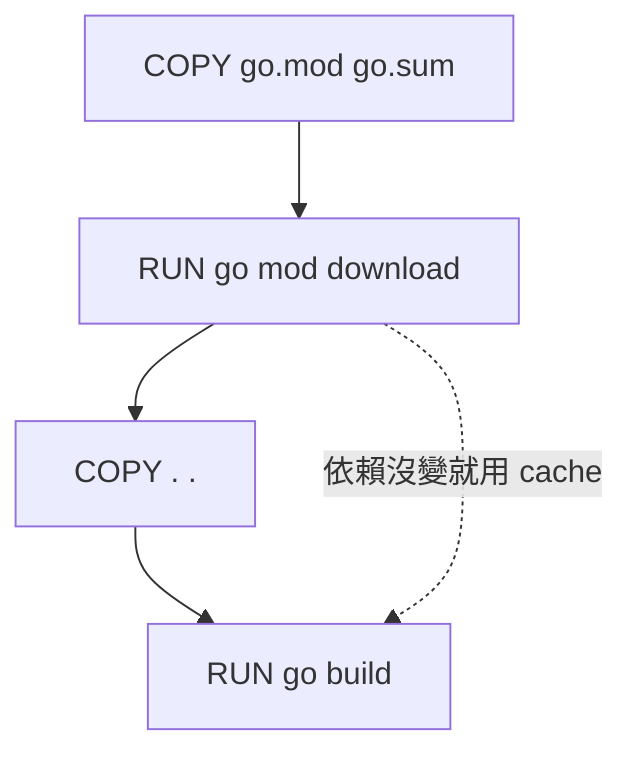

# 09. 執行檔打包與部署

Go 的編譯產出是單一靜態連結的二進制檔案，這是部署上的巨大優勢。這一章涵蓋從 `go build` 到容器化部署的完整流程。

## `go build` 基礎

```bash
# 基本編譯
go build ./cmd/api

# 指定輸出檔名
go build -o bin/myservice ./cmd/api

# 查看編譯過程
go build -v ./cmd/api
```

| Flag | 說明 |
|---|---|
| `-o` | 指定輸出路徑 |
| `-v` | 顯示編譯的 package |
| `-race` | 啟用 race detector（開發/測試用） |
| `-trimpath` | 移除編譯路徑資訊（安全考量） |
| `-tags` | 指定 build tags |

## 交叉編譯

Go 內建交叉編譯，不需要額外工具鏈。

```bash
# Linux AMD64
GOOS=linux GOARCH=amd64 go build -o bin/myservice-linux ./cmd/api

# Linux ARM64（Raspberry Pi 4、AWS Graviton）
GOOS=linux GOARCH=arm64 go build -o bin/myservice-arm64 ./cmd/api

# macOS ARM（Apple Silicon）
GOOS=darwin GOARCH=arm64 go build -o bin/myservice-darwin ./cmd/api

# Windows
GOOS=windows GOARCH=amd64 go build -o bin/myservice.exe ./cmd/api
```

### 常用 GOOS / GOARCH 組合

| GOOS | GOARCH | 用途 |
|---|---|---|
| `linux` | `amd64` | 伺服器、Docker |
| `linux` | `arm64` | ARM 伺服器、Raspberry Pi 4 |
| `linux` | `arm` | Raspberry Pi 3 |
| `darwin` | `arm64` | macOS Apple Silicon |
| `darwin` | `amd64` | macOS Intel |
| `windows` | `amd64` | Windows 桌面/伺服器 |

```bash
# 查看所有支援的平台
go tool dist list
```

## `-ldflags` 注入版本資訊

在編譯時注入版本、commit hash、build time，不用寫死在程式碼中。

```go
// main.go
package main

var (
	version   = "dev"
	commit    = "none"
	buildTime = "unknown"
)

func main() {
	fmt.Printf("version=%s commit=%s built=%s\n", version, commit, buildTime)
}
```

```bash
go build -ldflags "\
  -X main.version=v1.2.3 \
  -X main.commit=$(git rev-parse --short HEAD) \
  -X main.buildTime=$(date -u +%Y-%m-%dT%H:%M:%SZ)" \
  -o bin/myservice ./cmd/api
```

| ldflags | 說明 |
|---|---|
| `-X pkg.var=value` | 設定字串變數的值 |
| `-s` | 去掉 symbol table（減小體積） |
| `-w` | 去掉 DWARF debug info（減小體積） |
| `-s -w` | 最小化二進制（通常減少 20-30%） |

## 靜態連結

```bash
# 完全靜態連結（不依賴 libc，適合 scratch / alpine）
CGO_ENABLED=0 go build -o bin/myservice ./cmd/api
```

| 設定 | 說明 |
|---|---|
| `CGO_ENABLED=0` | 禁用 CGO，產生純 Go 靜態二進制 |
| `CGO_ENABLED=1` | 啟用 CGO，需要系統 C 庫（如 SQLite） |

> **工程經驗**：除非依賴 C library（如 SQLite、某些加密庫），否則一律用 `CGO_ENABLED=0`。容器部署幾乎都是靜態連結。

## Build Tags（條件編譯）

```go
//go:build linux
// +build linux

package mypackage

// 這個檔案只在 Linux 上編譯
```

```go
//go:build !production

package debug

// 只在非 production build 時編譯
func DebugLog(msg string) {
	fmt.Println("[DEBUG]", msg)
}
```

```bash
# 指定 build tag
go build -tags production ./cmd/api
```

| 用途 | Tag 範例 |
|---|---|
| 平台專用程式碼 | `//go:build linux` |
| 開發/測試專用 | `//go:build !production` |
| 功能開關 | `//go:build feature_v2` |
| 整合測試 | `//go:build integration` |

## `//go:embed` 嵌入靜態資源

Go 1.16+ 可以把檔案直接嵌入二進制。

```go
import "embed"

//go:embed configs/default.yaml
var defaultConfig []byte

//go:embed templates/*
var templateFS embed.FS

//go:embed static/index.html
var indexHTML string
```

| 嵌入類型 | 變數型別 | 說明 |
|---|---|---|
| 單一檔案 | `[]byte` 或 `string` | 直接讀取內容 |
| 多檔案/目錄 | `embed.FS` | 實作 `fs.FS` 介面 |

```go
// 搭配 HTTP server 使用
mux.Handle("/static/", http.FileServer(http.FS(staticFS)))
```

## Docker 最佳實踐

### Multi-stage Build

```dockerfile
# Stage 1: Build
FROM golang:1.26-alpine AS builder

WORKDIR /app

# 先複製 go.mod/go.sum，利用 Docker cache
COPY go.mod go.sum ./
RUN go mod download

COPY . .
RUN CGO_ENABLED=0 go build \
    -ldflags="-s -w -X main.version=${VERSION}" \
    -o /app/server ./cmd/api

# Stage 2: Run
FROM scratch

COPY --from=builder /app/server /server
COPY --from=builder /etc/ssl/certs/ca-certificates.crt /etc/ssl/certs/

EXPOSE 8080
ENTRYPOINT ["/server"]
```

| Base Image | 大小 | 適合 |
|---|---|---|
| `scratch` | 0 MB | 純靜態二進制，最安全 |
| `gcr.io/distroless/static` | ~2 MB | 比 scratch 多 CA certs 和 tzdata |
| `alpine` | ~5 MB | 需要 shell debug |

### Docker Cache 優化



## Makefile 完整範例

```makefile
.PHONY: build test lint run docker clean

APP_NAME := myservice
VERSION  := $(shell git describe --tags --always --dirty)
COMMIT   := $(shell git rev-parse --short HEAD)
BUILD_TIME := $(shell date -u +%Y-%m-%dT%H:%M:%SZ)
LDFLAGS  := -s -w \
  -X main.version=$(VERSION) \
  -X main.commit=$(COMMIT) \
  -X main.buildTime=$(BUILD_TIME)

build:
	CGO_ENABLED=0 go build -ldflags "$(LDFLAGS)" -o bin/$(APP_NAME) ./cmd/api

test:
	go test -race -cover -count=1 ./...

lint:
	golangci-lint run ./...

run:
	go run ./cmd/api

docker:
	docker build --build-arg VERSION=$(VERSION) -t $(APP_NAME):$(VERSION) .

clean:
	rm -rf bin/

# 交叉編譯所有平台
release:
	GOOS=linux   GOARCH=amd64 go build -ldflags "$(LDFLAGS)" -o bin/$(APP_NAME)-linux-amd64 ./cmd/api
	GOOS=linux   GOARCH=arm64 go build -ldflags "$(LDFLAGS)" -o bin/$(APP_NAME)-linux-arm64 ./cmd/api
	GOOS=darwin  GOARCH=arm64 go build -ldflags "$(LDFLAGS)" -o bin/$(APP_NAME)-darwin-arm64 ./cmd/api
	GOOS=windows GOARCH=amd64 go build -ldflags "$(LDFLAGS)" -o bin/$(APP_NAME)-windows-amd64.exe ./cmd/api
```

## GitHub Actions CI/CD 範例

```yaml
name: CI

on:
  push:
    branches: [main]
  pull_request:

jobs:
  test:
    runs-on: ubuntu-latest
    steps:
      - uses: actions/checkout@v4
      - uses: actions/setup-go@v5
        with:
          go-version: '1.26.x'
      - run: go test -race -cover ./...

  build:
    needs: test
    runs-on: ubuntu-latest
    if: startsWith(github.ref, 'refs/tags/v')
    steps:
      - uses: actions/checkout@v4
      - uses: actions/setup-go@v5
        with:
          go-version: '1.26.x'
      - name: Build
        run: |
          CGO_ENABLED=0 go build \
            -ldflags "-s -w -X main.version=${{ github.ref_name }}" \
            -o myservice ./cmd/api
      - name: Docker Build & Push
        run: |
          docker build -t myservice:${{ github.ref_name }} .
```

## 常見錯誤

| 錯誤 | 原因 | 修正 |
|---|---|---|
| 二進制在 alpine 跑不了 | 動態連結了 libc | `CGO_ENABLED=0` |
| embed 找不到檔案 | 路徑相對於 Go 原始碼檔案 | 確認路徑相對位置 |
| ldflags 注入沒生效 | 變數 package path 錯誤 | 用完整 `module/pkg.var` |
| Docker image 太大 | 沒用 multi-stage | 分離 build 和 run stage |
| race detector 線上啟用 | `-race` 有 5-10x 效能損耗 | 只在測試啟用 |

## 小練習

1. 用 `-ldflags` 注入版本號，啟動後印出版本。
2. 交叉編譯出 Linux AMD64 和 ARM64 兩個版本。
3. 用 `//go:embed` 把設定檔嵌入二進制。
4. 寫一個 multi-stage Dockerfile，產出最小映像。
5. 寫一個 Makefile 包含 build、test、docker target。
