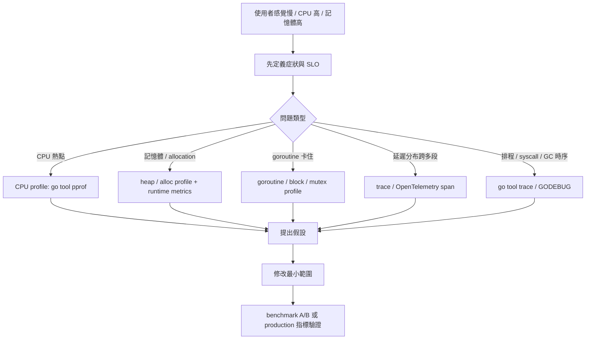

# 10. 效能調優與記憶體管理

對於資深工程師而言，Go 不只是「寫起來很快」，更重要的是了解底層運作機制，寫出「跑起來很快且穩定」的程式碼。

## Escape Analysis (逃逸分析)

Go 會在編譯時期決定變數該放在 Stack（輕量、無 GC 壓力）還是 Heap（需 GC 回收）。這個過程稱為逃逸分析。

| 分配位置 | 說明 |
|---|---|
| **Stack (堆疊)** | 函式結束時自動釋放，零 GC 成本。 |
| **Heap (堆積)** | 生命週期超過函式範圍，由 Garbage Collector (GC) 負責回收。 |

### 如何查看逃逸分析結果

使用 `go build -gcflags="-m"`：

```go
package main

import "fmt"

func createStack() int {
	x := 42 // 分配在 stack
	return x
}

func createHeap() *int {
	x := 42 // x escapes to heap
	return &x
}

func main() {
	a := createStack()
	b := createHeap()
	fmt.Println(a, *b) // fmt.Println 的參數也會逃逸，因為它接受 any (interface{})
}
```

### 常見的逃逸情境

1. **回傳指標**：如上方的 `createHeap`。
2. **存入 Interface**：將具體型別存入 `interface{}`（如 `fmt.Println(x)`）通常會導致逃逸，因為底層需要動態分配。
3. **大小未知的 Slice**：`make([]int, n)` 如果 `n` 是變數，通常會逃逸；如果是常數 `make([]int, 10)` 則不一定。
4. **Closure 捕獲變數**：在 goroutine 中捕獲外部變數。

> **工程經驗**：不要盲目為了避免逃逸而把所有指標改成傳值（Pass by Value）。如果 struct 很大，傳值複製的成本可能高於 GC 成本。保持語意清晰（修改原物件用指標）才是首要原則。

## Memory Alignment (記憶體對齊)

Struct 的大小不僅取決於欄位，還取決於「宣告順序」。CPU 為了高效讀取，會要求資料對齊到特定的記憶體位址（Padding）。

```go
import "unsafe"

// 錯誤示範：大小為 24 bytes
type BadStruct struct {
	a bool   // 1 byte (+ 7 bytes padding)
	b int64  // 8 bytes
	c int32  // 4 bytes (+ 4 bytes padding)
}

// 最佳化：大小為 16 bytes
type GoodStruct struct {
	b int64  // 8 bytes
	c int32  // 4 bytes
	a bool   // 1 byte (+ 3 bytes padding)
}

// unsafe.Sizeof 可以看真實佔用大小
fmt.Println(unsafe.Sizeof(BadStruct{}))  // 24
fmt.Println(unsafe.Sizeof(GoodStruct{})) // 16
```

> **工程經驗**：對於記憶體敏感的高併發應用，宣告 Struct 時請將欄位「由大到小」排序。可使用工具如 `fieldalignment` 自動檢查。

## Garbage Collection (GC) 簡介

Go 使用 **Tricolor Mark-and-Sweep (三色標記清除法)**，並高度優化為「低延遲 (Low Latency)」。

1. **Mark Phase**：找出所有還在使用的物件（STW - Stop The World 極短，通常小於 1ms）。
2. **Sweep Phase**：回收未被標記的物件（與程式並發執行）。

**GC 觸發時機**：預設情況下，當 heap 成長到上一次的兩倍時（`GOGC=100`）會觸發。
**Go 1.19+ 新增 `GOMEMLIMIT`**：可以設定記憶體軟上限，避免 OOM (Out Of Memory)。

### Go 1.26：Green Tea GC

Go 1.26 起，Green Tea GC 已由實驗功能變成預設 GC。它改善小物件標記與掃描的 locality 與 CPU scalability，對大量小物件分配的服務通常更友善。

| 重點 | 實務解讀 |
|---|---|
| 預設啟用 | 升級 Go 1.26 後不需要額外 flag 才會使用新版 GC |
| 仍需量測 | 不要只因新版 GC 就移除 pprof / metrics；升級前後要比較 latency、heap、GC pause |
| 可暫時關閉 | 若遇到明確回歸，可用 `GOEXPERIMENT=nogreenteagc` 建置並回報問題 |
| 與容器相關 | 搭配 `GOMEMLIMIT` 與 Go 1.25+ container-aware `GOMAXPROCS` 一起看，避免只調單一參數 |

## `sync.Pool` 重複利用物件

當你的服務每秒產生數萬個短命的物件（如 byte buffer），會對 GC 造成龐大壓力。`sync.Pool` 提供了一個物件池，讓你可以重複利用這些物件。

```go
var bufferPool = sync.Pool{
	New: func() any {
		// 只有當 Pool 裡面沒有可用的物件時，才會呼叫 New
		return new(bytes.Buffer)
	},
}

func handleRequest() {
	// 1. 從池中拿取
	buf := bufferPool.Get().(*bytes.Buffer)
	
	// 2. 使用完畢後，清空並放回池中
	defer func() {
		buf.Reset() // 非常重要：放回前一定要清空殘留資料
		bufferPool.Put(buf)
	}()

	buf.WriteString("hello performance")
}
```

> **注意**：`sync.Pool` 中的物件隨時可能被 GC 清除，不能用來存放像 DB 連線這種有狀態且不能隨便丟棄的資源（那應該用 connection pool）。

## 效能診斷決策流程

資深工程師調效能時，第一步不是改 code，而是先定義「慢在哪裡」。Go 官方 diagnostics 文件把診斷工具分成 profiling、tracing、debugging、runtime statistics/events；這些工具解的是不同問題，不能混用。



| 症狀 | 第一工具 | 不適合用 |
|---|---|---|
| 某段 CPU 飆高 | CPU profile | execution trace 不是 hot spot 工具 |
| heap 持續上升 | heap profile、`runtime/metrics` | 只看 `runtime.MemStats` 單一快照 |
| request latency 長尾 | trace / distributed trace | 只看平均 benchmark |
| goroutine 越跑越多 | goroutine profile、`runtime.NumGoroutine` | 只靠 log 猜測 |
| lock contention | mutex profile、block profile | 只加更多 goroutine |
| GC pause 或記憶體壓力 | `/gc/*` runtime metrics、gctrace、heap profile | 只調 `GOGC` 不量測 |

> **工程經驗**：效能 PR 應該附「修改前資料、修改後資料、判讀結論」。如果只有 `快很多` 這種描述，reviewer 無法判斷是否只是測試雜訊。

## Benchmark A/B 與 `benchstat`

單次 benchmark 容易被 CPU 溫度、背景程式、電源狀態與測試快取影響。正式比較修改前後時，請重複多次並用 `benchstat` 看統計差異。

```bash
# 修改前
go test -run='^$' -bench=. -benchmem -count=10 ./... > old.txt

# 修改後
go test -run='^$' -bench=. -benchmem -count=10 ./... > new.txt

# 安裝並比較
go install golang.org/x/perf/cmd/benchstat@latest
benchstat old.txt new.txt
```

| 注意事項 | 原因 |
|---|---|
| 使用 `-run='^$'` | 避免 unit test 干擾 benchmark |
| 加 `-benchmem` | 同時觀察 `B/op` 與 `allocs/op` |
| 至少 `-count=10` | 降低雜訊，讓統計比較更有意義 |
| 固定環境 | 不要一邊跑 benchmark 一邊開高負載程式 |
| 沒顯著差異就不要硬說有變快 | `benchstat` 顯示 `~` 時代表沒有足夠證據 |

## Profiling (效能分析)

當程式變慢時，不要用猜的，用 `pprof` 來測量。

### 內建 HTTP pprof

在長時間執行的服務（如 Web API）中，引入 `net/http/pprof`：

```go
import _ "net/http/pprof"

func main() {
	// 啟動 pprof server
	go func() {
		log.Println(http.ListenAndServe("localhost:6060", nil))
	}()
	// ... 你的主程式
}
```

### 如何分析

在終端機使用 `go tool pprof` 抓取資料：

| 指令 | 用途 |
|---|---|
| `go tool pprof http://localhost:6060/debug/pprof/profile?seconds=30` | 擷取 30 秒的 **CPU 瓶頸** |
| `go tool pprof http://localhost:6060/debug/pprof/heap` | 查看目前 **記憶體用量** 與分配熱點 |
| `go tool pprof http://localhost:6060/debug/pprof/goroutine` | 查看目前的 **goroutine 數量與狀態** |
| `go tool pprof http://localhost:6060/debug/pprof/block` | 查看 goroutine 卡在 channel、mutex、timer 等同步點的位置 |
| `go tool pprof http://localhost:6060/debug/pprof/mutex` | 查看 mutex contention 熱點 |

**常用 pprof 互動指令**：
- `top`：列出最耗資源的函式。
- `web`：在瀏覽器中開啟視覺化的呼叫圖 (Call Graph)，非常直觀（需安裝 Graphviz）。
- `list <func>`：看某個函式每一行程式碼的耗時。

### Block / Mutex Profile

block profile 與 mutex profile 預設不是完整啟用，因為它們會增加執行成本。只在需要診斷同步阻塞時打開。

```go
func enableContentionProfiles() {
	// 每次 block 都取樣，適合短時間診斷；長時間 production 可調大。
	runtime.SetBlockProfileRate(1)

	// 大約每 5 次 mutex contention 取樣一次。
	runtime.SetMutexProfileFraction(5)
}
```

| Profile | 看到什麼 | 常見修正 |
|---|---|---|
| block | goroutine 等 channel send/receive、select、cond、timer 的位置 | 加 buffer、調整 fan-in/out、讓 cancel path 可退出 |
| mutex | 哪些 lock 等待最久 | 縮小 critical section、分片鎖、改資料所有權 |
| goroutine | 目前所有 goroutine stack | 找 leak、deadlock、卡住的 I/O |

## `runtime/metrics` 與 GODEBUG

`runtime/metrics` 提供比 `runtime.ReadMemStats` 更一般化、可演進的 runtime 指標介面。做服務監控時，不要只在問題發生後抓 pprof；平常就應該看 GC、heap、goroutine、scheduler 類指標的趨勢。

```go
samples := []metrics.Sample{
	{Name: "/gc/heap/live:bytes"},
	{Name: "/gc/heap/goal:bytes"},
	{Name: "/sched/goroutines:goroutines"},
}
metrics.Read(samples)
for _, sample := range samples {
	fmt.Println(sample.Name, sample.Value)
}
```

| 指標 / 開關 | 用途 |
|---|---|
| `/gc/heap/live:bytes` | 上次 GC 後仍存活的 heap，觀察長期記憶體壓力 |
| `/gc/heap/goal:bytes` | 下一輪 GC 目標，搭配 `GOGC` / `GOMEMLIMIT` 判讀 |
| `/sched/goroutines:goroutines` | goroutine 數量，快速偵測 leak 趨勢 |
| `GODEBUG=gctrace=1` | 印出 GC 事件，短時間定位 GC 壓力 |
| `GODEBUG=schedtrace=1000` | 每秒印出 scheduler 狀態，診斷排程與 runnable goroutine 壓力 |

## Execution Trace

`go tool trace` 看的是時間線：goroutine 何時 runnable、何時執行、何時被 syscall 或 GC 影響。它適合回答「為什麼 CPU 沒有吃滿」、「哪段流程被序列化」、「timer / network / syscall 是否拖慢整體」。

```bash
go test -trace=trace.out ./...
go tool trace trace.out
```

| 適合用 trace | 先不要用 trace |
|---|---|
| 查平行度不足、scheduler 延遲、syscall 等待 | 找 CPU hot function |
| 查 goroutine 在時間線上的互相等待 | 找 allocation 熱點 |
| 查 GC、network、timer 對 request 的時序影響 | 取代 distributed tracing |

## Production Profiling 安全邊界

pprof 可以在 production 使用，但要有邊界。CPU profile、block profile、mutex profile 都可能帶來額外成本；正式服務建議只開在內網管理端口、加上存取控制，並一次只收集一種 profile。

| 做法 | 原因 |
|---|---|
| pprof 綁 `localhost` 或管理網段 | 避免公開 debug endpoint |
| 隨機挑單一 replica 取樣 | 避免整個服務同時承受 profiling 成本 |
| CPU profile 設短時間窗口 | 降低對 latency 的影響 |
| 不同 profile 分開收集 | profiling 工具可能互相干擾 |
| 保存 profile 檔案與 commit SHA | 讓效能結論可追溯 |

## 常見陷阱

| 陷阱 | 說明 |
|---|---|
| 過早優化 | 不要一開始就用 `sync.Pool` 或斤斤計較逃逸分析。先求對，再求快。 |
| `fmt.Sprintf` 濫用 | 字串串接在迴圈中極度耗能。請改用 `strings.Builder`。 |
| Slice 容量未預分配 | 如果知道長度，務必 `make([]int, 0, capacity)`，減少 append 時的 array 搬移。 |
| 忘記 Reset | 把物件放回 `sync.Pool` 前忘記清空，導致下一次 Get() 拿到髒資料。 |
| 看錯工具 | 用 trace 找 CPU hot spot、用 CPU profile 判斷長尾延遲，都容易得出錯誤結論。 |
| benchmark 次數太少 | 單次 `go test -bench` 只能當煙霧測試，不能當正式效能結論。 |

## 小練習

1. 寫一段字串串接程式，分別用 `+` 和 `strings.Builder`，並加上 `//go:noinline` 測試 `go build -gcflags="-m"` 的逃逸狀況。
2. 試著調整 struct 欄位順序，用 `unsafe.Sizeof` 觀察記憶體大小變化。
3. 在你的並發爬蟲專案中加上 pprof endpoint，用 `go tool pprof` 查看 CPU 熱點。
4. 對同一個 benchmark 跑 `-count=10`，用 `benchstat` 比較修改前後結果。
5. 在短時間測試環境啟用 block / mutex profile，觀察 worker pool 是否有 lock 或 channel contention。
