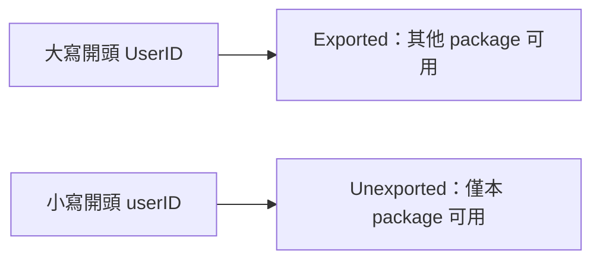
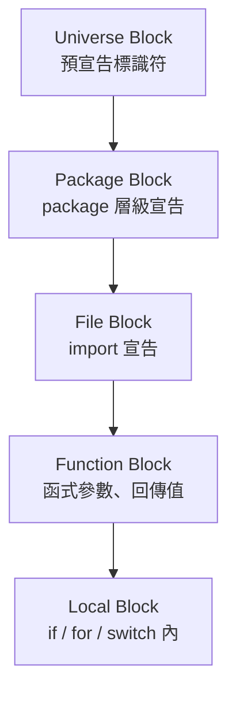
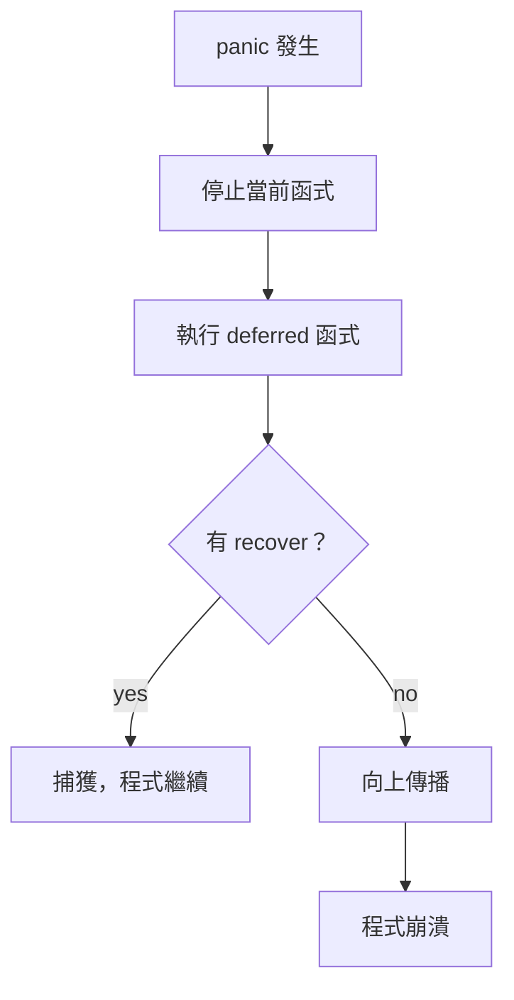

# A1. Go 語言規範速覽

> 本章整理自 [Go 語言規範](https://go.dev/ref/spec)，涵蓋標識符、關鍵字、運算子、字面量、作用域等語言基礎，幫助建立完整的語法心智模型。

## 原始碼表示

Go 原始碼是 UTF-8 編碼的 Unicode 文字。這代表你可以用中文、日文等 Unicode 字元當變數名稱（但不建議）。

```go
名前 := "Gopher"  // 合法，但不推薦
π := 3.14159      // 合法
```

---

## 標識符 (Identifiers)

標識符用來命名變數、型別、函式等程式實體。

### 命名規則

```text
identifier = letter { letter | unicode_digit }
letter     = unicode_letter | "_"
```

| 規則 | 說明 | 範例 |
|---|---|---|
| 首字元必須是字母或 `_` | 不能以數字開頭 | `count` ✓ `_temp` ✓ `2nd` ✗ |
| 後續字元可以是字母、數字或 `_` | 可以混用 | `myVar2` ✓ `user_id` ✓ |
| 大小寫敏感 | `Foo` 和 `foo` 是不同的 | — |
| 大寫開頭 = 公開 (exported) | 可被其他 package 存取 | `MaxRetry` 公開，`maxRetry` 私有 |
| Unicode 字母也合法 | 不限 ASCII | `αβ` ✓（但建議用英文） |

```go
// 合法標識符
a
_x9
ThisVariableIsExported
αβ

// 非法標識符
2nd       // 開頭是數字
case      // 是關鍵字
a+b       // 含運算子
```

### Exported vs Unexported



| 條件 | 說明 |
|---|---|
| 首字元是 Unicode 大寫字母（Lu 類別） | 被視為 exported |
| 宣告在 package block 或是 struct field / method | 才有 export 意義 |
| 其他情況 | 都是 unexported |

> **工程經驗**：Go 用大小寫取代 `public` / `private` 關鍵字，這是 Go 最獨特的設計之一。命名時想清楚「這個東西需要被外部看到嗎？」

---

## 預宣告標識符 (Predeclared Identifiers)

以下標識符在 universe block 中隱式宣告，可以直接使用，但**也可以被覆蓋**（shadowing）。

### 預宣告型別

| 型別 | 說明 |
|---|---|
| `bool` | 布林 |
| `int`, `int8`, `int16`, `int32`, `int64` | 有號整數 |
| `uint`, `uint8`, `uint16`, `uint32`, `uint64` | 無號整數 |
| `uintptr` | 指標大小的無號整數 |
| `float32`, `float64` | 浮點數 |
| `complex64`, `complex128` | 複數 |
| `string` | 字串 |
| `byte` | `uint8` 的別名 |
| `rune` | `int32` 的別名 |
| `error` | 內建錯誤介面 |
| `any` | `interface{}` 的別名（Go 1.18+） |
| `comparable` | 可比較型別約束（Go 1.18+） |

### 預宣告常數

| 常數 | 說明 |
|---|---|
| `true`, `false` | 布林常數 |
| `iota` | 常數生成器，在 `const` block 內自動遞增 |

### 零值

| 標識符 | 說明 |
|---|---|
| `nil` | pointer、slice、map、channel、function、interface 的零值 |

### 預宣告函式

| 函式 | 用途 | 範例 |
|---|---|---|
| `append` | 追加元素到 slice | `s = append(s, 1, 2)` |
| `cap` | 取得 slice / channel 的容量 | `cap(s)` |
| `clear` | 清除 map 或 slice（Go 1.21+） | `clear(m)` |
| `close` | 關閉 channel | `close(ch)` |
| `complex` | 建立複數 | `complex(1, 2)` |
| `copy` | 複製 slice | `copy(dst, src)` |
| `delete` | 刪除 map 中的 key | `delete(m, "key")` |
| `imag` | 取得複數的虛部 | `imag(c)` |
| `len` | 取得長度 | `len(s)` |
| `make` | 建立 slice / map / channel | `make([]int, 10)` |
| `max` | 取最大值（Go 1.21+） | `max(1, 2, 3)` |
| `min` | 取最小值（Go 1.21+） | `min(1, 2, 3)` |
| `new` | 配置記憶體，回傳指標；Go 1.26+ 可直接接 expression | `p := new(int)` / `p := new(42)` |
| `panic` | 觸發 panic | `panic("error")` |
| `print` | 列印到 stderr（debug 用） | `print("debug")` |
| `println` | 列印到 stderr 加換行 | `println("debug")` |
| `real` | 取得複數的實部 | `real(c)` |
| `recover` | 捕獲 panic | `recover()` |

> **注意**：預宣告標識符可以被覆蓋，但這是極危險的做法：
> ```go
> // 千萬不要這樣做！
> true := false  // 合法但致命
> len := 42      // 覆蓋了內建 len
> ```

---

## 關鍵字 (Keywords)

Go 只有 **25 個關鍵字**，是主流語言中最少的之一。關鍵字**不能**作為標識符。

| 分類 | 關鍵字 | 說明 |
|---|---|---|
| **宣告** | `const` `func` `import` `package` `type` `var` | 定義程式實體 |
| **複合型別** | `chan` `interface` `map` `struct` | 定義型別 |
| **流程控制** | `break` `case` `continue` `default` `else` `fallthrough` `for` `goto` `if` `range` `return` `select` `switch` | 控制執行流 |
| **併發** | `go` `defer` | goroutine 與延遲執行 |

```go
// 所有 25 個關鍵字
break     default      func    interface  select
case      defer        go      map        struct
chan      else         goto    package    switch
const     fallthrough  if      range      type
continue  for          import  return     var
```

---

## 運算子與標點符號

### 算術運算子

| 運算子 | 說明 | 範例 |
|---|---|---|
| `+` | 加法 / 字串串接 | `a + b` |
| `-` | 減法 | `a - b` |
| `*` | 乘法 / 指標取值 | `a * b` / `*ptr` |
| `/` | 除法 | `a / b` |
| `%` | 取餘數 | `a % b` |

### 位元運算子

| 運算子 | 說明 | 範例 |
|---|---|---|
| `&` | AND | `a & b` |
| `\|` | OR | `a \| b` |
| `^` | XOR / 位元取反 | `a ^ b` / `^a` |
| `&^` | AND NOT（bit clear） | `a &^ b` |
| `<<` | 左移 | `a << 2` |
| `>>` | 右移 | `a >> 2` |

### 比較運算子

| 運算子 | 說明 |
|---|---|
| `==` | 相等 |
| `!=` | 不相等 |
| `<` | 小於 |
| `<=` | 小於等於 |
| `>` | 大於 |
| `>=` | 大於等於 |

### 邏輯運算子

| 運算子 | 說明 |
|---|---|
| `&&` | 邏輯 AND（短路求值） |
| `\|\|` | 邏輯 OR（短路求值） |
| `!` | 邏輯 NOT |

### 特殊運算子

| 運算子 | 說明 | 範例 |
|---|---|---|
| `<-` | Channel 傳送 / 接收 | `ch <- v` / `v := <-ch` |
| `...` | 可變參數 / slice 展開 | `func(a ...int)` / `f(s...)` |
| `:=` | 短變數宣告 | `x := 42` |
| `++` | 遞增（語句，非表達式） | `i++` |
| `--` | 遞減（語句，非表達式） | `i--` |
| `&` | 取位址 | `&x` |
| `*` | 解參考 | `*ptr` |

### 賦值運算子

| 運算子 | 等效 |
|---|---|
| `=` | 賦值 |
| `+=` `-=` `*=` `/=` `%=` | 複合賦值 |
| `&=` `\|=` `^=` `<<=` `>>=` `&^=` | 位元複合賦值 |

> **注意**：Go 的 `++` 和 `--` 是語句 (statement)，不是表達式 (expression)。`x := i++` 是非法的。

---

## 字面量 (Literals)

### 整數字面量

```go
42          // 十進位
0600        // 八進位（以 0 開頭）
0o600       // 八進位（Go 1.13+ 推薦寫法）
0xBadFace   // 十六進位
0b110011    // 二進位（Go 1.13+）

// 可用底線分隔增加可讀性（Go 1.13+）
1_000_000          // 一百萬
0xFF_FF_FF_FF      // 十六進位
0b1111_0000_1111   // 二進位
```

| 前綴 | 基數 | 範例 |
|---|---|---|
| 無 | 10（十進位） | `42` |
| `0` 或 `0o` / `0O` | 8（八進位） | `0755` `0o755` |
| `0x` / `0X` | 16（十六進位） | `0xFF` |
| `0b` / `0B` | 2（二進位） | `0b1010` |

### 浮點數字面量

```go
0.          // 0.0
72.40
1.e+0       // 1.0
6.67428e-11 // 科學記號
.25         // 0.25
1_5.0       // 15.0

// 十六進位浮點（Go 1.13+）
0x1p-2      // 0.25 (1 × 2⁻²)
0x1.Fp+0    // 1.9375
```

### Rune 字面量

Rune 代表一個 Unicode code point，用單引號括住。

```go
'a'         // 97 (U+0061)
'本'        // 26412 (U+672C)
'\t'        // 9 (tab)
'\n'        // 10 (newline)
'\x07'      // 7 (bell)
'\u12e4'    // 4836
'\U00101234' // 1053236
'\''        // 39 (single quote)
```

| 跳脫序列 | Unicode | 說明 |
|---|---|---|
| `\a` | U+0007 | 響鈴 (bell) |
| `\b` | U+0008 | 退格 (backspace) |
| `\f` | U+000C | 換頁 (form feed) |
| `\n` | U+000A | 換行 (newline) |
| `\r` | U+000D | 回車 (carriage return) |
| `\t` | U+0009 | 水平 tab |
| `\v` | U+000B | 垂直 tab |
| `\\` | U+005C | 反斜線 |
| `\'` | U+0027 | 單引號（僅 rune 字面量） |
| `\"` | U+0022 | 雙引號（僅 string 字面量） |

### 字串字面量

Go 有兩種字串字面量：

```go
// 解釋型字串（interpreted）：支持跳脫序列
"Hello, world!\n"
"日本語"
"\u65e5\u672c\u8a9e"   // 同上

// 原始字串（raw）：所見即所得，反斜線無特殊意義
`Hello, world!\n`      // \n 是兩個字元，不是換行
`可以
跨行`                   // 保留換行
`正則表達式: \d+\.?\d*`  // 不用雙重跳脫
```

| 類型 | 語法 | 跳脫 | 換行 | 常見用途 |
|---|---|---|---|---|
| Interpreted | `"..."` | 支持 | 不可 | 一般字串 |
| Raw | `` `...` `` | 不支持 | 可以 | 正則、SQL、多行文字 |

### 虛數字面量

```go
0i
2.71828i
1E6i
0x1p-2i    // 0.25i
```

---

## 分號自動插入

Go 使用分號 `;` 作為語句終結符，但幾乎不需要手動寫。編譯器在以下 token 結尾時自動插入分號：

| Token 類型 | 範例 |
|---|---|
| 標識符 | `x` `myFunc` |
| 字面量 | `42` `"hello"` `3.14` |
| 關鍵字 | `break` `continue` `fallthrough` `return` |
| 運算子 / 標點 | `++` `--` `)` `]` `}` |

這就是為什麼 Go 強制大括號必須在同一行：

```go
// 正確
if x > 0 {
    return true
}

// 錯誤！編譯器會在 0 後面插入分號
if x > 0    // ← 這裡自動變成 if x > 0;
{
    return true
}
```

---

## 作用域 (Scope)

Go 的作用域分為五個層次：



| 作用域 | 可見範圍 | 包含 |
|---|---|---|
| **Universe** | 所有原始碼 | 預宣告型別、函式、常數 |
| **Package** | 同 package 所有檔案 | `var`、`func`、`type`、`const` 在 package 層級宣告 |
| **File** | 單一檔案 | `import` 宣告 |
| **Function** | 函式體內 | 參數、回傳值、函式內宣告 |
| **Block** | `{}` 區塊內 | `if`、`for`、`switch` 的短變數宣告 |

```go
package main

import "fmt" // file scope

var globalVar = 1 // package scope

func main() { // function scope
    localVar := 2 // block scope (main body)

    if x := 3; x > 0 { // block scope (if)
        fmt.Println(x, localVar, globalVar)
    }
    // x 在這裡不可見
}
```

### Shadowing（變數遮蔽）

內層作用域可以宣告與外層相同名稱的變數，這叫 shadowing。

```go
x := 1
fmt.Println(x) // 1

{
    x := 2          // shadow 外層的 x
    fmt.Println(x)  // 2
}

fmt.Println(x) // 1（外層不受影響）
```

> **工程經驗**：Shadowing `err` 是最常見的 bug 來源之一。用 `golangci-lint` 的 `govet` 檢查器可以偵測。

---

## 可變參數函式 (Variadic Functions)

函式的最後一個參數可以用 `...` 前綴，接受零或多個該型別的引數。

```go
func sum(nums ...int) int {
    total := 0
    for _, n := range nums {
        total += n
    }
    return total
}

// 呼叫方式
sum(1, 2, 3)           // 傳入多個引數
sum()                  // 零個也可以

// 展開 slice
nums := []int{1, 2, 3}
sum(nums...)           // 用 ... 展開 slice
```

| 語法 | 說明 |
|---|---|
| `func f(a ...T)` | 宣告可變參數，`a` 在函式內是 `[]T` |
| `f(1, 2, 3)` | 傳入多個值 |
| `f(slice...)` | 展開 slice 傳入 |

標準庫中常見的可變參數函式：

```go
fmt.Println(a ...any)
fmt.Sprintf(format string, a ...any)
append(slice []T, elems ...T)
```

---

## `new` vs `make`

| 函式 | 用途 | 回傳 | 適用型別 |
|---|---|---|---|
| `new(T)` | 配置零值記憶體 | `*T`（指標） | 任何型別 |
| `make(T, ...)` | 初始化內部結構 | `T`（值） | slice、map、channel |

```go
// new：回傳指標，值為零值
p := new(int)     // *int，值為 0
u := new(User)    // *User，各欄位為零值

// Go 1.26+：new 可接 expression，回傳該值的指標
age := new(42)                    // *int，值為 42
name := new(strings.ToUpper("go")) // *string，值為 "GO"

// make：回傳已初始化的值
s := make([]int, 0, 10)  // 已初始化的 slice
m := make(map[string]int) // 已初始化的 map
ch := make(chan int, 5)   // buffered channel
```

> Go 1.26 以前，`new` 只能接型別（例如 `new(int)`）；若需要指向某個初始值，通常要先宣告變數再取址。新版語法讓 optional field、測試資料與 pointer literal 更簡潔。

---

## `panic` 與 `recover`

Go 不用 exception，但有 `panic` / `recover` 機制處理不可恢復的錯誤。

```go
func safeDiv(a, b int) (result int, err error) {
    defer func() {
        if r := recover(); r != nil {
            err = fmt.Errorf("recovered: %v", r)
        }
    }()

    return a / b, nil // b == 0 時會 panic
}
```



| 規則 | 說明 |
|---|---|
| `panic` 用於不可恢復的錯誤 | 如程式設計錯誤、必要資源缺失 |
| `recover` 只能在 `defer` 中呼叫 | 其他地方呼叫永遠回傳 `nil` |
| 一般錯誤用 `error` 回傳 | `panic` 不是 exception 的替代品 |

> **工程經驗**：在 library 中幾乎不應使用 `panic`。只在 `main`、`init` 或確定是 programmer error 時才用。HTTP handler 中可以用 middleware 做 `recover`。

---

## 註解 (Comments)

```go
// 單行註解

/*
多行註解
可以跨行
*/

// Go doc 註解：緊接在宣告前面的註解會被 go doc 讀取
// Add returns the sum of a and b.
func Add(a, b int) int {
    return a + b
}
```

| 類型 | 語法 | 說明 |
|---|---|---|
| 行註解 | `// ...` | 到行尾 |
| 區塊註解 | `/* ... */` | 不可巢套 |
| Doc 註解 | `// FuncName ...` | 緊接宣告，被 `go doc` 讀取 |

> **Go 慣例**：Doc 註解以被描述的標識符名稱開頭：`// Add returns ...` 而非 `// This function adds ...`

---

## 常見錯誤

| 錯誤 | 原因 | 修正 |
|---|---|---|
| 用關鍵字當變數名 | `case := 1` 非法 | 換名稱 |
| Shadow 預宣告標識符 | `len := 42` 覆蓋了內建 `len` | 避免用預宣告名稱當變數 |
| 大括號換行 | 分號自動插入導致語法錯誤 | `{` 放在同一行 |
| Shadow `err` | if 內的 `:=` 建立了新 `err` | 注意用 `=` 而非 `:=` |
| `new` vs `make` 混用 | `new(map[string]int)` 回傳 nil map 的指標 | map / slice / channel 用 `make` |

## 小練習

1. 列出所有 25 個 Go 關鍵字，並分類。
2. 用 `0b`、`0o`、`0x` 分別寫出數字 255 的二進位、八進位、十六進位字面量。
3. 用原始字串寫一個多行 SQL 查詢。
4. 寫一個可變參數函式 `sum(nums ...int) int`。
5. 用 `recover` 捕獲除以零的 panic。
6. 故意 shadow 一個 `err` 變數，觀察行為差異。
