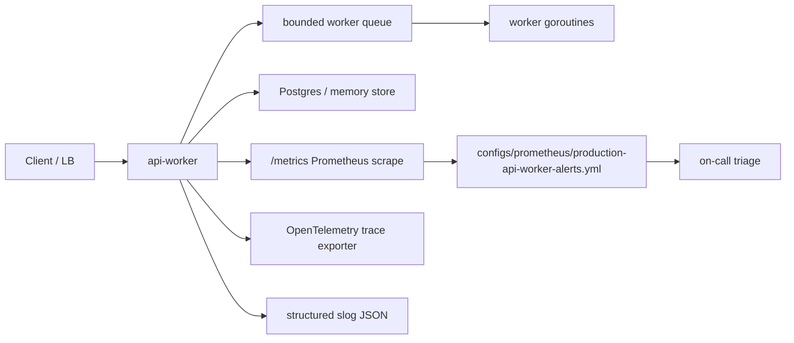

# production-api-worker Operational Runbook

> 文件日期：2026-05-17
> 完整日期時間：2026-05-17 11:02:15 CST +0800
> 適用範圍：`production-api-worker` API、worker queue、Postgres migration、Prometheus metrics、OpenTelemetry trace、pprof diagnostics、Docker Compose smoke gate。

## 1. Overview

這份 runbook 把教材中的 observability、health check、API contract 與 deployment gate 轉成值班可操作流程。目標不是取代正式 SRE 平台，而是讓 Go production 教材具備最小可交付的事故處理骨架。

| 目標 | 交付內容 |
|---|---|
| SLI / SLO | 定義 API availability、request error rate、worker latency、queue depth 與 readiness 狀態 |
| Alert rule | 提供 Prometheus rule 檔，可由 CI 與人工審查檢查 |
| Prometheus scrape config | 提供本地 scrape job 與 rule_files 載入範本 |
| pprof diagnostics | 預設關閉 `/debug/pprof/`；事故期間短期啟用時強制 Bearer token |
| OTLP collector contract | 固定 `production-api-worker/otel-collector.yaml` 的 OTLP gRPC receiver、debug exporter 與 Compose endpoint |
| Incident workflow | 從告警、分級、初判、緩解、驗證到復盤 |
| Verification | 對應 repo 內可重跑命令，避免 runbook 只停在文字 |

## 2. Architecture



| Signal | Source | 主要用途 |
|---|---|---|
| `api_requests_total{route,method,status}` | HTTP middleware | API availability、error rate、route regression |
| `worker_queue_depth` | queue observer | backlog、worker starvation、downstream slowdown |
| `worker_job_duration_seconds` | worker histogram | job latency SLO、slow job triage |
| `worker_jobs_total{result}` | worker result counter | worker success/failure trend |
| `X-Request-ID` | API middleware | log、trace、client report correlation |
| OTLP gRPC `0.0.0.0:4317` | `production-api-worker/otel-collector.yaml` | 本地 trace receiver 與 backend 替換邊界 |

## 3. Setup

本機或 CI 先確認服務可啟動並暴露 metrics：

```bash
cd production-api-worker
API_KEY=dev-secret docker compose up -d --build
API_KEY=dev-secret make compose-smoke
curl -H 'Authorization: Bearer dev-secret' http://localhost:8080/metrics
docker compose down -v
```

Prometheus rule 檔位於：

```text
configs/prometheus/production-api-worker-alerts.yml
```

Prometheus scrape config 位於：

```text
configs/prometheus/prometheus.yml
```

本地教學 profile：

```bash
cd production-api-worker
docker compose --profile monitoring up -d --build
open http://localhost:9090
docker compose down -v
```

若設定 `API_KEY`，`/metrics` 會要求 `Authorization: Bearer <token>`。正式環境應改用 Prometheus bearer token file、secret mount 或平台原生 scrape auth，不要把 secret 寫入 repo 內的 `prometheus.yml`。

OpenTelemetry collector 設定檔位於：

```text
production-api-worker/otel-collector.yaml
```

本地 contract 固定 OTLP gRPC receiver `0.0.0.0:4317`、Compose endpoint `OTEL_EXPORTER_OTLP_ENDPOINT=otel-collector:4317` 與 `debug exporter`。這讓教材能先驗證 trace pipeline wiring，再由正式環境替換成 Tempo、Jaeger、OTLP backend 或雲端 APM。

```bash
node scripts/check-otel-collector-contract.mjs
cd production-api-worker && make otel-check
```

pprof diagnostics 預設關閉。只有需要 CPU、heap、goroutine 或 trace 證據時才短期啟用：

```bash
cd production-api-worker
ENABLE_PPROF=true PPROF_TOKEN=debug-token go run ./cmd/api-worker
curl -H 'Authorization: Bearer debug-token' http://localhost:8080/debug/pprof/
curl -H 'Authorization: Bearer debug-token' 'http://localhost:8080/debug/pprof/profile?seconds=30' -o profile.pb.gz
go tool pprof profile.pb.gz
```

正式環境應同時限制來源網段或經由 VPN / gateway 存取。診斷完成後關閉 `ENABLE_PPROF`，並把採集到的 profile 當作 incident evidence 保存，不要提交到 repo。

## 4. Configuration

| 類型 | 建議值 | 說明 |
|---|---|---|
| Availability SLO | 99.5% / 30 days | 教學用 API service baseline；正式環境需依 SLA 重算 |
| Error rate warning | 5xx ratio > 2% for 10m | 先告警，確認是否為部署或 downstream 問題 |
| Error rate critical | 5xx ratio > 5% for 5m | 進入 incident，優先 rollback 或停止導流 |
| Worker latency warning | p95 > 2s for 10m | 檢查 DB、queue、CPU throttling 與 worker 數 |
| Queue depth warning | depth > 50 for 10m | 接近預設 queue size `64` 時需立即判斷壅塞來源 |
| Readiness critical | `/readyz` 非 200 或服務 scrape 失敗 | LB / orchestrator 應停止導流 |
| Diagnostics access | disabled by default | `ENABLE_PPROF=true` 只允許短期事故診斷，且必須帶 `Authorization: Bearer <token>` |
| Rate limit | `RATE_LIMIT_REQUESTS_PER_MINUTE=120` | 單一 client IP 超限回 `429 rate_limited`；調高前需確認 queue、DB pool 與上游重試行為 |
| Trusted proxy client IP contract gate | `TRUSTED_PROXY_CIDRS` | 只有 trusted proxy 來源才可採用 `X-Forwarded-For` 第一個 IP；外部直連不可用 header 偽造 client IP，並由 `node scripts/check-trusted-proxy-contract.mjs` 固定 |

## 5. Example

### Alert 1：API 5xx error rate 升高

1. 查 Prometheus：`api_requests_total` 依 `route`、`method`、`status` 分組。
2. 找出主要 route：`/jobs`、`/jobs/{id}`、`/metrics` 或 health endpoint。
3. 用 `X-Request-ID` 對照 structured log 與 trace。
4. 若是新版本導致 contract 破壞，先 rollback 或停止導流，再跑 contract tests。

```bash
cd production-api-worker
go test ./internal/api -run 'Test.*Contract|TestRequestTimeoutContract|TestAPIKeyAuthContract' -count=1
```

### Alert 2：worker queue depth 長時間偏高

1. 檢查 `worker_queue_depth` 是否接近 `QUEUE_SIZE`。
2. 檢查 `worker_job_duration_seconds` p95 是否同步升高。
3. 若 DB latency 升高，確認 `DATABASE_MAX_OPEN_CONNS`、Postgres `max_connections` 與 migration 狀態。
4. 若是 worker 數不足，調整 `WORKERS` 前先保留 CPU / latency / DB connection 證據。

```bash
cd production-api-worker
go test ./internal/worker -run 'Test.*Shutdown|TestConcurrentEnqueueAndShutdownDoesNotPanic' -count=1
go test -run='^$' -bench=. -benchmem -count=10 ./... > bench.txt
```

### Alert 3：readiness 失敗

1. `/livez=200` 但 `/readyz=503`：服務可能正在 draining，確認是否為正常 deploy / shutdown。
2. `/livez` 也失敗：檢查 container restart、panic recovery log、DB migration、port conflict。
3. 若 compose smoke 失敗，保留 `docker compose logs --no-color` 作為 release blocker。

```bash
cd production-api-worker
docker compose up -d --build
make compose-smoke
docker compose logs --no-color
docker compose down -v
```

### Incident diagnostics：需要 CPU / heap / goroutine 證據

1. 先確認 metrics 已指出異常範圍，例如 CPU 飆高、worker latency 上升或 goroutine 疑似累積。
2. 短期啟用 `ENABLE_PPROF=true`，並設定 `PPROF_TOKEN` 或沿用 `API_KEY`。
3. 使用 Bearer token 抓取 profile，保存為 incident artifact。
4. 診斷完成後關閉 `ENABLE_PPROF`，再回補測試、runbook 或容量設定。

```bash
curl -H 'Authorization: Bearer debug-token' 'http://localhost:8080/debug/pprof/goroutine?debug=1' > goroutine.txt
curl -H 'Authorization: Bearer debug-token' 'http://localhost:8080/debug/pprof/heap' -o heap.pb.gz
```

## 6. Verification

| 檢查 | 指令 | 預期結果 |
|---|---|---|
| Runbook 文件完整性 | `node scripts/check-operational-runbook.mjs` | runbook、alert rules、README 與 CI 入口都存在 |
| Prometheus rule 語法層級檢查 | `node scripts/check-operational-runbook.mjs` | rule group、alert、expr、for、severity、runbook_url 皆存在 |
| Prometheus scrape config | `node scripts/check-prometheus-config-contract.mjs` | scrape job、rule_files、Compose monitoring profile、README 與 CI 入口一致 |
| pprof diagnostics contract | `node scripts/check-pprof-contract.mjs` | `ENABLE_PPROF`、`PPROF_TOKEN`、Go tests、runbook、README 與 CI 入口一致 |
| OTLP collector contract | `node scripts/check-otel-collector-contract.mjs` | OTLP receiver、debug exporter、Compose endpoint、runbook、README 與 CI 入口一致 |
| pprof Go contract | `cd production-api-worker && go test ./internal/config ./internal/api -run 'Test.*Pprof|TestPprofDiagnosticsContract' -count=1` | pprof 預設關閉，啟用時要求 token，合法 token 才能讀 profile index |
| Production contract | `cd production-api-worker && make ci-contract` | API / config / migration / retry / worker 合約通過 |
| Compose smoke | `cd production-api-worker && API_KEY=dev-secret docker compose up -d --build && API_KEY=dev-secret make compose-smoke` | ready、live、job create/read、metrics 通過 |
| Compose monitoring profile | `cd production-api-worker && docker compose --profile monitoring up -d --build` | Prometheus 於 `http://localhost:9090` 載入 scrape config 與 alert rules |

## 7. Troubleshooting

| 症狀 | 可能原因 | 處置 |
|---|---|---|
| `/metrics` 回 401 | 啟用 `API_KEY` 但 scrape 未帶 Bearer token | 調整 Prometheus scrape config 或暫用 local teaching mode |
| collector 啟動失敗 | `otel-collector.yaml` receiver / exporter / pipeline 名稱不一致 | 先跑 `node scripts/check-otel-collector-contract.mjs`，再跑 `docker compose config` |
| `/debug/pprof/` 回 404 | `ENABLE_PPROF` 未啟用 | 只有 incident diagnostics 期間才短期設定 `ENABLE_PPROF=true` |
| `/debug/pprof/` 回 401 | 未帶 Bearer token 或 token 不符 | 帶 `Authorization: Bearer <PPROF_TOKEN>`，不要把 token 寫入文件或 repo |
| Prometheus targets 顯示 down | API 未啟動、Compose profile 未啟用或 scrape auth 未同步 | 查 `docker compose ps`、`/readyz`、`/metrics` 與 Prometheus targets |
| 5xx 集中在 `/jobs` | request decoding、DB transaction、queue enqueue 或 retry timeout | 先跑 API contract，再查 request id 對應 trace |
| queue depth 不下降 | worker 卡住、DB 慢、downstream 慢或 worker 數不足 | 查 worker duration histogram、DB pool、CPU throttling |
| readiness 長時間 503 | draining 未結束或 shutdown 卡住 | 查 queue drain log、worker shutdown test、compose logs |
| alert 過度頻繁 | threshold 未對齊教學 workload | 先保留一週 baseline，再調整 warning / critical 閾值 |

## 8. Best Practices

| 原則 | 做法 |
|---|---|
| 先看 SLI，再看 log | 用 metrics 判斷範圍，再用 request id 進 log / trace |
| 不把 health endpoint 上鎖 | `/livez`、`/readyz` 保持公開供 LB / orchestrator 使用 |
| 控制 label cardinality | route label 使用 `/jobs/{id}`，避免 job id 進入 metrics label |
| 告警要能行動 | 每條 alert 必須有 summary、description、severity 與 runbook link |
| trace pipeline 可替換 | 本地使用 debug exporter；正式環境替換 backend 時保留 OTLP receiver、endpoint 與取樣策略說明 |
| pprof 短期啟用 | profile 可能暴露 memory、cmdline、goroutine 與 route 資訊，診斷完成後必須關閉 |
| 復盤要回到測試 | incident 後補 contract test、smoke gate 或 runbook 檢查，不只修文字 |

## 9. Risk Notes

| 風險 | 說明 |
|---|---|
| 教學閾值不等於正式 SLA | 2%、5%、2s、50 queue depth 是教材 baseline；正式環境需依流量重算 |
| Prometheus rule 未接真實 Alertmanager | 本 repo 提供 rule 與檢查腳本，不代表已部署告警平台 |
| Trace backend 未固定 | 本地 collector 使用 `debug exporter`；正式環境需指定 Tempo、Jaeger、OTLP backend 或雲端 APM、取樣率與保存期限 |
| pprof profile 敏感 | heap、goroutine、cmdline、trace 可能含環境與請求資訊；只保存於受控 incident artifact |
| Docker Compose 不是 Kubernetes | Compose smoke 可證明端到端最小流程，不取代 K8s readiness/liveness/rollout policy |
