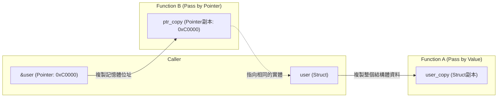
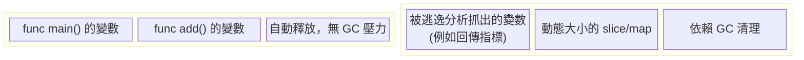
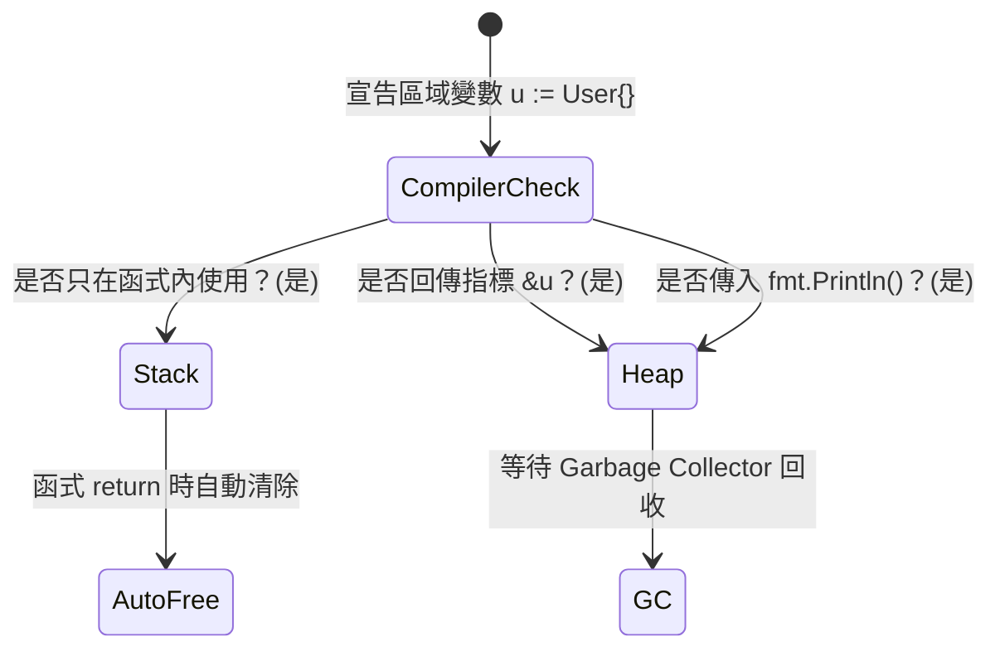
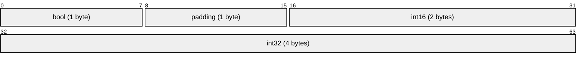

# 01. 架構與記憶體 (Memory & Architecture)

## 1. 值傳遞 (Pass by Value) vs 指標傳遞 (Pass by Pointer)

Go 語言中**所有的參數傳遞都是值傳遞（複製）**。即使是指標，傳遞的也是記憶體位址的副本。

## 2. 記憶體分配：Stack vs Heap

- **Stack (堆疊)**：函式內的區域變數，函式結束自動清除，極快。
- **Heap (堆積)**：全域變數或逃逸變數，依賴 GC (Garbage Collection) 回收，成本高。

## 3. 逃逸分析 (Escape Analysis)

編譯器決定變數該放 Stack 還是 Heap。當區域變數的生命週期超出了原本的函式（例如回傳了它的指標），它就會「逃逸」到 Heap。

## 4. 記憶體對齊 (Memory Alignment)

結構體 (Struct) 欄位的排列順序會影響最終佔用的記憶體大小，因為 CPU 讀取記憶體時會要求特定位元組對齊。

*(最佳化原則：將型別大小由大到小排序，可大幅減少 padding 浪費的空間)*
