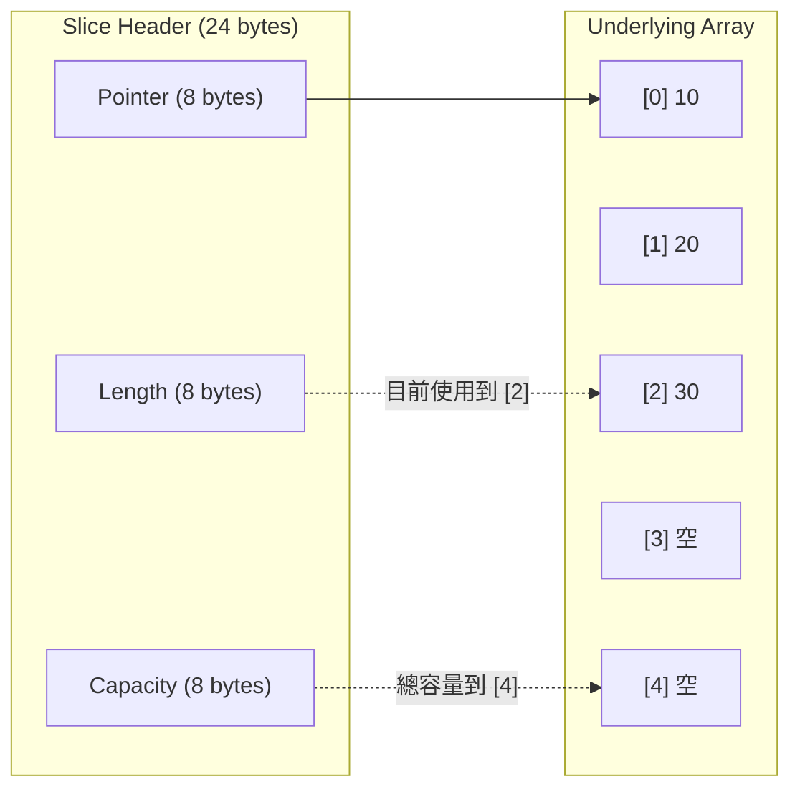
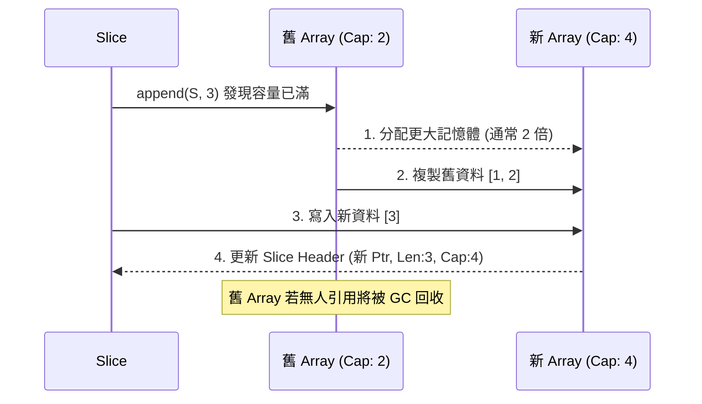
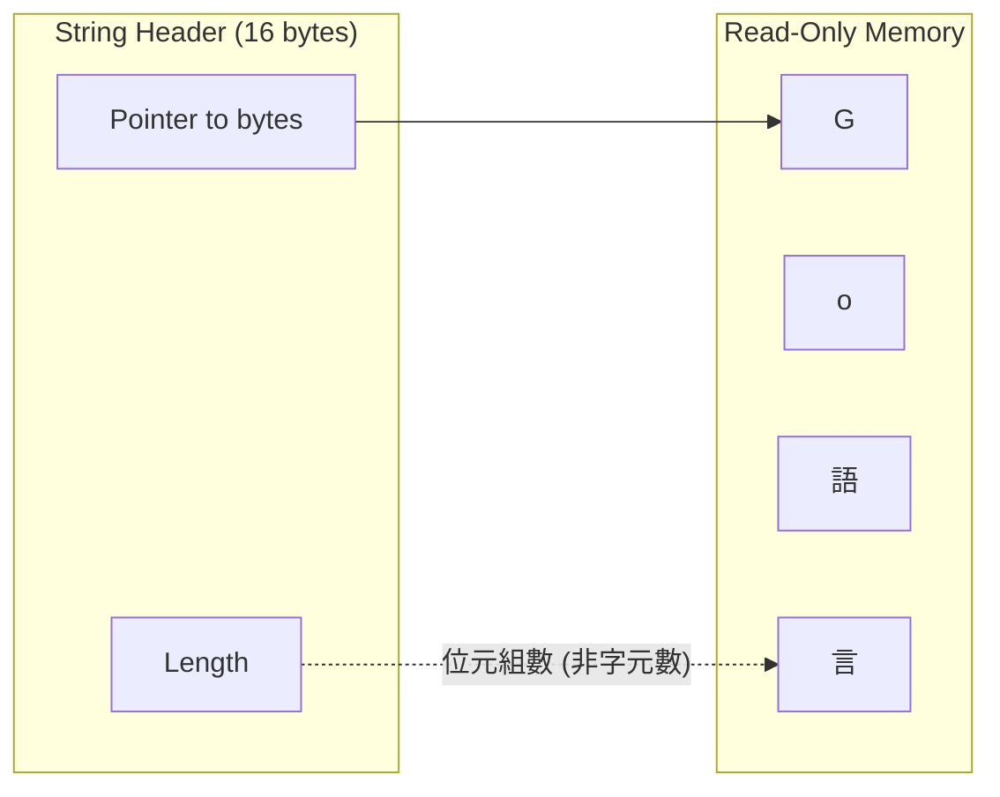
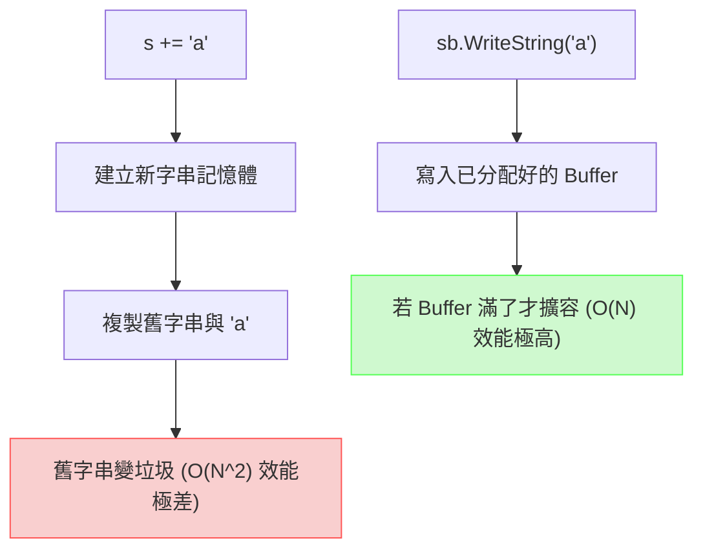

# 02. 資料結構視覺化 (Data Structures)

## 1. Slice 的底層三欄位結構 (Slice Header)

Slice 不是陣列，而是一個包含了三個欄位的結構體（在 64-bit 機器上佔 24 bytes），作為底層陣列的「視窗」。

## 2. Append 擴容機制

當 Slice 容量 (`cap`) 不足時，`append` 會建立一個新的底層陣列，並將舊資料複製過去，然後回傳新的 Slice Header。

## 3. String 的底層結構

字串 (`string`) 在 Go 語言中是唯讀的位元組切片 (`[]byte`)，底層是一個包含兩個欄位的結構體（16 bytes）。

## 4. `strings.Builder` 高效拼接

使用 `+` 號拼接字串會不斷產生新的字串物件並觸發 GC；`strings.Builder` 則是在一塊預先分配的緩衝區上直接寫入。

