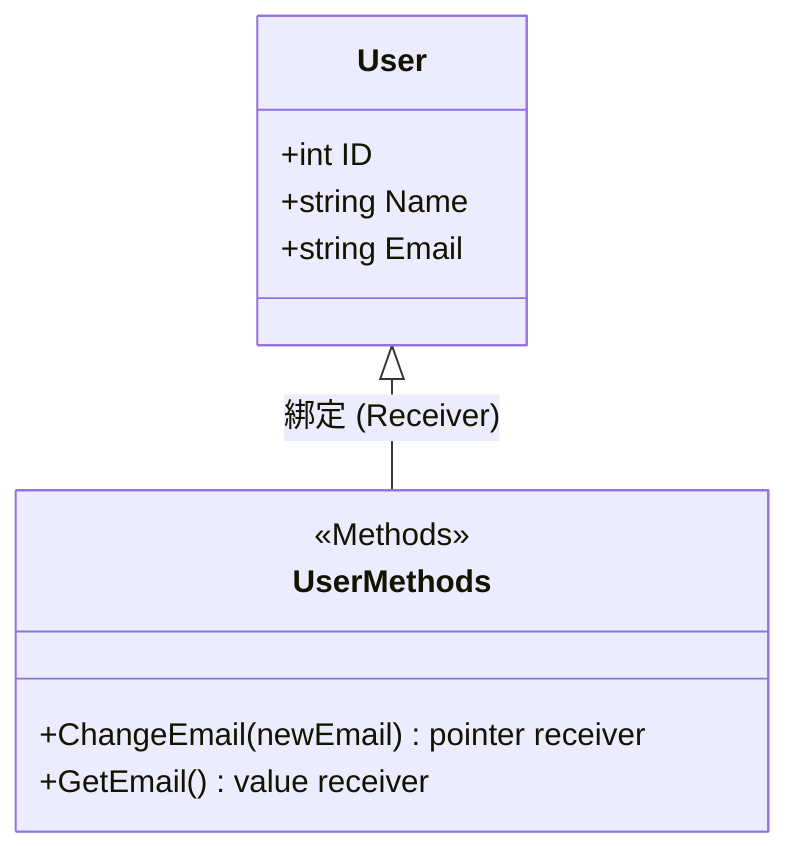
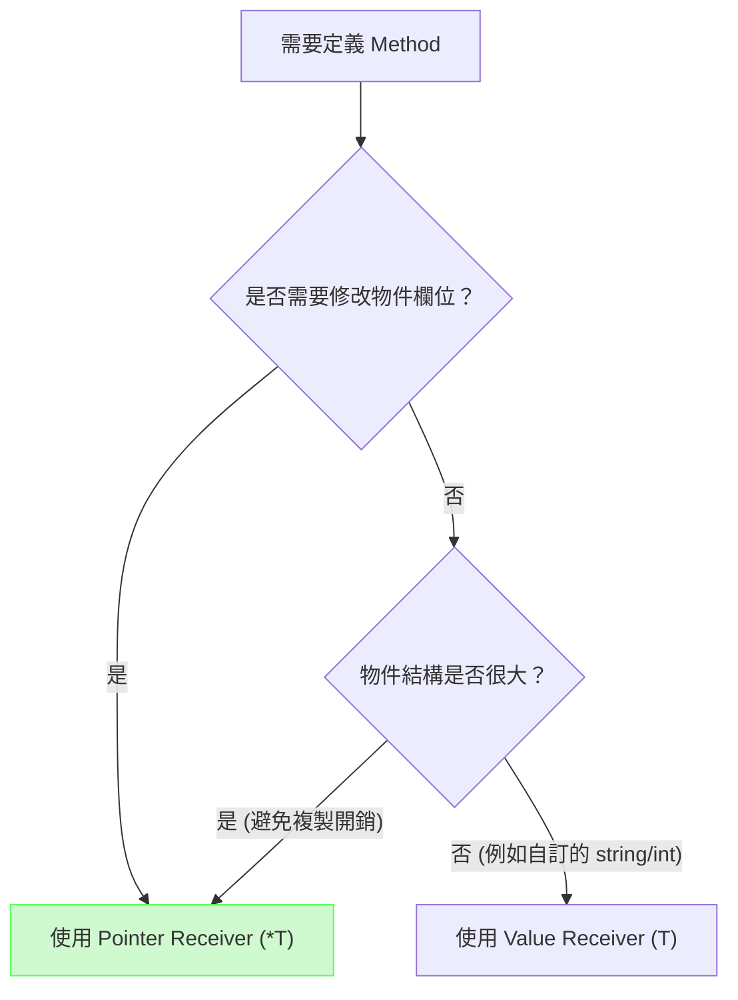
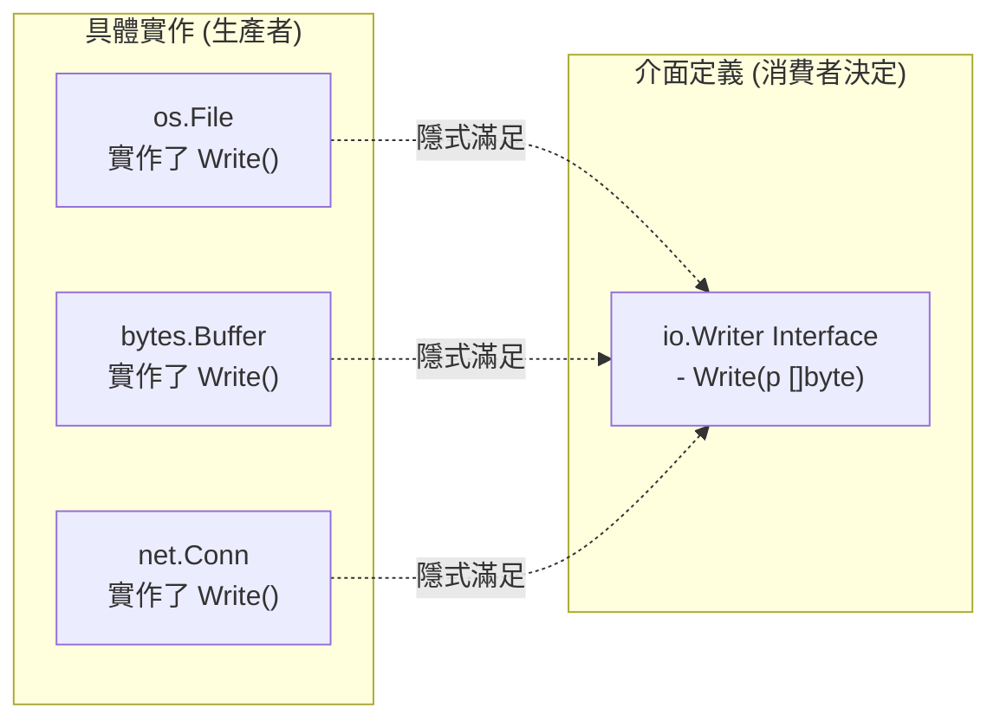

# 03. 物件導向抽象 (OOP in Go)

## 1. Go 的「物件感」：Struct + Method

Go 沒有 `class` 關鍵字，資料（Struct）與行為（Method）是分離定義的。透過 Method Receiver 將函式綁定到 Struct 上。



## 2. Value Receiver vs Pointer Receiver

決定 Method 接收者要用 `T` (Value) 還是 `*T` (Pointer) 是 Go 常見的設計抉擇。



## 3. 繼承的替代方案：組合 (Embedding)

Go 語言主張「組合優於繼承」（Composition over Inheritance）。透過將一個 Struct 匿名嵌入另一個 Struct，外部 Struct 會自動「提升」(Promote) 內部 Struct 的欄位與方法。

```mermaid
flowchart BT
    subgraph "Go 的組合 (has-a)"
        BaseModel["BaseModel (ID, CreatedAt)"]
        User["User (Name)"]
        BaseModel -. "匿名嵌入" .-> User
        User -- "自動擁有 ID, CreatedAt" --> Usage["user.ID"]
    end
    
    subgraph "傳統物件導向 (is-a)"
        BaseClass["BaseClass"]
        ChildClass["ChildClass"]
        BaseClass <|-- ChildClass : 繼承
    end
```

## 4. 介面與 Duck Typing (隱式實作)

在 Java/C# 中，類別必須顯式宣告 `implements SomeInterface`。但在 Go 語言中，只要一個型別實作了介面定義的所有 Method，它就自動滿足該介面。這稱為 **Duck Typing**（如果牠走起來像鴨子、叫起來像鴨子，牠就是鴨子）。



## 5. 錯誤處理鏈 (Error Wrapping)

Go 的錯誤也是介面。當錯誤從底層一路往上層傳遞時，我們通常會使用 `fmt.Errorf("... %w", err)` 將其包裝，形成錯誤鏈。

```mermaid
flowchart TD
    DB["Database Layer\n(sql.ErrNoRows)"]
    Repo["Repository Layer"]
    Service["Service Layer"]
    Handler["HTTP Handler"]
    
    DB -- "回傳 err" --> Repo
    Repo -- "fmt.Errorf(\"find user: %w\", err)" --> Service
    Service -- "fmt.Errorf(\"login failed: %w\", err)" --> Handler
    Handler -. "使用 errors.Is(err, sql.ErrNoRows)\n解開錯誤鏈檢查" .-> DB
```
