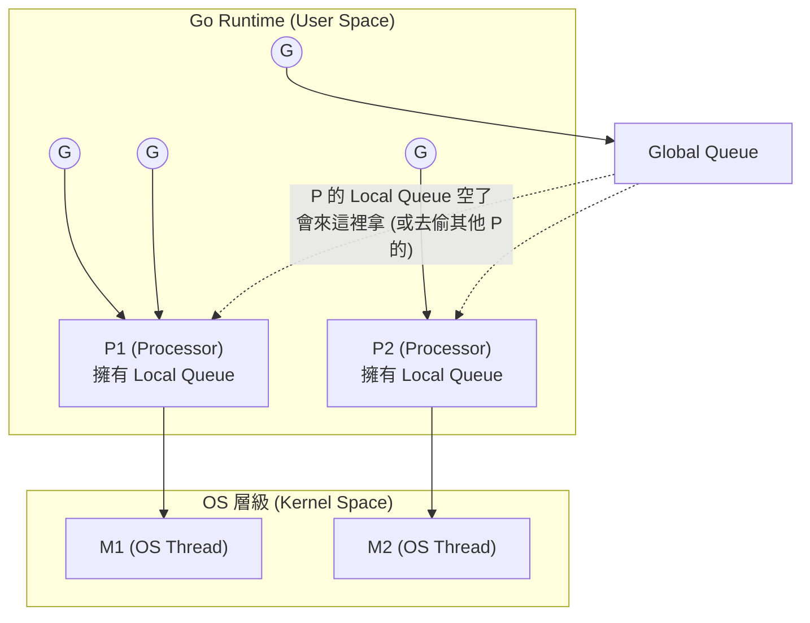
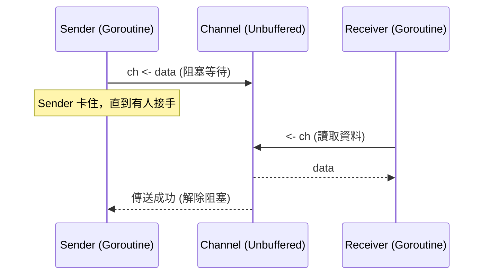
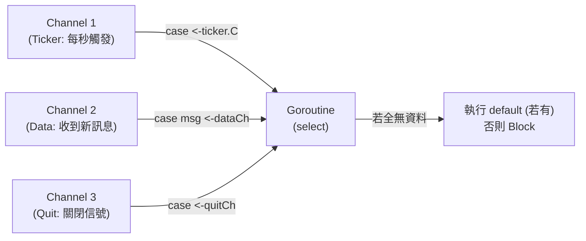
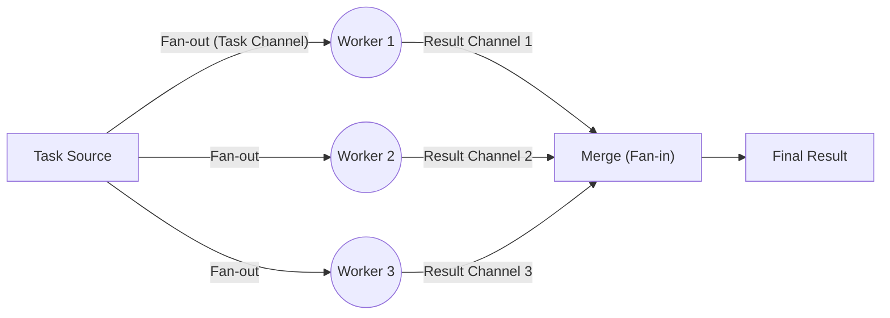

# 04. 併發模型 (Concurrency)

## 1. GMP 排程模型

Go 的 Goroutine 如此輕量且高效，歸功於其 runtime 內部的 M:N 排程器（GMP 模型）。


*名詞解釋：G (Goroutine), M (Machine/Thread), P (Processor/資源調度者)*

## 2. Channel 通訊模式

Go 的併發名言：**"不要透過共享記憶體來通訊；要透過通訊來共享記憶體"**。



## 3. 多路複用：`select` 

`select` 讓單一 Goroutine 可以同時等待多個 Channel 的讀寫事件。如果多個 case 同時就緒，它會**隨機**選擇一個執行（避免飢餓現象）。



## 4. Context 樹狀連鎖取消

Context 是 Go 用來控制跨 Goroutine 超時與取消的標準方式。當父節點被取消，所有的子孫節點都會收到取消信號。

```mermaid
graph TD
    Root["context.Background()"]
    Req["Request Context (User ID: 123)"]
    DB["DB Query Context (Timeout: 5s)"]
    API1["API Call 1 (Timeout: 2s)"]
    API2["API Call 2 (Timeout: 2s)"]
    
    Root --> Req
    Req --> DB
    Req --> API1
    Req --> API2
    
    style API1 fill:#f9cfcf,stroke:#ff5555
    Note right of API1: 若 API 1 提早發生 Timeout
    Note left of Req: 呼叫 cancel()
    Req -. "連鎖發送 Done 信號" .-> DB
    Req -. "連鎖發送 Done 信號" .-> API2
```

## 5. Fan-out / Fan-in 模式

經典的高效能併發處理模式：由一個來源分發給多個 Worker 處理 (Fan-out)，再由一個收集器將多個 Worker 的結果合併 (Fan-in)。


