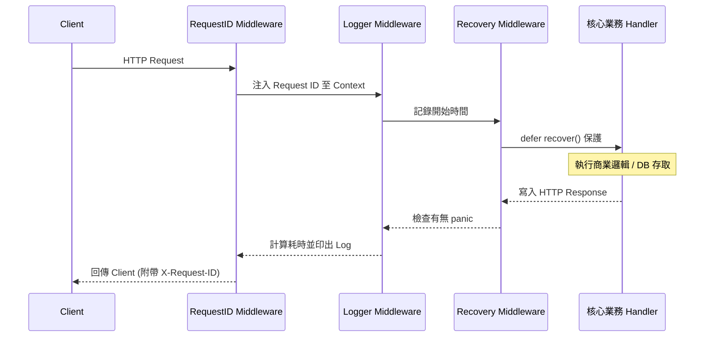
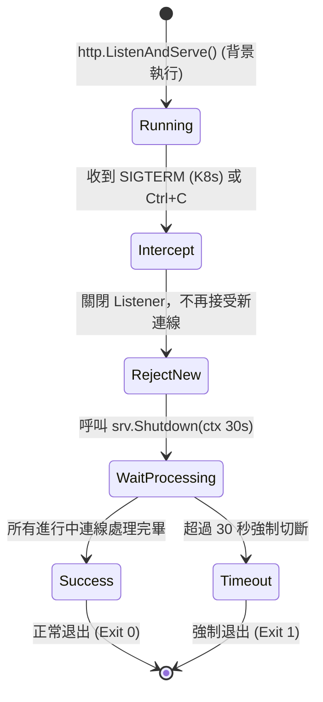

# 05. 後端實務 (Backend Patterns)

## 1. Middleware 洋蔥模型

Go 的 HTTP Middleware 是透過 `func(http.Handler) http.Handler` 的函數包裝實現的。執行時會像剝洋蔥一樣，從外層往內層執行，拿到回應後再從內層往外層離開。



## 2. Graceful Shutdown (優雅關閉)

當伺服器需要重啟或部署新版本時，直接 kill 會導致處理到一半的請求失敗。標準做法是攔截系統信號（SIGTERM），拒絕新請求，並給予一定時間讓舊請求處理完畢。



## 3. database/sql 連線池生命週期

Go 的 `database/sql` 預設內建連線池 (Connection Pool)，它隱藏了底層 TCP 連線的細節，開發者不需手動管理物理連線，只需管理邏輯連線 (`rows.Close()`, `tx.Rollback()`)。

```mermaid
flowchart TD
    App["Application Code\n(db.Query)"]
    Pool{"Connection Pool"}
    Idle["閒置連線 (Idle)\n數量由 MaxIdleConns 控制"]
    DB["實體資料庫 (PostgreSQL/MySQL)"]
    
    App -->|1. 請求連線| Pool
    Pool -->|2a. 有閒置連線| Idle
    Pool -->|2b. 無閒置且未達 MaxOpenConns| DB: "新建 TCP 連線"
    Idle -.->|3. 執行 SQL| DB
    DB -.->|4. 回傳 Rows| App
    
    App -- "5. 呼叫 rows.Close()" --> Pool
    Pool -->|6. 回收為閒置狀態| Idle
    Idle -.->|背景機制| Drop["超過 ConnMaxLifetime\n或 ConnMaxIdleTime\n自動斷線"]
```

## 4. CI/CD Multi-stage Docker Build 流程

Go 語言「靜態編譯」的優勢在於：編譯完的 binary 不依賴系統環境。透過 Multi-stage build，可以丟棄幾百 MB 的編譯環境，產出極小的 Production Image。

```mermaid
flowchart LR
    subgraph Stage 1: Builder (golang:1.22-alpine)
        SRC["原始碼 (go.mod, *.go)"]
        Compile["go build -o app (CGO_ENABLED=0)"]
        SRC --> Compile
    end
    
    subgraph Stage 2: Production (scratch / alpine)
        Bin["執行檔 /app"]
        Cert["CA 憑證 (TLS 需要)"]
        Bin -. "完全獨立運行" .-> Cert
    end
    
    Compile -- "只將編譯好的 binary 複製過來\n(捨棄 SDK 與原始碼)" --> Bin
    
    style Stage 1 fill:#f0f0f0,stroke:#333,stroke-dasharray: 5 5
    style Stage 2 fill:#cce5ff,stroke:#004085
```
