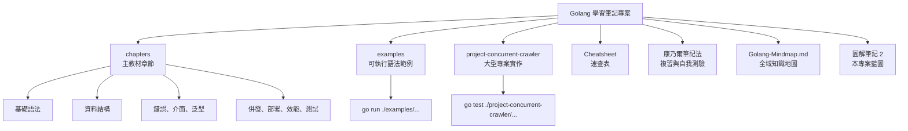
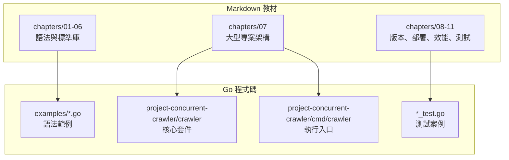
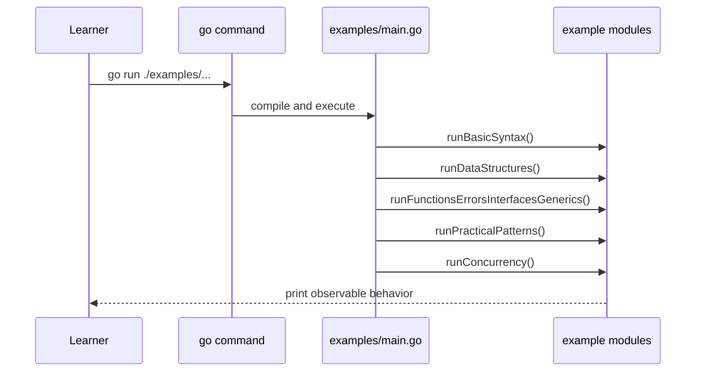
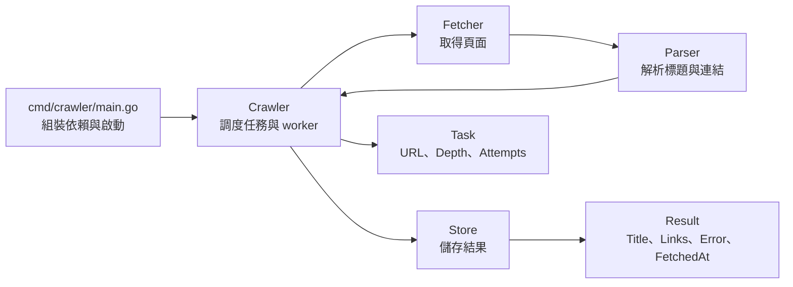
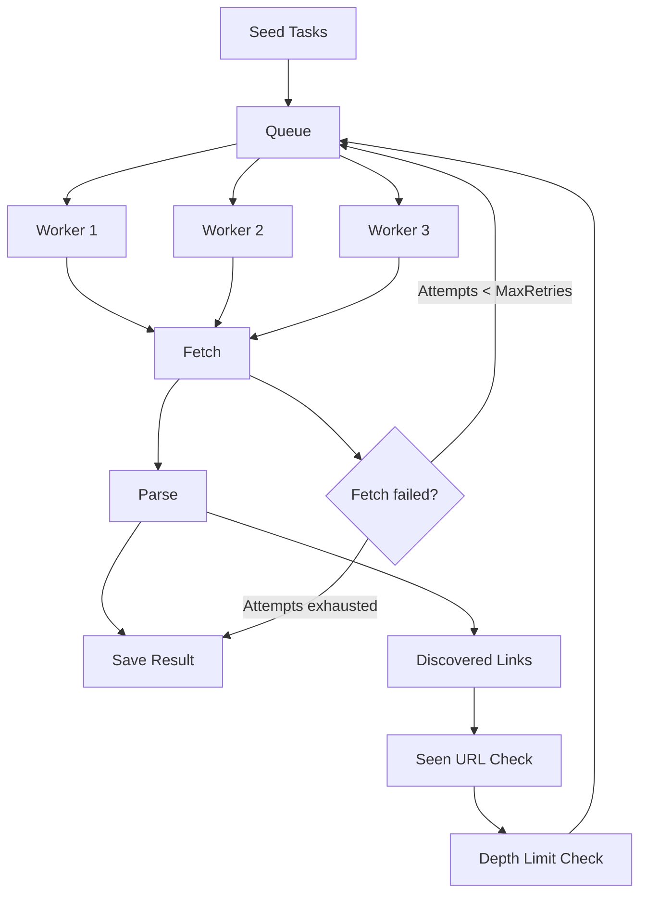
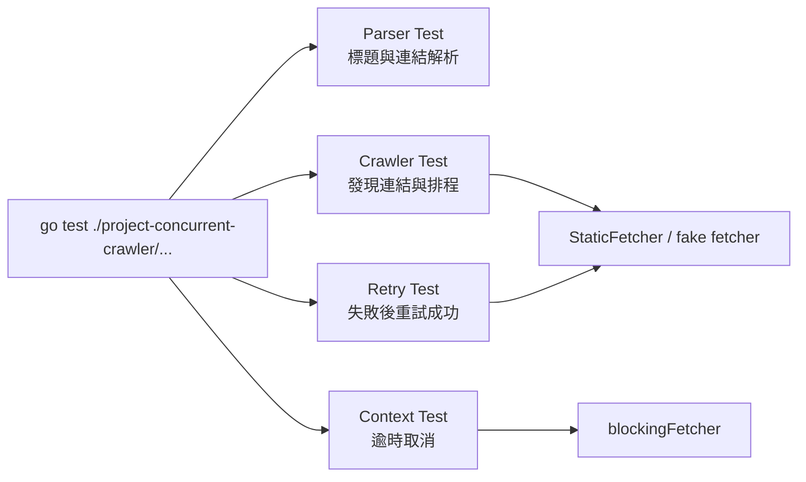
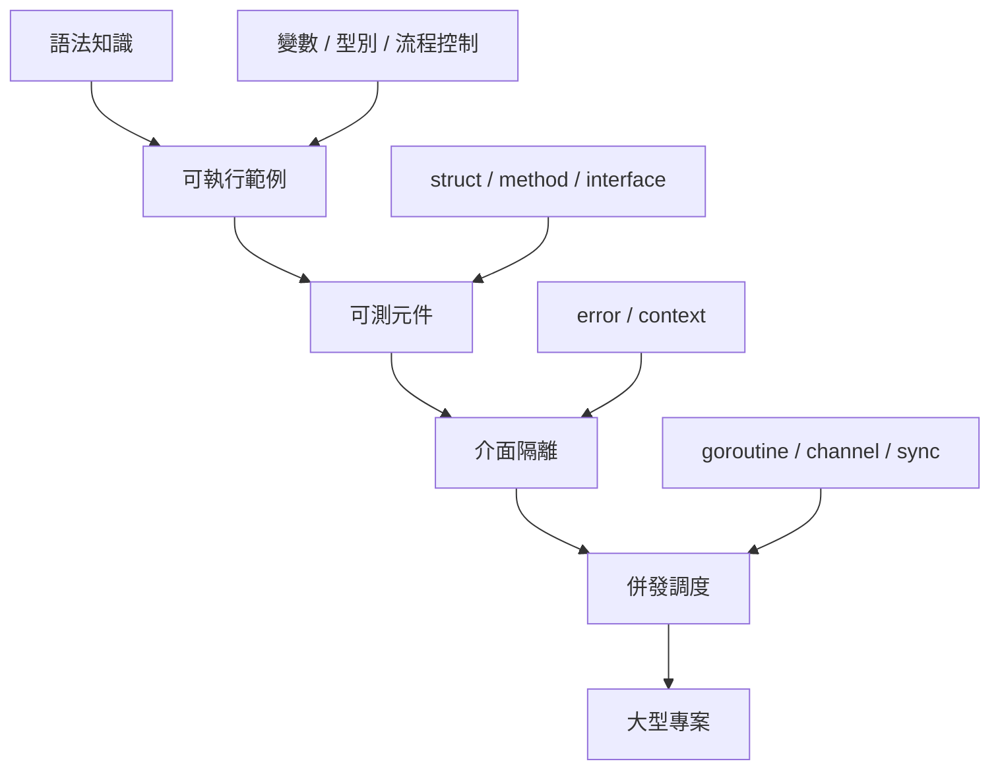

# Golang 學習筆記專案圖解藍圖

這份圖解筆記用「專案藍圖」角度整理本 repo。它不是逐章重寫教材，而是幫你快速看懂：這個專案有哪些教材資產、學習路線如何串接、範例程式怎麼驗證，以及大型並發爬蟲專案如何把 Go 語法落到實務架構。

## 1. 專案全景



| 區塊 | 角色 | 讀者使用方式 |
|---|---|---|
| `chapters/` | 主線教材 | 依章節循序學習 Go |
| `examples/` | 最小可執行語法範例 | 邊讀邊跑，修改參數觀察結果 |
| `project-concurrent-crawler/` | 大型專案示範 | 看 Go 如何組成可測、可維護架構 |
| `Cheatsheet/` | 速查 | 開發時快速回憶語法與實務 pattern |
| `康乃爾筆記法/` | 複習筆記 | 用提問、摘要、自測鞏固記憶 |
| `Golang-Mindmap.md` | 知識總覽 | 面試前或複習時建立全局感 |
| `圖解筆記 2/` | 專案藍圖 | 快速理解本 repo 的結構與資料流 |

## 2. 學習路線地圖

```mermaid
flowchart LR
  S["開始：有程式基礎的新手"]
  S --> C1["01 環境與專案結構"]
  C1 --> C2["02 基礎語法"]
  C2 --> C3["03 資料結構與物件感"]
  C3 --> C4["04 函式、錯誤、介面、泛型"]
  C4 --> C5["05 實務標準庫"]
  C5 --> C6["06 併發程式設計"]
  C6 --> C7["07 大型專案架構"]
  C7 --> C8["08 版本管理"]
  C8 --> C9["09 打包與部署"]
  C9 --> C10["10 效能與記憶體"]
  C10 --> C11["11 進階測試"]
  C11 --> A1["A1 語言規範速覽"]
```



| 階段 | 心智模型 | 對應產出 |
|---|---|---|
| 基礎 | 看懂 Go 程式如何被組織與執行 | `go.mod`、`package`、`func main` |
| 語法 | 掌握型別、流程控制、函式與錯誤 | 可執行範例 |
| 抽象 | 用 struct、method、interface、generics 建模 | 小型元件與測試替身 |
| 實務 | 使用 JSON、HTTP、檔案、testing | 標準庫工作流 |
| 併發 | 管理 goroutine、channel、context 生命週期 | worker pool 與取消控制 |
| 專案 | 把語法組成大型可維護應用 | 並發爬蟲 / 任務系統 |

## 3. 章節與程式碼的對照



| 如果你想學 | 先讀 | 再看 |
|---|---|---|
| Go 基礎語法 | `chapters/02-basic-syntax.md` | `examples/basic_syntax.go` |
| Slice、map、struct、pointer | `chapters/03-data-structures.md` | `examples/data_structures.go` |
| error、interface、generics | `chapters/04-functions-errors-interfaces-generics.md` | `examples/functions_errors_interfaces_generics.go` |
| HTTP 與 JSON | `chapters/05-practical-go.md` | `examples/practical_patterns.go` |
| goroutine 與 worker | `chapters/06-concurrency.md` | `examples/concurrency.go` |
| 大型專案拆分 | `chapters/07-large-project-concurrent-crawler.md` | `project-concurrent-crawler/crawler/*.go` |

## 4. 可執行範例的執行路徑



| 範例檔 | 示範重點 |
|---|---|
| `main.go` | 串接所有 demo，形成一個可跑的學習入口 |
| `basic_syntax.go` | 變數、常數、if、switch、for |
| `data_structures.go` | slice、map、rune、struct、method |
| `functions_errors_interfaces_generics.go` | 多回傳值、error wrapping、interface、generic function |
| `practical_patterns.go` | JSON、HTTP handler 測試方式 |
| `concurrency.go` | worker pool、channel、context、WaitGroup |

## 5. 大型專案架構圖



| 元件 | 對應檔案 | 設計目的 |
|---|---|---|
| `Crawler` | `crawler.go` | 集中處理排程、worker、retry、context |
| `Task` / `Result` | `types.go` | 用明確資料模型描述任務與結果 |
| `Fetcher` | `fetcher.go` | 把外部資料取得抽成可替換介面 |
| `Parser` | `parser.go` | 把 HTML 解析與任務調度分離 |
| `MemoryStore` | `store.go` | 示範 thread-safe 的記憶體儲存 |
| `cmd/crawler` | `main.go` | 示範依賴組裝與實際啟動 |

## 6. 並發爬蟲資料流



| 控制點 | 專案做法 | 避免的問題 |
|---|---|---|
| worker 數量 | `Config.Workers` | 無限制 goroutine 造成資源耗盡 |
| queue 大小 | `Config.QueueSize` | 任務暴增導致記憶體壓力 |
| 深度限制 | `Config.MaxDepth` | 無止境爬取 |
| retry 上限 | `Config.MaxRetries` | 永遠重試同一個失敗任務 |
| rate limit | `Config.RateLimit` | 對外部服務造成過大壓力 |
| context | `ctx.Done()` | goroutine leak 與無法中止 |

## 7. 測試策略圖



| 測試 | 驗證行為 |
|---|---|
| `TestLinkParserParsesTitleAndLinks` | parser 能取出 title、解析相對與絕對連結 |
| `TestCrawlerCrawlsDiscoveredLinks` | crawler 能排程 seed 與新發現連結 |
| `TestCrawlerRetriesThenSucceeds` | 暫時失敗會依 retry 策略再次排程 |
| `TestCrawlerReturnsContextError` | context 逾時會讓整體流程可中止 |

## 8. 從筆記到實務專案的轉換



這份專案的學習重點不是背 API，而是建立一條工程路線：

1. 先用小範例看懂語法。
2. 再把語法封裝成函式、型別與介面。
3. 接著用測試確認行為。
4. 最後用 context、worker pool、retry、store 組成大型專案。

## 9. 建議驗證指令

在這台 macOS 環境中，如果一般 `go test` 或 `go run` 遇到 linker 問題，可使用外部 linker 與專案內 cache。

```bash
mkdir -p .tmp .gocache
TMPDIR="$PWD/.tmp" GOCACHE="$PWD/.gocache" go run -ldflags=-linkmode=external ./examples/...
TMPDIR="$PWD/.tmp" GOCACHE="$PWD/.gocache" go test -ldflags=-linkmode=external ./project-concurrent-crawler/...
TMPDIR="$PWD/.tmp" GOCACHE="$PWD/.gocache" go run -ldflags=-linkmode=external ./project-concurrent-crawler/cmd/crawler
```

## 10. 一頁式複習

| 問題 | 回答 |
|---|---|
| 這個 repo 的主教材在哪裡？ | `chapters/` |
| 能跑的語法範例在哪裡？ | `examples/` |
| 大型專案主軸是什麼？ | 並發爬蟲 / 任務系統 |
| 主要 Go 實務能力有哪些？ | error handling、interface、context、testing、goroutine、channel |
| 專案如何避免外部依賴難測？ | `Fetcher`、`Parser`、`Store` 都可替換 |
| 併發流程如何收斂？ | worker pool、queue、depth limit、retry limit、context cancellation |
