# Golang 教學內容圖解筆記

這份筆記專注整理本專案的「教學內容」，不是整理 repo 檔案結構。讀法像一張課堂白板：先看圖建立心智模型，再用表格抓關鍵差異，最後回到教材章節與 Go 程式碼實作。

## 1. Go 學習主線

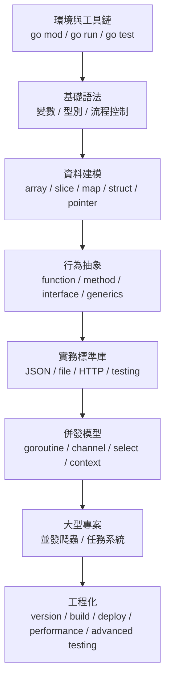

| 階段 | 學習問題 | 對應能力 |
|---|---|---|
| 工具鏈 | Go 程式如何建立、執行、測試？ | 能建立 module 並跑測試 |
| 基礎語法 | Go 如何表達資料與控制流程？ | 能寫可讀的小程式 |
| 資料建模 | Go 沒有 class，如何組織資料？ | 能用 struct、slice、map 建模 |
| 行為抽象 | Go 如何做多型與重用？ | 能用 interface 與 generics |
| 標準庫 | 實務後端常見任務怎麼做？ | 能處理 JSON、HTTP、檔案與測試 |
| 併發 | 如何同時做多件事又不失控？ | 能使用 worker pool 與 context |
| 專案化 | 語法如何組成大型應用？ | 能拆分依賴、測試與執行入口 |
| 工程化 | 如何交付、調校、維護？ | 能版本管理、打包、部署與效能分析 |

## 2. 基礎語法心智圖

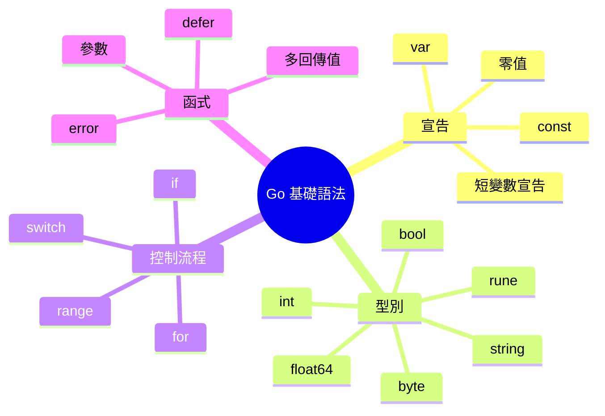

| 語法 | 最重要觀念 | 容易犯的錯 |
|---|---|---|
| `var` | 宣告後一定有 zero value | 誤以為未初始化不能用 |
| `:=` | 函式內快速宣告 | 在 package scope 使用 |
| `const` | 編譯期常數 | 放入需要 runtime 才知道的值 |
| `if value, ok := ...; ok` | 宣告與判斷可放同一行 | 在外層還想使用 `value` |
| `switch` | 預設不 fallthrough | 套用其他語言習慣 |
| `for` | Go 唯一迴圈語法 | 忘記 `range` 回傳 index/value |
| `defer` | 函式結束前執行 | 在大量 loop 中堆太多 defer |

### 基礎語法的學習順序

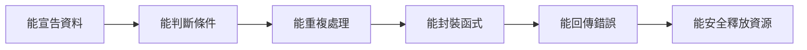

## 3. 型別與零值圖解

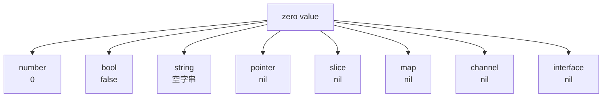

| 型別類別 | 零值是否可直接使用 | 說明 |
|---|---|---|
| number / bool / string | 可以 | 可直接讀取與比較 |
| pointer | 視情況 | 使用前要判斷是否 `nil` |
| slice | 部分可以 | 可以 `append`，但沒有元素 |
| map | 不能直接寫入 | 寫入前要 `make` |
| channel | 不能傳收 | nil channel 會永久阻塞 |
| interface | 要小心 | typed nil 與 nil interface 不同 |

## 4. 資料結構視角

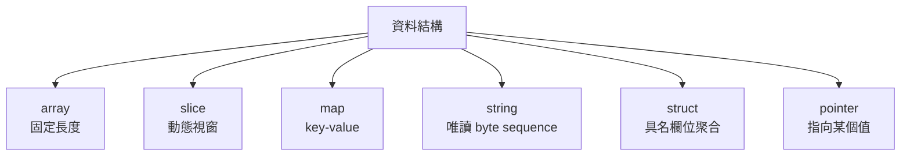

| 結構 | 適合用途 | 關鍵觀念 |
|---|---|---|
| array | 固定大小資料 | 長度是型別的一部分 |
| slice | 大多數列表資料 | header 包含 pointer、len、cap |
| map | 查表、索引、統計 | 非 thread-safe |
| string | 文字與不可變資料 | `len` 回傳 byte 數 |
| struct | 領域物件與資料傳輸 | Go 主要資料建模工具 |
| pointer | 修改原值、避免複製、表達可選 | 使用前留意 nil |

### Slice 的概念圖

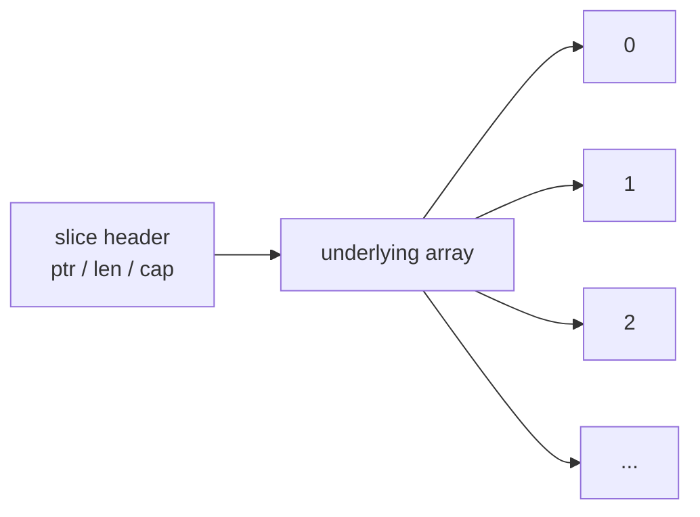

教學重點：slice 看起來像動態陣列，但本質是指向底層 array 的描述物件。這能解釋為什麼傳 slice 到函式時，元素可被改到，但重新 append 後不一定影響原 slice header。

## 5. Go 的物件感

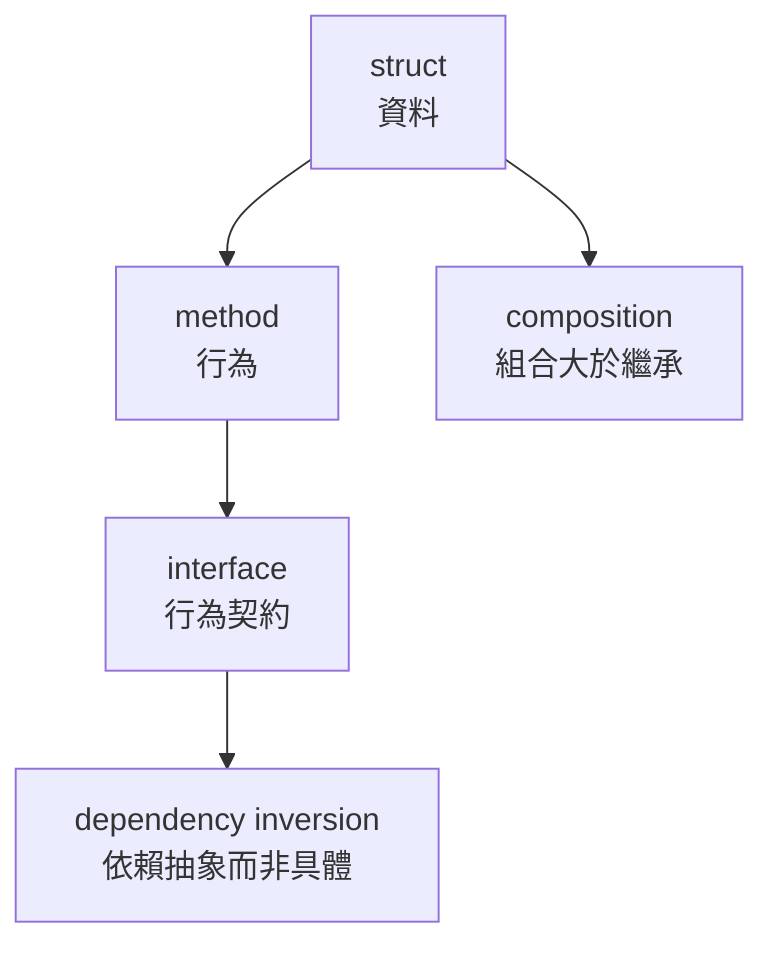

| 其他 OOP 語言常見詞 | Go 對應觀念 |
|---|---|
| class | `struct + method` |
| inheritance | composition / embedding |
| implements | 不需宣告，method set 自動滿足 |
| abstract class | 小 interface |
| override | 用組合與注入替換行為 |

### Interface 使用時機

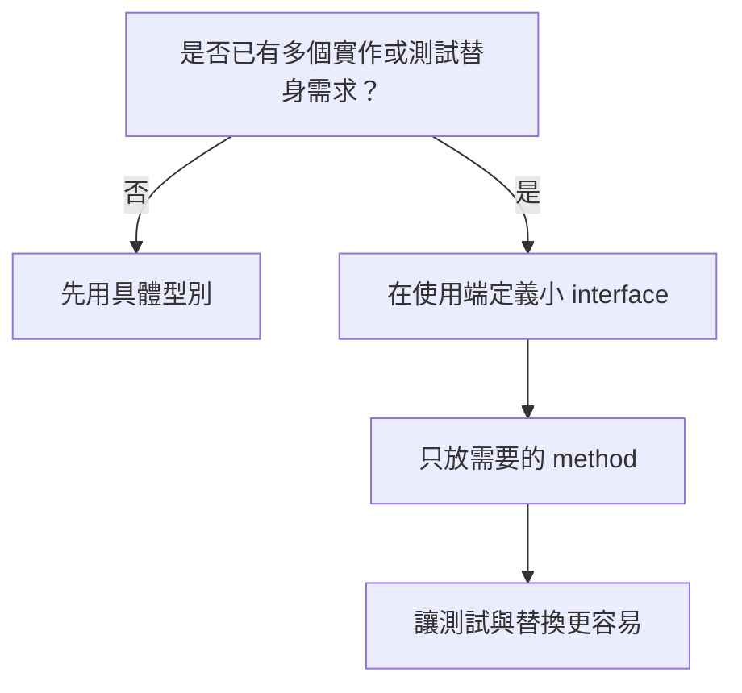

## 6. 錯誤處理路徑

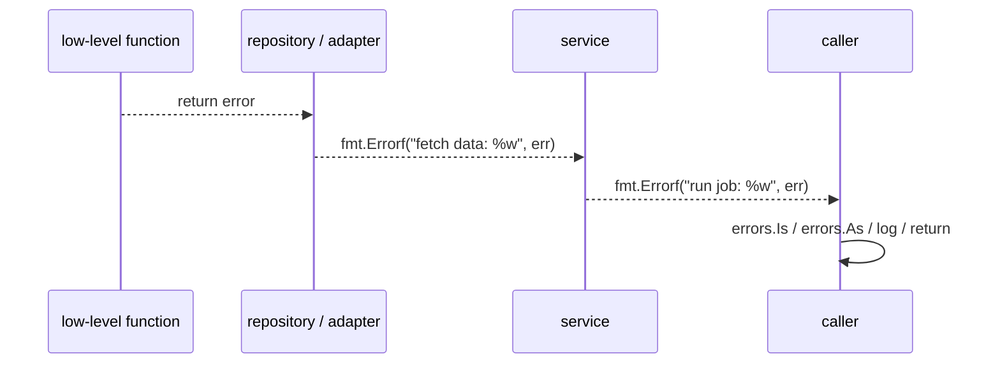

| 做法 | 目的 |
|---|---|
| 回傳 `error` | 讓呼叫端明確決策 |
| 用 `%w` 包裝 | 保留原始錯誤供 `errors.Is` 判斷 |
| 在邊界處處理 | handler、main、worker 最適合決定如何回應 |
| 不吞錯 | 讓故障可以被定位 |

教學重點：Go 的錯誤處理不是「每行都很吵」，而是把失敗路徑顯式化。大型專案中，這會讓故障比例外堆疊更容易被控制。

## 7. Generics 的定位

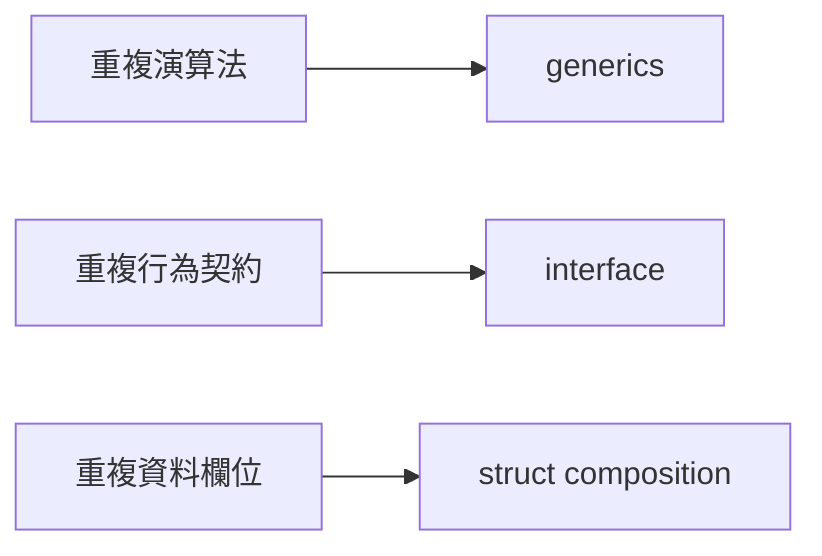

| 問題 | 適合工具 |
|---|---|
| `[]int`、`[]string` 都要找第一個元素 | generics |
| 不同儲存體都要 `Save` | interface |
| 多個型別都有建立者與時間欄位 | struct embedding |

簡單判斷：泛型解決「型別不同但演算法相同」，interface 解決「實作不同但行為相同」。

## 8. 標準庫實務地圖

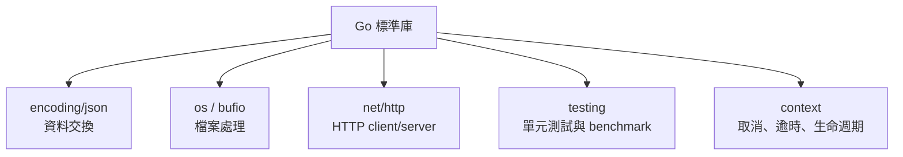

| 場景 | 常用套件 | 工程提醒 |
|---|---|---|
| JSON API | `encoding/json` | 欄位要 exported 才能 marshal |
| 讀寫檔案 | `os`、`bufio` | 大檔案避免一次讀入 |
| HTTP client | `net/http` | 設 timeout，傳 context |
| HTTP server | `http.ServeMux` | handler 要明確處理 method 與錯誤 |
| 測試 | `testing` | table-driven test 覆蓋邊界 |
| benchmark | `testing.B` | 先測量，再優化 |

## 9. 併發教學地圖

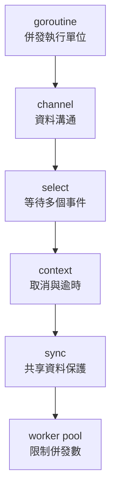

| 工具 | 解決的問題 | 不該濫用的地方 |
|---|---|---|
| goroutine | 背景或並行工作 | 沒有退出條件 |
| channel | goroutine 間傳資料 | 當成全域共享變數 |
| select | 同時等 job、timeout、cancel | case 太多導致流程難讀 |
| context | 控制生命週期 | 存放業務資料 |
| mutex | 保護共享狀態 | 可用資料流解決時不必硬鎖 |
| worker pool | 控制資源上限 | 任務太小時過度設計 |

### Worker Pool 概念圖

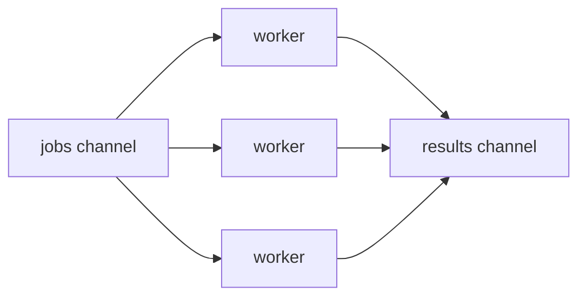

教學重點：goroutine 很便宜，但系統資源不是無限。worker pool 的目的不是變快而已，更重要是讓併發有上限。

## 10. Context 生命週期

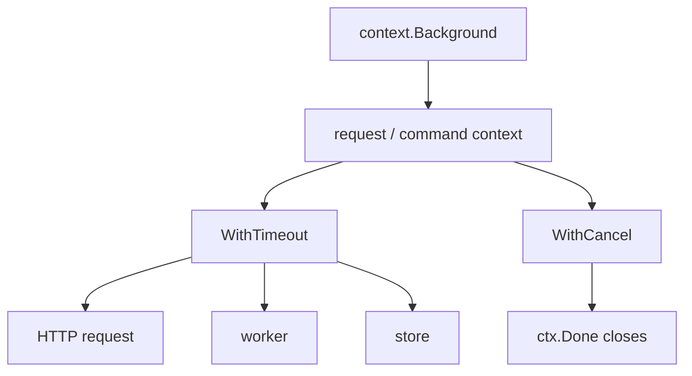

| 原則 | 說明 |
|---|---|
| context 從上層傳入 | 下層不應自己決定全域生命週期 |
| 每個阻塞點都要看 `ctx.Done()` | 避免 goroutine leak |
| timeout 要靠近邊界 | HTTP、DB、外部服務呼叫都需要 |
| 不把 context 存在 struct 裡 | 除非是非常明確的長生命週期物件 |

## 11. 大型專案教學模型：並發爬蟲

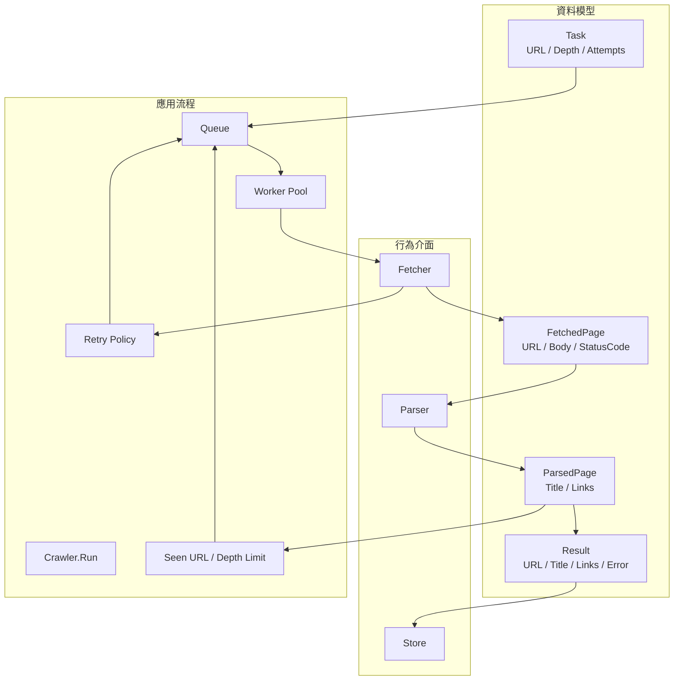

| 教學主題 | 在爬蟲專案中的落點 |
|---|---|
| struct | `Task`、`FetchedPage`、`ParsedPage`、`Result`、`Config` |
| interface | `Fetcher`、`Parser`、`Store` |
| error | fetch 失敗、parse 失敗、context 取消 |
| goroutine | 多個 worker 同時處理任務 |
| channel | jobs、discovered、done |
| mutex | `MemoryStore` 與 stats 保護 |
| context | 中止整個爬取流程 |
| testing | fake fetcher、blocking fetcher、parser test |

## 12. 從語法到專案的對照表

| 教材語法 | 小範例理解 | 專案級應用 |
|---|---|---|
| `if` / `switch` | 判斷分數、狀態 | 判斷 retry、depth、錯誤類型 |
| `for` / `range` | 走訪 slice / map | worker 持續讀取 jobs |
| `defer` | 關閉檔案或 response body | worker 結束時釋放資源 |
| `struct` | `User` | `Task`、`Result`、`Config` |
| method | `User.Rename` | `Crawler.Run`、`MemoryStore.Save` |
| interface | `KeyValueStore` | `Fetcher`、`Parser`、`Store` |
| generics | `First[T]`、`Contains[T]` | 適合抽共用容器或演算法 |
| context | timeout demo | 取消 worker 與 HTTP request |
| test | table-driven test | crawler 行為測試 |

## 13. 測試學習路線

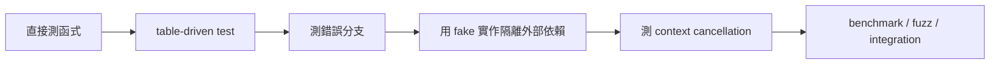

| 測試層級 | 目標 | 範例 |
|---|---|---|
| 函式測試 | 輸入輸出正確 | parser 解析 title 與 links |
| table-driven | 多案例一致驗證 | 分數等級、錯誤分支 |
| fake dependency | 不依賴外部服務 | fake fetcher |
| cancellation | 流程能停止 | blocking fetcher + timeout |
| benchmark | 找效能瓶頸 | 字串處理、資料結構操作 |
| integration | 確認元件串接 | crawler 從 seed 到 store |

## 14. 部署與效能的學習位置

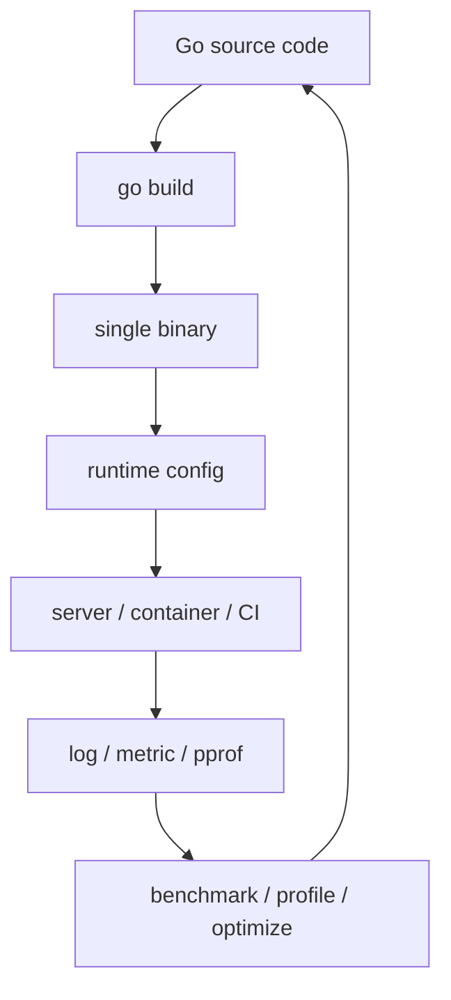

| 主題 | 要學會的判斷 |
|---|---|
| 版本管理 | 什麼變更需要 tag、release note、SemVer |
| build | 何時需要 `ldflags`、交叉編譯、embed |
| deploy | binary、Docker、CI/CD 的取捨 |
| memory | 何時值複製、何時 pointer、何時會逃逸 |
| pprof | 先用資料找瓶頸，不靠感覺優化 |
| advanced testing | mock、fuzz、integration 的邊界 |

## 15. 一張圖記住整套課

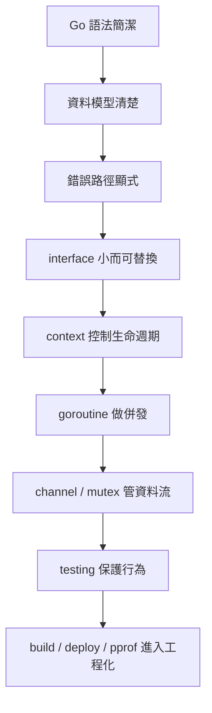

這套教材最後要建立的不是「會背 Go 語法」，而是下面這個能力：

| 能力 | 具體表現 |
|---|---|
| 讀得懂 | 看到 Go 專案知道入口、package、資料流 |
| 寫得出 | 能從小函式寫到可執行 command |
| 拆得開 | 能用 interface 和 struct 分離責任 |
| 測得到 | 能用 fake、table-driven test、context test 驗證行為 |
| 收得住 | 能限制併發、處理取消、避免資源失控 |
| 交得出去 | 能 build、version、deploy、profile |
